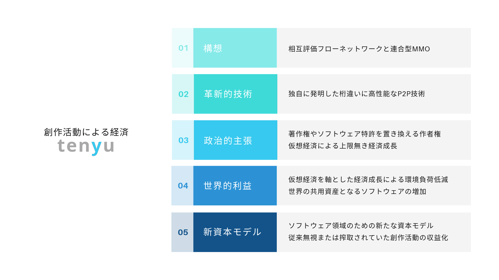
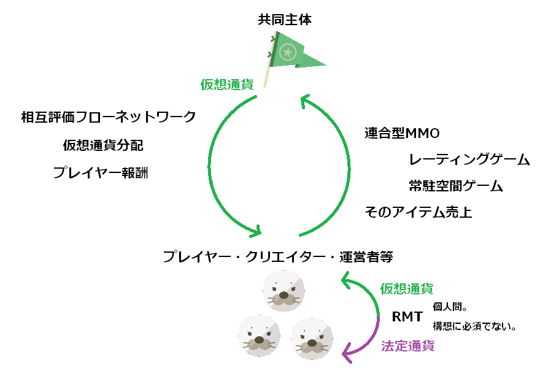
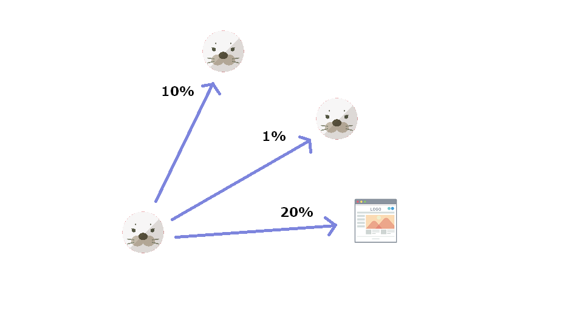
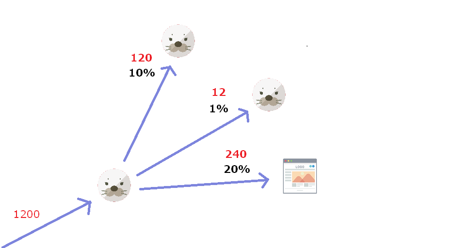
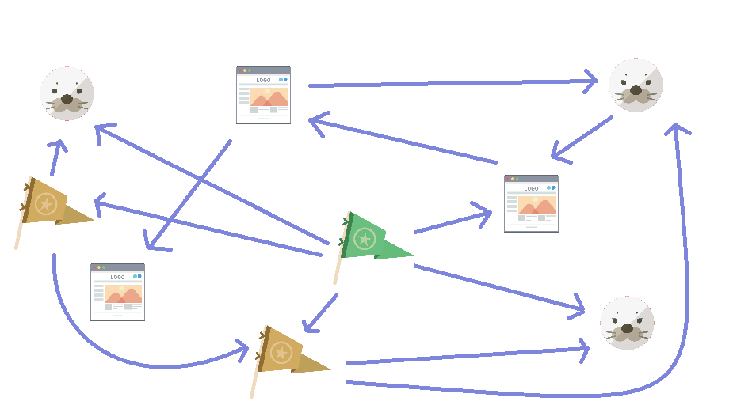
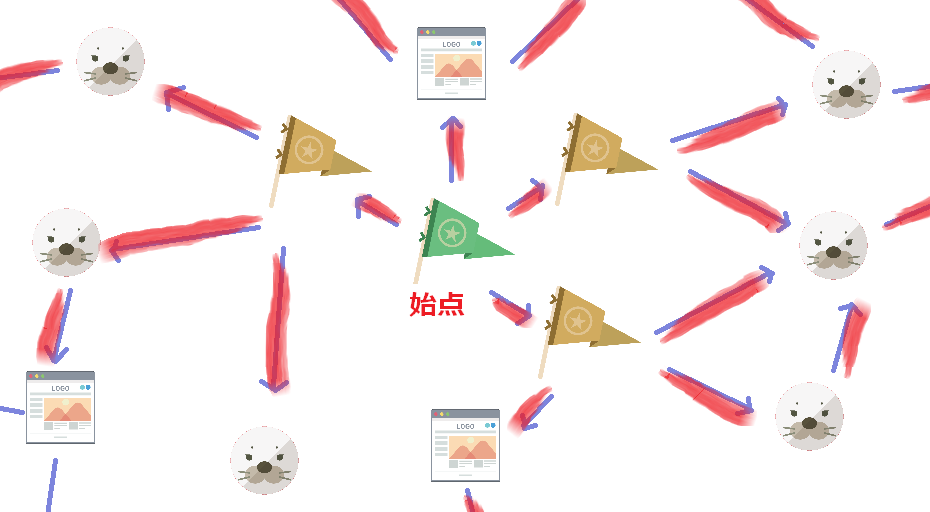
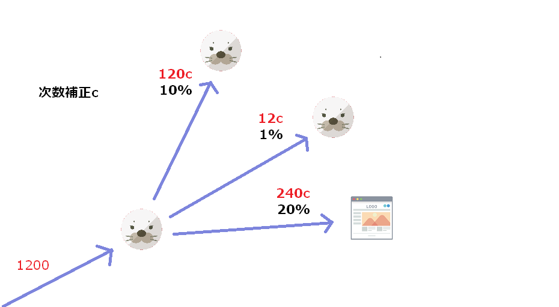

# 概要
  

※技術的な話が出てきますが、プロジェクト概要を把握するだけなら飛ばして構いません。

Tenyuは世界のソフトウェアや知識生産を最大化するためにこれらを主張しています。
- 構想  
[ソフトウェア制作や知識生産活動を収益化するための汎用的なプラットフォーム](#相互評価フローネットワーク)や、[持続可能なMMO](#連合型MMO)があります。  
- 革新的技術  
ブロックチェーンを代替する[独自のP2P技術](#P2P技術)による従来技術と比較して桁違いに高性能かつ堅牢な[仮想通貨](#仮想通貨)（もちろん通貨以外のデータも扱える）があります。  
- 政治的主張  
著作権やソフトウェア特許を[作者権](#作者権)に変えるべきとか、[環境負荷低減のために仮想経済を軸に経済成長しろ](#デフレ)という政治的主張があります。
- 世界的利益  
[世界の共用資産](https://github.com/lifeinwild/tenyu/blob/master/programmingEnvironment.md#%E5%89%B5%E7%99%BA%E7%9A%84%E3%81%AA%E3%82%BD%E3%83%95%E3%83%88%E3%82%A6%E3%82%A7%E3%82%A2_%E8%A7%A3%E9%87%88_%E6%A1%88_%E6%80%9D%E6%83%B3)の増加や、[環境負荷軽減等](#何に価値を感じるべきか)があります。
- 新資本モデル  
私の考えでは、私がTenyuプロジェクトを通して提案している事は[ソフトウェアのための新たな資本モデル](#資本)です。つまり、政府資本や民間資本等と同次元の新たな概念です。

それらは[互いに本質的な関係を持っています](#目的)。

**[Tenyuプロジェクトは参加者から集金する話ではなく、参加者にTenyuの連合型MMOで使用できる仮想通貨を与える話です](#仮想通貨)**。  

現在賛同者を増やすために説明を試行錯誤しています。分からなかったところをissuesかtwitterのDMで教えてください。レビュー記事歓迎。

[note](https://note.mu/lifeinwild/n/n222f2e79c75e)
[twitter](https://twitter.com/lifeinwild)
[hatenablog](https://lifeinwild1.hatenablog.com/entry/2019/09/27/135417?_ga=2.156494840.236788421.1569559812-1362957773.1569559812)

# 目次  
- [目的](#目的)
- [ソフトウェアの状況](#ソフトウェアの状況)
- [プロジェクトの状況](#プロジェクトの状況)
- [免責事項](#免責事項)
- [License](#License)
- [採用したソフトウェアの構成](#採用したソフトウェアの構成)
- [基盤ソフトウェアのソースコードの公開](#基盤ソフトウェアのソースコードの公開)
- [プライバシーや動作等に関するポリシー](#プライバシーや動作等に関するポリシー)
- [Tenyu基盤ソフトウェアを実行するリスク](#Tenyu基盤ソフトウェアを実行するリスク)
- [クリエイターにとって実際どんな感じ](#クリエイターにとって実際どんな感じ)
- [私](#私)  
- [限定公開プロジェクトとして活動していた時のURL](#限定公開プロジェクトとして活動していた時のURL)
- [想定される参加者](#想定される参加者)
- [作者権](#作者権)
- [プロジェクト権](#プロジェクト権)
- [人権](#人権)
- [創作とは](#創作とは)
- [動機付け](#動機付け)
- [ソフトウェアの性質](#ソフトウェアの性質)
- [方法について簡易な説明](#方法について簡易な説明)
- [ソフトウェア特許問題](#ソフトウェア特許問題)
- [Tenyuプロジェクトに影響を与えた創作的成果](#Tenyuプロジェクトに影響を与えた創作的成果)
- [必要スペック](#必要スペック)
- [推奨スペック](#推奨スペック)
- [基本概念](#基本概念)
  - [承認情報](#承認情報)
	- [承認情報基盤](#承認情報基盤)
  - [P2P承認情報基盤](#P2P承認情報基盤)
  - [天祐Tenyu](#天祐Tenyu)
  - [資本](#資本)
  - [コード資産の共有](#コード資産の共有)
  - [仮想通貨](#仮想通貨)
- [Tenyuの実行環境](#Tenyuの実行環境)
- [Javaでゲームを作る事は妥当か](#Javaでゲームを作る事は妥当か)
- [TenyuのP2P技術の概要](#TenyuのP2P技術の概要)
- [Tenyuの性能](#Tenyuの性能)
- [仮想通貨の流れ](#仮想通貨の流れ)
  - [仮想通貨分配](#仮想通貨分配)
  - [プレイヤー報酬](#プレイヤー報酬)
- [なぜP2Pでやるか](#なぜP2Pでやるか)
- [なぜ信頼可能な前提を作らなければならないか](#なぜ信頼可能な前提を作らなければならないか)
- [ソフトウェア開発の未来](#ソフトウェア開発の未来)
- [分散合意で決定できる情報](#分散合意で決定できる情報)
- [相互評価フローネットワーク](#相互評価フローネットワーク)
  - [有向グラフ](#有向グラフ)
  - [エッジ作成操作](#エッジ作成操作)
  - [エッジ作成のルール](#エッジ作成のルール)
  - [フロー計算](#フロー計算)
  - [次数補正](#次数補正)
  - [ダミーアカウント問題と格差是正](#ダミーアカウント問題と格差是正)
  - [ノードとエッジの種類](#ノードとエッジの種類)
  - [１シナリオ](#１シナリオ)
  - [主旨](#主旨)
  - [共同主体の重要性](#共同主体の重要性)
  - [URL証明](#URL証明)
- [アンケート機能](#アンケート機能)
- [TenyuLicenseの概要](#TenyuLicenseの概要)
- [TenyuLicense](#TenyuLicense)
- [MMOとは何か](#MMOとは何か)
- [仮想経済](#仮想経済)
- [余暇の収益化やネット上の様々な活動の収益化](#余暇の収益化やネット上の様々な活動の収益化)
- [参加者の立場](#参加者の立場)
  - [ユーザー](#ユーザー)
  - [全体運営者](#全体運営者)
  - [プレイヤー](#プレイヤー)
  - [ゲームクリエイター](#ゲームクリエイター)
  - [素材クリエイター](#素材クリエイター)
- [プレイヤーの動態](#プレイヤーの動態)
  - [クエストの代替](#クエストの代替)
  - [ゲーム内通貨](#ゲーム内通貨)
  - [装備](#装備)
  - [材料](#材料)
  - [ゲーム](#ゲーム)
  - [ゲームクライアント](#ゲームクライアント)
  - [常駐空間ゲーム](#常駐空間ゲーム)
  - [PvE](#PvE)
  - [PvP](#PvP)
  - [レーティングゲーム](#レーティングゲーム)
  - [レーティングゲームのチート対策まとめ](#レーティングゲームのチート対策まとめ)
  - [暴言問題](#暴言問題)
  - [RMT](#RMT)
  - [ゲームにおける不正行為](#ゲームにおける不正行為)
  - [アイテム](#アイテム)
  - [マッチングサーバとレーティング](#マッチングサーバとレーティング)
  - [ユーザー認証](#ユーザー認証)
- [オンラインゲーム主軸モデル](#オンラインゲーム主軸モデル)
  - [衛星作品](#衛星作品)
  - [ゲームの条件](#ゲームの条件)
  - [前提とするゲームエンジン](#前提とするゲームエンジン)
  - [ゲームエンジン評価](#ゲームエンジン評価)
  - [タイトルを分ける](#タイトルを分ける)
  - [ゲームの仕様凍結](#ゲームの仕様凍結)
  - [アバター](#アバター)
  - [コンテンツ消費問題](#コンテンツ消費問題)
  - [エンドコンテンツ問題](#エンドコンテンツ問題)
- [P2P技術](#P2P技術)
  - [ノード、エッジという言葉](#ノード、エッジという言葉)
  - [独自用語](#独自用語)
  - [全体的なイメージ](#全体的なイメージ)
  - [プロセッサ証明](#プロセッサ証明)
  - [ストーリー](#ストーリー)
  - [分散合意](#分散合意)
  - [分散合意とプロセッサ証明の相補性](#分散合意とプロセッサ証明の相補性)
  - [選挙](#選挙)
  - [メッセージ拡散](#メッセージ拡散)
  - [メッセージ受付サーバ](#メッセージ受付サーバ)
  - [ターン](#ターン)
  - [一斉更新](#一斉更新)
  - [同調処理](#同調処理)
  - [P2P技術と多重送金とオンラインゲーム](#P2P技術と多重送金とオンラインゲーム)
  - [それでもなぜP2Pがなのか](#それでもなぜP2Pが必要なのか)
  - [古い説明＿分散合意](#古い説明＿分散合意)
  - [古い説明＿プロセッサ証明](#古い説明＿プロセッサ証明)
  - [古い説明＿プロセッサ証明において近傍の近傍数を証明的に確認する方法](#古い説明＿プロセッサ証明において近傍の近傍数を証明的に確認する方法)
  - [古い説明＿分散合意を通じた全ノードにおけるDBの統一方法](#古い説明＿分散合意を通じた全ノードにおけるDBの統一方法)
  - [古い説明＿定期的なＤＢの統一処理下における任意のノードが任意のタイミングでＤＢの更新を起こす方法](#古い説明＿定期的なＤＢの統一処理下における任意のノードが任意のタイミングでＤＢの更新を起こす方法)
  - [純粋P2P型のみでP2Pプラットフォームを実現するには](#純粋P2P型のみでP2Pプラットフォームを実現するには)
  - [存在日時証明TSA](#存在日時証明TSA)
  - [公開日時証明](#公開日時証明)
  - [オフライン秘密鍵](#オフライン秘密鍵)
  - [P2Pソフトウェアにおけるスキーマエボリューションの解決](#P2Pソフトウェアにおけるスキーマエボリューションの解決)
- [その他](#その他)
  - [表記義務がある使用ライブラリ](#表記義務がある使用ライブラリ)
  - [バージョンアップのセキュリティ](#バージョンアップのセキュリティ)
  - [ビルドチェーン攻撃のリスク](#ビルドチェーン攻撃のリスク)
  - [競技を通じた報酬](#競技を通じた報酬)
  - [vtuber現象](#vtuber現象)
  - [何に価値を感じるべきか](#何に価値を感じるべきか)
  - [創作活動はパクられる](#創作活動はパクられる)
  - [Q&A](#Q\&A)
  - [FAQ](#FAQ)
  - [交換リングとの共通点について](#交換リングとの共通点について)
  - [デフレ](#デフレ)
  - [AI対策](#AI対策)

# 目的  
一般論としてソフトウェアはいくつかの問題を抱えていました。
ソフトウェアを有料化するためにわざわざ一部機能を無効化するコードを入れたり、[ソフトウェア特許に関する紛争](#ソフトウェア特許問題)が増えたり、他の人のソフトウェアに何かアイデアを思いついても自由に改修できない状況がありました。他にも世界中で使用されるプログラムやWEBサイトを作ってもほとんど収益化できない事がありました。特にライブラリ等の背後で使われているものは広告モデルも適さず収益化する手段がほとんどありませんでした。  

ソフトウェアは単純に生産性を考えるとソースコードが公開されて世界の[共用資産](https://github.com/lifeinwild/tenyu/blob/master/programmingEnvironment.md#%E5%89%B5%E7%99%BA%E7%9A%84%E3%81%AA%E3%82%BD%E3%83%95%E3%83%88%E3%82%A6%E3%82%A7%E3%82%A2_%E8%A7%A3%E9%87%88_%E6%A1%88_%E6%80%9D%E6%83%B3)となっていくのが正しいように思われますが、世界の生産性に貢献しても売上0では続かないので、ソースコードの公開や成果物の自由な相互利用を達成するための経済システムが必要になります。そのための経済モデルを考えた結果、経済について根本的な解釈の変化がありました。[無責任支払い](#無責任支払い)  
私は[相互評価フローネットワーク](#相互評価フローネットワーク)及びそれを通じた[仮想通貨分配](#仮想通貨分配)によってソフトウェアの収益化問題が根本的に解決できると思っています。これに伴い相互評価フローネットワークが実現される事を前提とした[著作権等の修正](#作者権)を主張しています。  

オンラインゲームのプレイヤーや動画制作者、配信者、プログラマー、その他ソフトウェア制作者やオンラインサービスの提供者等ネット上での様々な活躍について、**有料化する事無く[自由な相互利用を保ちながら](#主旨)幅広くネット上での活躍が収益化される状況**を目指します。もしこの構想が実現するなら、このプロジェクトへの貢献によっても報酬が得られます。

さらに、MMOにも根本的なモデルの問題がありました。  
[コンテンツ消費問題](#コンテンツ消費問題)  
[エンドコンテンツ問題](#エンドコンテンツ問題)  
MMOの問題に関しても構想としては解決できたと思っています。  

私は昔からそのような考察を良くします。ただ自分の状況をどうにかするというだけでなく、一般に、普遍的に同種の問題をまとめて解決するにはどうすればいいか。つまり自分のソフトウェアをマネタイズするだけでなくソフトウェアのマネタイズ問題を一般的に解決する汎用的なシステムを作れないかとか、特定のMMOが特定の状況を脱するだけでなくMMOのモデル上の根本的問題は何かとか。

ソフトウェア一般の収益化問題とMMOというゲームの問題は一見関係が無さそうですが、そうではありません。MMOはクリエイターによる制作、サーバーによるサービス提供、ユーザーによるアイテムの購入や使用に至るまで最も純粋に[オンラインで完結しうる特殊な経済](#MMOとは何か)です。だからネット全体に跨る経済システムを構想するならMMOは考慮する価値があります。そして私はMMOを組み込む事でソフトウェアのマネタイズ問題を（構想上）解決しました。

単純化するとこんな感じです。[連合型MMO](#連合型MMO)によって[仮想通貨](#仮想通貨)の使途を作り価値を持たせて、連合型MMOにおける[有料アイテム](#アイテム)を仮想通貨で購入できて、支払われた仮想通貨は[共同主体](#共同主体の重要性)に回収され、共同主体は[相互評価フローネットワーク](#相互評価フローネットワーク)を通じて各種クリエイターら（[プレイヤー報酬もある](#プレイヤー報酬)）に[仮想通貨を分配します](#仮想通貨分配)。  
   

さらに、従来のP2P技術は問題がありました。四六時中演算量を注ぎ続けて消費電力を食ったり、CPU以外のハードウェアで演算量を効率良く稼げてしまい一般ユーザーを出し抜けてしまう事で実際の多数派が演算量において多数派にならなかったり、P2Pネットワークで共有されたDBの更新性能が低かったりしました。さらに、演算量以外の信用ソースを持ちえないという問題がありました。
これらの問題も[解決されました](#P2P技術)。

[仮想通貨](#仮想通貨)は誰もが全体のデータを持っていて透明性がありデータの遷移が追跡可能であるという透明性があります。
さらに、独自のP2P技術によるユーザー全員の[投票を通じた意思決定機能](#選挙)があり、[全体運営者](#全体運営者)を選出できます。従来のC/S型では管理者をユーザーが選出する事ができませんでしたが、Tenyuではそれが可能になります。投票プロセスや結果は作者である私や全体運営者ですら改ざんできません。その投票技術は世界的な電子投票を実現しうる重要なものです。  

[P2P技術と相互評価フローネットワークの関係](#全体運営者)  
[P2P技術とMMOの関係](#P2P技術と多重送金とオンラインゲーム)  

このプロジェクトの主張が実現されると環境負荷が低減するなど[社会的メリット](#何に価値を感じるべきか)があります。

抽象ノードという仕組みを通じて任意の対象を[仮想通貨分配](#仮想通貨分配)の対象にできます。抽象ノードは世界の共用資産への貢献度に応じて収益化する事を可能にします。[ノードとエッジの種類](#ノードとエッジの種類)  

たまにネットで活動している人でファンにカンパを求めている人が居ます。例えばyoutubeのスーパーチャットやFANTIAなどです。しかしファンもほとんどの人が十分にお金を持っていない事に気付く必要があります。**Tenyuの構想はネット民が集まって何もないところに価値ある[仮想通貨](#仮想通貨)を作り出すというものなので、ネット民に対してより前向きな提案となります**。Tenyuの構想が実現した場合、インフルエンサーは[相互評価フローネットワーク上でエッジを作成してもらえるよう努力する](#余暇の収益化やネット上の様々な活動の収益化)事になり、そして金は共同主体が支払うだけなのでインフルエンサーが誰かから金を回収する必要が無いのです。  

# ソフトウェアの状況  
※とりあえず読む必要ありません。

基盤ソフトウェアは一通りの基本設計に成功し、テスト環境でのP2P機能の実証を終えました。
基盤ソフトウェアの他にレーティングゲームのサンプル、常駐空間ゲームのサンプル、管理ツールが必要で、まだ作成されていません。
それらは実現可能性に問題はありません。ただ労力の問題です。
このプロジェクトに興味を持つ人が居るようなら開発を継続しようと思っています。

しかし、**ゲームエンジン及び素材のツールチェーン及び素材がこの構想が走り出すために必須ですが、まだありません**。
私はもともと一通りのソフトウェアを揃えてすぐに利用できる状況にしてからプロジェクトを公開したいと思っていましたが、3D関係について最近調べ始めてようやく一通り把握できたというところで、このあたりの整備がいつ終わるか予想もつきません。
この途方もないプロジェクトを一人で抱えていても仕方ないし、もしかしたら協力してくれる人が現れるかもしれないので、とりえあず公開することにしました。

私は2か月間ほど3Dゲームプログラミングについて調べました。
それでVRM+BVH+jmonkeyが有力だと考えて少し作業していましたが、一旦中断する事にしました。
このあたりで様々な問題に遭遇しましたが、整理すると、私が遭遇した問題はjme3のtwist issue、自動リターゲット、VRM+BVH対応、v3.2対応です。
https://hub.jmonkeyengine.org/t/adventures-in-bvh-mocap-blender-and-jme/27752
> “bone twisting” issues
https://hub.jmonkeyengine.org/t/animation-retargeting-mocap-bvh/29985/5
>Also for rotation there are bone twisting issues.
https://github.com/Nehon/bvhretarget/blob/master/src/com/jme3/scene/plugins/bvh/BVHUtils.java
>but as for now I don't have a clue where it comes from.
- twist issueの発生原因が不明。前提とするスケルトンが違う場合にルートから少しずつ回転ずれが蓄積されるから？これのせいで他の問題に取り組んでも動作確認できない。そもそも、bvhretargetは構造が異なるスケルトン間での無理なマッピングを敢行しているという状況にあるのではと思う。
- 自動リターゲットは、スケルトンの比率の違い、ボーン名の違い、構造の違い、スキンの違いを解決する必要がある。
- 比率調整のコードはbvhretargetで既に書かれている。
- ボーン名の違いに対処するには辞書的なデータを用意する必要がある。これはボーン探索プログラムによる構造の違いへの対処でも活用できる。つまりどのボーンが右足か左足かをR.とかL.とかRightとかLeftといった文字列がボーン名に含まれている事を理由に決定する。
- 構造の違いに対処するためボーン探索プログラムを使用する。https://github.com/vrm-c/UniVRM/blob/20f994b043102187123b1a4384075f73bff66ccb/Assets/VRM/UniHumanoid/Scripts/SkeletonEstimator.cs
- ボーン探索プログラムは余計なボーンが多い場合に機能しない。そこでボーン探索プログラムに探索対象とするボーン名集合を入力し余計なボーンを無視する。例えばVRMはボーン名を仕様で決めている。まだこのアイデアを実装していない。
- スキンの違いはキャラクターの形状の違いのせいでアニメーション中に一部の部位がめり込むように表示される問題を起こす。それは演出用サブ物理空間というアイデアで解決されるはず。
- v3.2対応は、jmonkeyがちょうど新しいバージョンに移行中でアニメーションシステムが大幅に改変され、しかしBVHやリターゲット関連コードはコアメンバーによって保守されていなかったので生じた。これは一応できたもののエンジンへのハックを必要としたし、一時しのぎの修正が発生した。まだ確認していないが、v3.2がstableに到達したので最新のエンジンのコードに基づけば余計なハックは要らないかもしれない。

たぶん上述したアイデアで解決できるはず。しかしtwist issueの原因が本当にそれなのか分からないし解決方法をまだイメージできていない。結局、私はボーン探索プログラムを作成してみて、ある程度動作したものの、twist issueを解決できていない。

# プロジェクトの状況
当面の目的は一通りのソフトウェアを作成する事と、創作活動をしている個人を集めてこの構想を回し始める事です。  
この難解な話を理解してくれる人を増やすのが目下最大の難関です。特にP2P技術に関して、私はセキュリティが成立していると主張していますが、一般論として脆弱性が無い事を証明する方法は無いので、誰か実力のある人にレビュー記事を書いてもらうしかありません。

このプロジェクトは「大勢の参加者が得られればこうなる」というような事を良く主張しますが、現状参加者はほとんどいません。  
そもそもこんな独創的な事を言い出して賛同者が現れるのか？が分からないので、このままソフトウェア開発を進めるべきなのか分からないというところです。
SNSなどから反応を得て、それをモチベーションにして進めていきたいというのもあり、ソフトウェアが未完成ながらプロジェクトを公開して進めています。
  
# 免責事項  
本アプリの利用者は以下免責事項を承諾してください。  
本アプリの著作権等一切の権利は私（後述する「私」参照）にあります。  
本アプリを実行すると、他の利用者のコンピューターとの通信、ネットワークへの高い負荷、ストレージやメモリやCPUの使用、1日3回程度の高いCPU負荷、本アプリの自動的なオンラインアップデート、本アプリにユーザーが手動で入力した情報または自動的に取得される情報のP2Pネットワークでの共有が生じます。自動的に取得され共有される情報はタイムゾーン等およそ重大な個人情報ではなく利用者に損害を与えないと思われるものに限定され、ソースコードが公開されるので誰でもその詳細を調査できます。そのような情報は単に本構想を円滑に実行するために使用されます。例えばタイムゾーン情報はオンラインゲームにおいて誰とマッチングするかを決定する際に使用されます。  
本アプリを利用する上で発生したあらゆる損害に関して、私は一切の責任を負いません。  
本アプリはユーザー登録システムがあり、ユーザーはBANされる場合がありますが、BANによって生じた損害について私またはBANの決定を下した他のユーザーは一切責任を負いません。  
  
# License
この文書及びTenyu基盤ソフトウェアのソースコード及びバイナリのライセンスは[TenyuLicense](#TenyuLicense)です。
用途制限：本ライセンスはp2pソフトウェアまたは創作活動のプラットフォームを作成する目的ではない場合にのみ適用される。

リンク可。記事やコメントやツイートにおけるURL付き引用可。
  
# プライバシーや動作等に関するポリシー  
この項目で述べる事はポリシーであり、ポリシーを順守する努力は行われますが、契約や保証を意味しません。  
この文書で本アプリの目的が説明されますが、本アプリはそれら公称された目的のために必要な情報が取得され、必要な処理が行われます。ユーザーの損害となりうる情報公開その他ユーザーにとって損害となりうるあらゆる動作が生じないよう配慮して設計されます。取得された情報の大部分はP2Pネットワークで共有されます。ユーザーが手動で入力する情報と本アプリによって自動的に取得される情報があります。自動的に取得される情報は、グローバルIPアドレス、タイムゾーン、通信時の送信ポート、物理コア数、HDD容量及び残り容量、メモリ容量及び残り容量、使用OSやCPUの種類、現在日時など、本アプリが公称する目的のために必要な動作のための情報です。個人情報の不必要な収集は行われません。収拾された個人情報を販売するようなビジネスモデルや目的は本プロジェクトに存在していませんし、今後も存在しません。本アプリはwebapiを通じて同じコンピューター上で動作する任意の外部ツールに本アプリが管理する情報の大部分を提供します。  

# 採用したソフトウェアの構成  
※とりあえず読む必要ありません。

[programmingEnvironment.md](https://github.com/lifeinwild/tenyu/blob/master/programmingEnvironment.md)に私のソフトウェアに関する思想を書きました。それら思想からソフトウェアの構成を決定しました。

全Tenyu関連ソフトウェア
- 言語はJava
- JDKはLiberica
- バーチャルプラットフォームを現実的な範囲で追及する

Tenyu基盤ソフトウェア
- P2Pベースの特殊なアルゴリズムを実装する。性能やセキュリティ面で留意事項が多い
- GUIから各種機能を利用できる。
- jME3のjarが同梱される。各ゲームはjME3を同梱する必要が無い。
- Tenyutalkというソフトウェアを同梱する。

Tenyutalk
- P2Pベースの単純なシステム。分散処理の性能的な強みを最大限活かせる。
- WWWを代替しうる基本設計を持つ。

登録されるオンラインゲーム
- オンラインゲームは[仮想通貨](#仮想通貨)に価値を与える役割がある。オンラインゲーム内で使えるアイテムを仮想通貨で購入する。オンラインゲームをプレイすると仮想通貨が手に入る。
- ゲームエンジンはjME3
- バイナリ互換クロスプラットフォームであること。
- 基盤ソフトウェアから起動される。起動時にjME3などいくつかのjarがクラスパスに指定される。
 jME3のバージョンを基盤ソフトウェア上で設定しておける。その設定に応じたバージョンのjME3がクラスパスに指定される。
 基盤ソフトウェアに同梱されているライブラリを使う場合、ゲーム側に同梱する必要が無い。特にjME3は230MB程度あり大きいので同梱しないこと。
- Tenyu基盤ソフトウェアに登録された全素材を実行時に取得できる。素材を同梱する必要が無い。
- 全ゲーム共通の演出マネージャーがアセットでゲームを演出する。
- アバターやボイスに関して、プレイヤーは自分で登録したものを使える。登録されない場合デフォルトのものが使われる。
  
ネット上で自由に配布される衛星作品
- 例えばフリゲや動画や配信等

管理ツール
- Tenyu基盤ソフトウェアが持っている情報にグラフ検索を提供する。
 例えばユーザーAが紹介したユーザー一覧、さらにそれらユーザーが紹介したユーザー、
 それらユーザー全体のBANされた人数など。

# 基盤ソフトウェアのソースコードの公開
動作の透明性のため基盤ソフトウェアはソースコードが公開されます。
  
# Tenyu基盤ソフトウェアを実行するリスク  
※プロジェクトの概要を把握するだけなら読む必要無し。
最大のリスクはIPアドレスとTenyu上のユーザーIDの対応関係が公開されることです。もともとTenyuに関係無くネット上での行動によってあなたのIPアドレスが知られてしまう可能性がありますが、IPアドレスが分かるとポートスキャンが可能で、あなたが実行しているP2Pソフトウェアが分かります。Tenyu基盤ソフトウェアもP2Pソフトウェアです。IPアドレスが分かるとあなたが実行しているTenyu基盤ソフトウェアにアクセスされ、あなたのTenyuにおけるユーザーIDが特定可能です。ユーザーIDが分かればそのプロフィール等が見れます。あなたのネット上での活動がIPアドレスを通じて紐付けられてしまうリスクが少し上がります。  

Tenyuの仕様を考えるにあたりユーザーのIPアドレスが知られてしまう問題について解消する方法が見つからなかったので、むしろ利便性を選択し任意のユーザーの現在のIPアドレスが分かる仕様になっています。  
**ネットを使う時点で他人にIPアドレスを知られる事は回避しきれないので、知られても問題無いように対策しておく必要があります**。対策はルータやPCのソフトウェアを最新にしておく、アンチウイルスソフトを使用する、Torブラウザを使用する、ISPと複数契約する等です。  
  
あと強いて言えば、P2PソフトウェアのためにPCをつけっぱなしにする傾向が強まると雷によってPCが被害を受けやすい。特にLanケーブルは雷対策がされていない事が多い。

# クリエイターにとって実際どんな感じ  
本構想が実現したとして、特筆すべき事は、**TenyuLicenseで素材を公開すると勝手に使用されて勝手にエッジを得ていつの間にか収益化される**事です。無料で素材を公開しても収益化されます。

## 私  
私は個人のプログラマーで、長年オンラインゲームのプレイヤーで、幼い頃から文明の成り立ちやゲームや情報技術について良く考察していました。Tenyuプロジェクトは私の長年の考察の結晶です。  
  
2012～2015年頃相互評価フローネットワークを、2015年頃分散合意を、2017年頃オンラインゲーム主軸モデル等経済構想を発明しました。それらのアイデアの実現のために、プログラムや解説文書を作成したり、関連する諸機能の検討をしています。  
  
本構想やP2P技術の発明者が私であることは、2018年1月のTSA、2018年5月の特許の電子出願、2018年7月頃の上記bitbucketの投稿日時によって証明できます。私はソフトウェア特許に疑問を持っていますが、発明者であることを証明するために出願しました。  

twitter
https://twitter.com/lifeinwild
  
メールアドレス
exceptiontenyu@gmail.com  
satoji@protonmail.com  
lifeinwild1@gmail.com  
  
RSA 4096 publicKey BASE64  
PcKey:MIICIjANBgkqhkiG9w0BAQEFAAOCAg8AMIICCgKCAgEAsr3dxpS/V6zzCl16xVKwTUHpGlGE8IpFWcFdMkB90YyQyfoRwQm1dlSD8Rn6u3+OvfmBPoz9ppa+H4Zu9G9E9m0xYmnsIYakIMIboUt1qd95JNpqxzImTkWv0b2gInnwFeBp0LN/keRHicrBuUfVq98qwitcQq1OYQUQuJyeMXmmDxkvv8ug3fXizw/zDVKJ8M7nrsfjSnFwfi5egitd9eX3/KqQf5UGn7NqWbXFUPQwQ7MLQ9K8dfOF9xweWrrMEC57WZECxI82CTOprmvNruNh7FOLbqA0RpIdC1SRj6WgsOqveSXv/c+kU0R6zs7FVDg2X75n+fFOCLybEg0v2auBsiteQzdPoQvdLoJWvXKZ3ofCF0L3Gv8fhiR/3w6MLWHYYqsYkzdwmSjUS1SiPjCSrxonyId988o6Y82KwxiuEp50hvroJ0raEV9LhkfimkGTbSVegyag/avMksRvFM2aRlkncksTcCywNyfzMB8g73WoewTFO3tZ8V8JZB4csrot1jNfmQCIsYA6a0GgdQk9z7dhB+0zVS7kuXO+Djh6lpP5BM2uxByA0GBh1HYchuuEHasITRwqqzGozDFx2ScobegMQx4hObWv81O3rQdDhbEvG9h8jFZQB4yMQYjLQQaRhuTiq2Rr/critB/TmjhMIaDsemSkgkm3tWbpHAUCAwEAAQ==  
  
MobileKey:MIICIjANBgkqhkiG9w0BAQEFAAOCAg8AMIICCgKCAgEApIEDa624qLZcsZKRbAND9fgRylL2uvvm/OFafB420BXp270Doj1avizKheVJgeGz3dbV74ML3sTsLa6U46rtO8CTTeWec5o9OXNhRACdiqYMAx9uzifCvFe/VOSwwjp48bcCn4DrpvwVbD1ipbPo3Mt6ym7mX6491uonKkad6b9nlRAueesjP7C+yha8qOXzWQu3ibgRvEHj7pWXYrPUoP6k/A2QANkcDanzPA81gNCQLeU9JgyBIOjVVuW1++8xNTD+HVzww+5pF3lyFfAiCNjjMDAfuiHVExogF014oX59s9pvcE/8HWiAv1xyYaEeJ/8Li8189kHL9A2y7V91SErpHWvXr31OtymTrBH97eczLh8152MV2STDZRm73Uu9WtpGB6JyCA/0Tsl6C25em3B8Pb020ULEa7H+86PXjuifICqP4hzDLYPbbCXh3/lmAtibyRnjaA3I32wfKfCiN57i9X8SBjG1en9WqWxDSLo0BsWLMJjf3dP1PalBL17/a5EF5FfARL5/wIRkl58geLgvtGz0oKaoz/RvMmyuTD7cqZ1J03GZGVswlPfTMuDOSu1na3cKRYPpAyQcHYd/y7y1jP4KWt+fNE22gJUfYzr/aF4Eua+UDdln1Tq1B2BZycSwsy4NjMIJMxaGTI1EJUwykCiVYi+uEBdOWT74zEkCAwEAAQ==  
  
OfflineKey:MIICIjANBgkqhkiG9w0BAQEFAAOCAg8AMIICCgKCAgEAiUDRqf9GiC0rX6k2BxknD1qMBJdH8PfeCr5nnprn+PYqUwb1lAUA2OOTB9gLsfDsFpdfwF6B2Sa8r+f17tfNPSzUwMwi9Gj3tiYoaKdo+Y8zx1iHDvcCzgMw6I8gz8SYXZmgPCNEnkX0KbWN/gNBDP9DfYZkznSM3Mq6cIcWcRvn/9GUIB0E5WKqKm4axUJbyzuh653W0H2g3BnnQkknwGx2Dl4znDDLZ8pLwjB7Irt+Kn5r/pR3kUXfoxbkeIe663a6DeSV2GFnghSNgTtzVmyj5CDTVwMdVXYdenBnmtIgIgobqzA4a+890B3eecJ5NOIOn9qh6cY7p8il0aG0M7CT9XsA9Ld76FYqAfMS2c86WkI8d4kSswU5WdaXJ6FND2duUXJBeOJbw8XhqWO5I/tW9Y33iXTXpiF3cuJbCn7XF8F4cHFAS7nMEI+rlc8ADjRx+OCk1qJPNpZyzvcJpfZP2gTmTWbEKt8Znc2+Wt7nIY/Hk4aRNfMbF5K7WPz1knR4GR9sUHL5t+OPZjJOqvQGrgMJ3v/f5j54cpecEJbpHrx83cxS3LQIWROZa+5lgjOk1T0hD+dUYyTeoJj3zfZHIdgKpslO7xraZiUcEG8gETYW9FRGQ+jVBvAZpuqxlchMAYOYFxW4LV0wYEZME1OpFzHWTjln6G1VwnXADg0CAwEAAQ==  

他の公開鍵は長くなるので別ファイルに
PublicKeys.txt

## 限定公開プロジェクトとして活動していた時のURL
https://bitbucket.org/tenyuproject/tenyu/commits/all
2018年7-9月にかけて、オンラインゲームの古い知り合い2名にこの限定公開プロジェクトの内容を見せました。
一旦限定公開の段階を作り限られた人に見てもらいフィードバックをもらおうと考えたからです。

さらに、私が基盤ソフトウェアを完成させるタイミングでゲームが完成する方がプロジェクトが早く進むと思い、ネット上でゲーム制作ができそうな人を探し1名に協力を求め、当初好意的な反応で協力してくれるとの事でしたが、その人は結局何も作らずこのプロジェクトを離れました。その人が作ったものはゲームエンジンが自動的に作成するファイルを除けば、数行の機能しないコードだけだと思います。さらにゲームの素材を作れる人を探し1名に協力を求めましたが、協力が得られませんでした。そして、結局私は一人で全て制作する事になりました。

# 想定される参加者
私は創作活動による経済を実現するためにその他の全ての問題を無視して協力できます。
想定される参加者は創作活動による経済というこのプロジェクトの主旨に賛同する人全てです。

# 作者権
**創作的成果について、その作者や貢献者は他者にその立場を偽られない権利がある**。  

作者権と著作者人格権はかなり似ていますが、その違いは作者権はあらゆる創作的成果を対象とし著作物の定義に影響されない事です。作者権は発明やアイデアも対象とします。
[相互評価フローネットワーク](#相互評価フローネットワーク)が実現される前提で考えた場合、簡単に他者に報酬を与えられる事から貢献関係の記述について[人々の善良さに任せやすい](#無責任支払い)事と、背後の貢献関係まで記述できるのでアイデア等の根本的な貢献も対象にしやすいからです。

作者権は単純かつ最小の保護であり、著作権や特許より創発的です。
作者権は著作権や特許権などと異なり**他者が自分の創作物を利用することを排除する意味合いが無く、創作の自由と競合しません**。そして、**Tenyuプロジェクトは[作者の経済的利益と創作の自由を両立する構想](#主旨)があります**。創作物の自由な利用を促しつつ作者が妥当な報酬を獲得できるという構想です。**もし[その構想](#相互評価フローネットワーク)が成立するなら、それによって作者権程度の主張で十分に作者の経済的利益は達成されるから著作権や特許権のような他者の利用を排除する権利を主張する必要が無い**という考えが背景にあります。

従来の著作権や特許は世界の生産性を少なくとも部分的に阻害していました。他人の創作的成果を自由に利用できなかったからです。
しかし作者権が主張する事は誰が作者または貢献者であるかを明示するという事だけであり**部分的な阻害すらありません**。
  
貢献者は共同作業をしたメンバーだけを指すのではありません。多くの場合創作物は完全な独創ではなく他者の創作物を参考にした部分があり、[参考にした他者の創作物を明示する](#エッジ作成操作)事で自分が努力した部分を示す必要があります。  
**自分の創作物だと言える程度の独自の創作性が入っていたとしても参考にした創作物を明示する必要があります**。

作者権は創作者のための公正な世界を作るために必要です。
それが実現されると創作者は長期的な取り組みがしやすくなり、**創作者が互いを信用し創発的現象が起きやすくなります**。
悪質なパクリが横行すると創作者は相互に警戒します。

なおこの作者権の定義は作者や貢献者が望むなら匿名である事が可能です。
完全な匿名かHNか実名かは作者側が決めれます。

パクリという概念について。
他者の成果を参考にする事は正常な創作活動の一部ですが、悪質なパクリとみなされる場合もあります。その境界はどう決まるか？
それは**社会を騙したか、不当な評価を得たかで決まる**と思います。創作物を公開する場合不当な評価を獲得しないよう参考にした創作物を明示すべきです。ただし標準化した知識やソフトウェアはあえて言及しなくてもいい場合があると思います。
作者権はいわゆる悪質なパクリを否定します。
私が考えるあるべき創作物の相互利用ルールは[TenyuLicense](#TenyuLicenseの概要)に定義されます。

例えば、まとめサイトは悪質なパクリか？
まとめサイトはどこから情報を引用してきたか明示しているし、どのような活動をしているのか社会に誤解させていません。ですから悪質なパクリではありません。それが何であるかについて**社会が騙されていないから**です。
とはいえ、私が主張する作者権の侵害にならないというだけで、著作権侵害等別の問題が問われる可能性はあります。

作者権は「社会を騙してはいけない」事が本質であり、別の言い方をすれば真の作者に社会の認識を是正する仕事を無駄に与えるなという事であり、あるいは真の作者に社会からの誤解の元で暮らす事を強いるなという事です。

創作者は他者が得るべき評価を損なわせないよう注意する必要があり、そのため参考にした創作物や自分の活動内容を明示する必要があります。自分の成果を証明する事も重要で、TSAやリポジトリサービスの投稿日時等が役立ちます。

**創作活動による経済は「真の作者及び貢献者が捕捉されるべき」とする道徳観を人々が持つ必要があります**。
とはいえ、本構想は作者である事を証明するのに必ずしも性善説に依存せず、存在日時証明や公開日時証明によって作者であることを技術的に証明する方法を提供します。

# プロジェクト権  
プロジェクトは特定の目的のための活動で、しばしば複数人での作業を伴います。
https://dictionary.cambridge.org/dictionary/english/project
> a piece of planned work or an activity that is finished over a period of time and intended to achieve a particular purpose:

必ずしもあらゆるプロジェクトが期日を持つわけではないと私は思います。

プロジェクトを計画と説明している記事もネットで見つかりますが、
プロジェクトは計画を持つ場合がありますが計画自体ではありません。
プロジェクトは生もので、人的動態の一種で、活動です。

そして**プロジェクト権が主張する事はプロジェクトの主導者がプロジェクトをコントロールする権利を持つ**ということです。
この権利も守られなければソフトウェアプロジェクトの安全を達成できません。この権利に対する典型的な侵害は内部情報の流出、アカウントの乗っ取り、騙り、ねつ造、誤報、デマです。  

ちなみに、「人間は自身の生命活動や精神活動や社会活動の主導者である」と捉えるなら、人間はある種のプロジェクトであり、自己決定権はプロジェクト権から導出可能です。  

ドラえもん最終話同人誌問題
https://ja.wikipedia.org/wiki/%E3%83%89%E3%83%A9%E3%81%88%E3%82%82%E3%82%93%E6%9C%80%E7%B5%82%E8%A9%B1%E5%90%8C%E4%BA%BA%E8%AA%8C%E5%95%8F%E9%A1%8C   
私の考えでは、最大の問題はこの部分です。    
＞第三者によってWeb上に無断で公開された際には、作者・サークル名の記載された表紙や裏表紙は省かれ、本編のみであったことが後に誤解を呼ぶ事となった。   
それが正史の最終話であるという情報はデマであり、デマが広がる事は私の考えにおいてはプロジェクト権で否定されます。      
    
# 人権
私は[作者権](#作者権)と[プロジェクト権](#プロジェクト権)を人権に加えるべきと主張します。
人権は世界的な法規ですが、私が世界的な事を主張するのは、ソフトウェアはネットを通じて世界的に広まるので、ソフトウェアのための経済を構想すると人権の修正に思い至るからです。
加えて、経済は基本的権利や道徳や信用が全く無いようでは少しも成立しないからです。
ネット時代になり個人のソフトウェア制作や発明が可能になり、ソフトウェアの経済を作る必要があり、それを支えるための基本的権利を定義する必要があります。前述した通り作者権は特許や著作権より単純かつ創発的です。
  
人権とは？人権は一国ではなく世界的に規定され、権力を制限するものであると良く言われます。では**なぜ権力は人権によって制限されるか？**
人権とは**ほとんどの人が理解できる簡単な定義で、ほとんどの人が必要とする文明的前提について記述したもの**です。簡単だから広まります。
あるいはもともと人々が持っていた普遍的精神が記述されるという面もあり、定義が広まるまでもなく大勢の人々がその概念を持っています。
なんにせよ大勢の人々が人権概念を持つ事で、**民主主義を通じて人権が力を持ち**、社会全体を長期的に規定します。

人権に新しい定義を加えるべきという主張は、それが生存権や財産権等と同様に広く人々の当然の意識となり、各国の政府がその確保を方針の一部とし、世界全体で高度に達成されるべきであるという主張を意味します。
言い換えれば、殺人や盗みがほとんどの人の意識において嫌悪されるのと同様に、社会が創作活動の破壊や萎縮を嫌悪すべきであり、そのように人々は成長すべきという主張です。  
あるいは政府が殺人発生率や強盗発生率を低下させるよう努力するのと同様に、剽窃や盗用や冒認の率や内部情報流出の率を低下させるよう努力すべきという主張です。

人権やその他法規は立法を長期的に規定するので、ひいては社会全体を長期的に規定します。作者権やプロジェクト権を人権に加えた場合、**社会が創作活動を保護するよう長期的に規定されます**。  
ネット時代において作者権とプロジェクト権は世界的に成立すべきです。  
    
# 創作とは  
創作は発想と実現する事両方が構成要件です。
ものによって発想と実現どちらが重視されるか違うと思います。
**創作への貢献度はどこに難しさがあって誰がそれを解決したか**で決まると思います。  
創作的成果は社会に予測不可能な変化をもたらす場合があります。

創作活動は本質的に経営困難です。
理由
- アイデアを思いつく方法論は確立していません。創作活動の成功率やインパクトは予測不可能です。
- 作者の特殊な才能に依存している場合が多く交換困難で、しかし職業選択の自由から企業が作者を確保し続けれる保証はありません。
- 奴隷労働のように無理やり働かせてもダメで、優れた創作は作者の主体的努力によってのみ可能です。
- 創作活動の成果が出るペースを引き上げようと思っても人海戦術が効かないし、システマティックな生産体制は発想を制限する可能性が高くインパクトが低減する可能性があります。
- 創作活動の成果を評価するのは難しいです。売上に応じて評価するのは妥当ではありません。本当に新しいアイデアをもたらした作品が商業的にはあまり成功せず、それをブラッシュアップした作品が成功する場合もあります。企業としては売上があるから問題無いかもしれませんが、他人の作品をブラッシュアップする事は創作活動としては下流工程であり本質的ではありません。
- 心理学で"内発的動機付け"と呼ばれているものがあります。私の考えでは創作意欲はその一種ですが、他者からの命令や金銭的報酬は内発的動機づけを阻害すると言われています。内発的動機づけは人間が自己決定可能である事を示すものだからです。自由に自分の興味本位で創作できる事が大切です。参照：動機付け

やりがい搾取と言われているのは内発的動機づけの搾取です。クリエイティブ系の企業がそれで槍玉に挙がることが多い。しかし、実際にクリエイティブな仕事はやりがい＝内発的動機づけで制作にあたってもらう必要があり、しかも下手な金銭的報酬は内発的動機づけを低下させるので難しい。

以上の理由から民間資本は創作活動をうまく扱えない可能性が高い。
民間資本は確実に制作できる部分のみを作り本当に創作的な部分については既存作品の真似で済ましているように思えます。例えばMMOではWoWクローンが多い。
しかしユーザーが本当に望んでいるのは根本的な創作です。

解決策があります。ソフトウェアにおける創作に限れば予算や資格がほとんど不要であり敷居が低いので個人での創作活動が可能で、作者があくまで個人として活動する事で作者の退職によって創作活動が頓挫するリスクが無くなります。労働者としてではなくライフワークとして創作活動をすれば一生取り組むことになるということです。
多数の作者が相互評価することで商業的評価ではなく創作的評価が明らかになります。つまり新しいアイデアをもたらした作品こそが優れた創作的成果です。
「誰でもアイデアを思い付いた時に創作活動をする」そのような不定期な取り組みを可能にするプラットフォームが必要です。企業だと雇用してみたけど創作的成果が出なかったというリスクが問題になり、定期的な成果を要求されます。しかし**本当の**創作的成果は計画的に生産できるものではありません。
さらにソフトウェアは他のソフトウェアを参考にしたり部品として利用する事が可能です。相互利用しやすいライセンスを定義して人々がそのライセンスでソフトウェアを公開する事で利用可能なソフトウェアが増加し、私の言葉で言えばそれは世界の共用資産が増加しているということですが、その結果徐々に個人でも高度なソフトウェアを作れるようになるはずです。私はそのようなライセンスをTenyuLicenseとして定義しました。

これらの性質を考慮すると、(本質的な)創作活動は基本的に個人が低コストかつ不定期に行うものだと想定すべきであり、それはこれまで弱者であることが多かった個人が主役となる時代を主張するものです。とはいえソフトウェア制作は多様であり、私が主張している事が実現され大抵のソフトウェアが個人によって作られるようになったとしてもなお企業が作るべきソフトウェアは存在すると思います。大規模なものやハードウェアに近いものなど。
  
# 動機付け
創作意欲が内発的動機づけの一種であるという考えによれば、この一文は雇用や資本主義や市場経済等の論理が創作活動に適さないことを示しています。  
http://www.n-seiryo.ac.jp/~usui/sigoto/gakkai/niigata97.5.31.html   
＞1）金銭報酬は、内発的動機づけを低下させる。

https://warakunomichi.jp/motivation3-0    
＞内発的動機づけを失わせる。

ちなみに私の経験上、ある種の自由度が高いMMOでアイテムやゲーム内マネーを手に入れる事は内発的動機づけをむしろ強化する事があります。理由は分かりません。恐らくそこに「命令」が無く「自由」であると感じているからです。本当に創作意欲を殺しているのは金銭報酬よりも「命令」「従属」といった事かもしれません。

しかし内発的動機づけだけでは優れた創作的成果を挙げても社会に提供せずに終わります。
創作が楽しい、作った、終わり。社会に提供する必要性がありません。
社会と関わる事は様々なリスクや葛藤や苦労の原因だから外発的動機づけがなければ関わりません。
私の考えでは、創作活動における適切な外発的動機づけは**創発的現象を求める事**です。
自分の想像を超えた事になるかもしれないという点に創作者として魅力を感じるべきです。

創発    
https://kotobank.jp/word/%E5%89%B5%E7%99%BA-552975    
＞意図を超えたイノベーションが誘発されるところから「創発」と呼ばれ

創作活動は従来「やりがい（内発的動機づけ）」に頼っていた面がありますが、創作活動のためのシステムを真面目に考えるべきだと思います。    
**創作活動における金銭報酬はどの程度創発的現象に貢献したかに応じて与えられるべき**です。
それが創作活動をする者として唯一の健全な外発的動機だと私は考えています。
商業的な売上ではなく、二次創作をどの程度生み出したか、後の作品にどの程度影響を与えたかなどで報酬が決定すべきという事です。（相互評価フローネットワークでたくさんエッジを受ける事がそれ）
即ちあるべき報酬額は売上と連動せず派生作品の増加にこそ連動するのであり、売上を得ている者が報酬を支払うというアイデアは通用せず、報酬を支払う者は人ではなく**全体を代表する資金が枯渇しない特別な主体**（共同主体）である必要があります。
Tenyuの報酬システム（相互評価フローネットワーク）はそれを実現します。

# ソフトウェアの性質
ソフトウェアは複製が容易である事から、[生産性のみを考えれば世界的にソースコードを公開し相互利用した方が良い](https://github.com/lifeinwild/tenyu/blob/master/programmingEnvironment.md#%E5%89%B5%E7%99%BA%E7%9A%84%E3%81%AA%E3%82%BD%E3%83%95%E3%83%88%E3%82%A6%E3%82%A7%E3%82%A2_%E8%A7%A3%E9%87%88_%E6%A1%88_%E6%80%9D%E6%83%B3)。
しかしそれで成立するビジネスモデルが無かった。
オンラインサービスも無料提供した方が良いものが多いが、やはりビジネスモデルが課題になる。
Tenyuの[抽象ノード概念](#ノードとエッジの種類)はまさにそのようなビジネスモデルを提供します。

従来の経済は人から人へ価値が提供され、提供を受けた側がお金を支払っていました。
これはものや時間を収益化する事に適していました。
しかしソフトウェアを収益化する場合、その複製が容易であるという性質から、ソフトウェアを世界の共用資産として他者が自由に利用しやすいライセンスで公開する事が世界の生産性を最大化するために望ましく、制作者は**その世界の共用資産として制作物を供しているという点**から報酬を受け取るべきで、**即ち[個々のソフトウェア利用者が支払いをするのではなく全体を代表する特別な主体が世界の共用資産の保有者として支払いをする](#無責任支払い)のが妥当**です。Tenyuでその特別な主体は共同主体と呼ばれます。
さらに、ソフトウェアは創発的現象を非常に起こしやすく、[創発的現象への貢献に応じて収益化されるシステム](#相互評価フローネットワーク)が望ましい。
さらに、ソフトウェアは世界的に複製される事から、その[全体を代表する主体](#共同主体の重要性)は世界的なP2Pシステムで実現される事が望ましい。

# 方法について簡易な説明
作者に支払われる報酬はどこから出てくるか？**高性能かつ堅牢な仮想通貨を実現する[P2P技術](#P2P技術)を発明したので、[オンラインゲームによってその仮想通貨に価値を持たせ](#仮想経済)てアルゴリズム（[仮想通貨分配](#仮想通貨分配)）に従って作者に分配します**。  
どうやって価値を持たせるか？**多数のオンラインゲームでその仮想通貨を共通のゲーム内通貨として使う事によって価値を持たせます**。  
オンラインゲームは仮想通貨に価値を持たせれるか？**従来RMT市場が実現しオンラインゲームの通貨は法定通貨と交換されていました**。  
オンラインゲームをどう作るか？**素材を共有する仕組みがあり、[素材やソースコードを公開する事が利益につながる仕組み](#相互評価フローネットワーク)があるので、オンラインゲームの制作は徐々に簡単になります**。最初にいくつかサンプルゲームを私が制作します。  
どういうアルゴリズムで仮想通貨を分配するか？**相互評価フローネットワークの[フロー計算](#フロー計算)によって[分配します](#仮想通貨分配)。そのソースコードは公開されます。相互評価フローネットワークでは[人々の間の相互評価](#エッジ作成操作)に基づいて仮想通貨の[分配量が決定](#無責任支払い)します**。  
オンラインゲームはすぐに廃れないか？**多数のオンラインゲームを連携させれます（[連合型MMO](#連合型MMO))。1つのオンラインゲームが廃れるだけなら構想に支障はありません**。
一般に創作的成果はその背後に複雑な貢献関係があり、フローネットワークを用いなければ[正しく貢献関係を記述](#作者権)できません。創作的成果はある程度高度な独自の創作性が入っているとしても100％独自の成果である事はありません。**本構想はフローネットワークを用いる事で複雑な貢献関係を正確に記述できて、それに基づいて[仮想通貨を分配](#仮想通貨分配)します**。  
[広く他者に自分の成果を提供し](#主旨)、無料で利用してもらい、参考にした他者の成果を相互評価フローネットワーク上で公正に記述し、共同主体から自動的に貢献に応じた報酬が各作者に与えられる。
Tenyuプロジェクトはそのための技術と構想があります。  
  
# ソフトウェア特許問題
ソフトウェア特許は多くの人によって問題が指摘されています。  
https://japan.cnet.com/article/35015915/  

私が考えるに、その根本的原因は、ソフトウェア特許の抽象度の高さと、プログラムが様々な技術を組み合わせて作られる事からソフトウェア特許が多くのプロジェクトに影響を及ぼす事、ソフトウェアの変化の速さに対して特許制度がボトルネックになること、ディープラーニングが当初理解できる人間が世界でも100人以下しかいないという事態になった事実があり審査困難な場合がある事、セキュリティに関する発明はセキュリティの向上を証明する方法が無い事、特許制度が発明の背後にある貢献関係を正確に記述し得ない事、そして後述するハードウェア系分野とのコスト面の性質の違いにあります。  
  
もし全ての情報技術の発明が特許登録されたらソフトウェアの世界は破綻します。ほとんどまともにソフトウェアを書けなくなり変化のペースを保てません。現在そうなっていないのは特許を取得していない技術が多数あるから、または厳密に特許侵害が検出されていないからです。人々が完ぺきに法的に活動したら特許制度によってソフトウェアの世界は破綻します。  
ハードウェアの研究、製品化、普及などは莫大な予算が必要です。しかしソフトウェアは個人でも基礎技術を発明できるし、製品化できるし、世界に提供できます。その性質の違いを考慮すべきです。
特許制度はソフトウェアに適していません。むしろソフトウェア制作においていちいち特許の藪をかき分ける事を要求すると文明の利益に適いません。  
  
特許全般の問題もあります。冒認出願が多い事、多くの特許は先行する基本特許に誰でも思いつくような小さなアイデアを加えた程度のものである事などです。
重要な発明に挑むより誰かの基本的な発明に簡単なアイデアを加える事に集中するほうが経済的利益に適うかもしれません。
細かなアイデアで出願競争に勝利して特許を押さえてしまおうという行為は発明に取り組んでいるのではなくある種の法的闘争に取り組んでいるのであり、そこにおいて特許制度は発明を促進しておらずむしろ発明を阻害しています。
一方で特許出願しなければ誰かに冒認出願されてしまうかもしれず、特許制度への参加が強制されている面があります。  
  
Tenyuプロジェクトはソフトウェア特許問題を解決しうる構想を含んでいます。相互評価フローネットワークや、特に抽象ノードによる収益化がそれです。  

# Tenyuプロジェクトに影響を与えた創作的成果
 - PHI  β-Yak-38
https://ja.wikipedia.org/wiki/Phantasmal_Island  
15歳頃プレイしました。管理者が異なる多数のサーバの[連合型MMO](#連合型MMO)はTenyuのオンラインゲームを連携させる構想と類似するものです。  
 - でんし共産制社会  いんみ～
 http://www5b.biglobe.ne.jp/~shu-sato/dc.htm  
16歳頃このブログを読み、現在重視されているアイデアや価値観が限界を迎える事、軽視されているアイデアや価値観が未来において少し形を変えてむしろ重要になる可能性があるという信念、断片的な理由から将来の経済システムの輪郭を描き出そうとする知的姿勢に影響を受けました。  
 - フローネットワークのSNSへの適用。このアイデアは昔情報技術の研究者がWEB上で紹介していました。どこかの水道か土木関係の会社に勤めてフローネットワークの研究をしている人だったとおぼろげに記憶していますが、今探してみてもURLは見つかりませんでした。「そのような会社で情報技術の研究ができているのはフローネットワークが人間関係の記述に使える可能性があるという事を会社の偉い人たちに説明すると受けが良いから」というようなことを書いていたと思います。  
 - ビットコイン  satoshi nakamoto
演算量証明という概念は極めて重要で、TenyuのP2P技術はそれを応用したものです。
 - 公開鍵暗号、RSA  
https://en.wikipedia.org/wiki/Public-key_cryptography

公開鍵暗号と演算量証明、さらにTenyuの分散合意という技術によって世界的な改竄困難な電子投票が技術的に可能になります。他にP2Pネットワーク上でのDBの堅牢な共有が可能になります。  
  
# 必要スペック
このソフトウェアは常駐起動させておく想定なので、ブラウザ等他のソフトウェアと同時に動作させれるスペックを必要スペックに設定しました。
ゲームのプログラムや素材ファイルをDLするので必要なストレージ容量が大きくなります。
最も懸念されるのは回線とストレージです。

- cpu 4core+
- network ↑↓20Mbps+
- mem 8GB+
- ssd 80GB+

# 推奨スペック
- cpu 12core+
- network ↑↓300Mbps+
- mem 32GB+
- nvme ssd 4TB+

# 基本概念

## 承認情報  
まず、**非**承認情報は例えばニュースや動画など**情報の取得**を本質とします。承認情報はオンラインゲームのアイテムデータ等**情報がどこかに保持される事**を本質とします。オンラインゲームのアイテムデータは従来の方法ではゲームサーバーに保存されます。もしゲームサーバーのDBをもらってもプレイヤーは嬉しくありません。大勢のプレイヤーが共用している**サーバーにデータが保持される事**が本質です。そのような情報を承認情報と呼びます。  
承認情報は必ずしもサーバーに保存されるわけではなく、[P2P承認情報基盤](#P2P承認情報基盤)もあります。
  
## 承認情報基盤  
承認情報のCRUDが可能で恣意的改ざんを受けないシステム。ゲームサーバー、一部のP2Pネットワークなど。  
例えばオンラインゲームのサーバーは各プレイヤーキャラクターのレベルやアイテム所有情報等の承認情報を作成、更新、あるいは削除して、それら情報を多くのプレイヤーに送信し、承認情報のCRUDを実現しています。

承認情報基盤は攻撃に晒されやすいです。そこに価値ある情報が記録されているのでそれを改ざんできる事に価値があるからです。  
承認情報基盤はセキュリティを達成する必要があります。それが達成されると価値が高い承認情報を保持できるようになります。

## P2P承認情報基盤  
[承認情報基盤](#承認情報基盤)をP2Pネットワークで実現する事が可能です。P2Pは承認情報基盤としてC/Sと決定的に異なります。C/Sは運営による不正行為やサービス終了を防げません。P2Pは誰もが状態遷移を監視できて不正を監視可能で僅かでも需要がある限りサービスが継続されます。そしてP2Pは選挙的な機能を実現できます。共同主体のような全体を代表する主体を作るためにP2Pは適しています。  
  
## 天祐Tenyu
Tenyuは本構想を実装した私が作成しているプログラムの名前です。Javaのアプリケーションで、[P2P承認情報基盤](#P2P承認情報基盤)です。  
Tenyuは[分散合意とプロセッサ証明](#P2P技術)に基づいた[近傍評価](#プロセッサ証明)及び[同調処理](#同調処理)という発明によって、高性能かつ堅牢なP2P承認情報基盤を実現します。  
さらに、その技術によって、本構想ではユーザーが[全体運営者](#全体運営者)を[選挙的プロセス](#選挙)によって選出する事が可能です。  
Tenyuのあらゆる[承認情報](#承認情報)は堅牢性が保証され、過半数の参加者が健全である限り保存された承認情報は恣意的な改ざんを受けません。全体運営者や開発者ですら恣意的な改ざんが出来ません。ネットワークの大多数のノードが協調して改ざんしようとすればできますが、大多数のノードが悪意を持つ事は考えにくい。
大勢の攻撃者が居れば一部のノードに一時的に不正な値を見せる事は可能ですが、過半数の参加者に不正な値を見せる事はできず、過半数の参加者の持つ値がネットワークに広まります。Tenyuの承認情報は完全な透明性があり、状態遷移が追跡可能で、誰でも検証できます。ネットワーク勃興から最新状態までの全状態遷移を再現できます。  
誰でもTenyuで共有された全ての情報が取得可能で、そこにユーザー一覧や各ユーザーのアイテム所有情報や仮想通貨残高やユーザー間の相互評価等重要な情報が全て置かれているので、誰もがそれらの情報と連携したサービスを開発できます。  
TenyuはP2Pネットワークを通じて**改竄困難な選挙を実施できて、各運営者の影響力の設定ができたり、アンケートが実施できて、全ユーザーによる意思決定が行えます**。
  
## 資本  
私は本構想がソフトウェア領域のための新たな資本モデルであると主張します。
私の資本についての理解を説明します。

資本は事業形成能力であり、反復的な自己強化サイクルを持ちます。
資金力や設備や周囲からの認知など様々なものが事業形成に貢献しますが、資本はそれらを反復的に強化します。

私はこのTenyuプロジェクトを通じて主張しているソフトウェアのための資本モデルを共同資本と呼びます。
うまくいけばそれは[仮想通貨](#仮想通貨)の価値、[TenyuLicense](#TenyuLicenseの概要)のソフトウェアの数や規模、[相互評価フローネットワーク](#相互評価フローネットワーク)の複雑さ、ユーザー数を反復的に強化します。それらはいずれもそれらを強化する理由になるからです。

共同資本の特徴  
- オンライン上の自動化されたシステム
- 創発的現象に期待する楽観的なもの
- 初期投資できない
- 特殊な選挙的プロセスによる運営者選出
- 完全な透明性
- ソフトウェアを主領域とする。  
共同資本はほとんどのソフトウェアをその構想上で扱えますが、扱えないものもありそうです。例えばデバイスドライバ等ハードウェアに近いソフトウェアなど。

共同資本と政府資本、民間資本の違いについて。

政府資本は権力を通じて国内全体に強制的に作用できます。
共同資本は現実社会に強制力を持たないので政府資本と役割が被りません。

民間資本は独断的な投資が可能で、工業等の初期投資を必要とする専門的な事業に適しています。
共同資本は初期投資を扱えないので民間資本と役割が被りません。

共同資本は世界の共用資産となるソフトウェアや知識の生産に向いた資本です。  
ソフトウェアを[他者が利用しやすいライセンス](#TenyuLicenseの概要)で公開し世界の[共用資産とする](#主旨)等、最も創発的な選択をする事が前提にあり、[報酬の支払者は共同主体](#無責任支払い)という全体を代表する特別な主体です。  
Tenyuがもし世界的に普及したという前提で考えると、共同主体から報酬が支払われる事は「世界の共用資産への貢献に応じて報酬が支払われている」と解釈できます。  
誰にいくら報酬が支払われるかは多数のユーザーによってつくられる[相互評価フローネットワーク](#相互評価フローネットワーク)によって決定されます。  
このシステムは完全な透明性があり、誰も恣意的に改ざんできません。  

後述する[連合型MMO](#連合型MMO)によって仮想通貨に価値を持たせ、相互評価フローネットワークによってクリエイターに仮想通貨を[分配](#仮想通貨分配)し、制作者はエッジ獲得のためにソフトウェアを制作し[TenyuLicense](#TenyuLicenseの概要)で公開し、ソフトウェアが共有される事で他の人が新たなソフトウェアを作り易くなり、そうして作り易くなったソフトウェアの中にはゲームで使用可能なものも含まれ仮想経済が加速し仮想通貨の価値が向上し、TenyuLicenseに従って[エッジを作成していく](#エッジ作成操作)ことで一貫したルールの元で相互評価フローネットワークが発達し、相互評価フローネットワークの発達と安定が新たな参加者を呼び込み、これらサイクルが反復的に繰り返され強化され続けます。  
そのサイクルの中でネット上で共有されたソフトウェアの増加や制作者のソフトウェアスキルの向上、制作者間の相互評価や信頼の構築が起こります。  
**本構想が十分に達成されると、相互評価フローネットワークはソフトウェアの汎用的なマネタイズ手段として確立します**。 

[共同資本](#共同主体の重要性)は世界で１つであるべきです。インターネットで世界的な情報の拡散が容易に発生するからです。ソフトウェアや知識の拡散に障壁を作る事は困難です。ネットがある事でソフトウェアや知識の生産において世界的な相互の貢献が容易に起こるので、その貢献に基づいた[報酬システム](#相互評価フローネットワーク)は世界で1つであるべきです。  
## コード資産の共有
ネット上での[コード資産の共有](#主旨)によってプログラマーの不足は解決されます。相互評価フローネットワークの[抽象ノード](#ノードとエッジの種類)に「OSS」とか「フリーソフト」といった分野を担当する抽象ノードを作り、そこからのエッジでその分野が収益化されます。  
  
## 仮想通貨  
仮想通貨は[P2P承認情報基盤](#P2P承認情報基盤)で管理された量で、たまに新規発行される事を除けば原則として保存量であり、多くの人々によって通貨として承認されたものです。  
特にTenyuの仮想通貨は[連合型MMO](#連合型MMO)においてゲーム内マネーとして使用できます。

仮想通貨はいくらでも作り出せるデータで大勢の参加者に与える事が可能です。いくらでも作り出せるからといって必ずしも価値を持たないわけではありません。[例えばMMOのゲーム内通貨もいくらでも作り出せるデータですがRMTで取引されるなど価値を持ちました](#仮想経済)。参加者数が多く、めちゃくちゃな運用がされないという信頼性があれば、仮想通貨は価値を持ちます。

**Tenyuプロジェクトは参加者から集金する話ではなく、参加者にTenyuの連合型MMOで使用できる仮想通貨を与える話です**。  
集金する話ではないとは、法定通貨（日本円など）を徴収するような考えが一切ないという事です。個人間で仮想通貨と法定通貨を交換する事は可能ですが、それはこの構想が持続するのに必要な事では無いので構想外の話になります。  
  
# Tenyuの実行環境
Tenyuの基盤ソフトウェアはJava 8を使用します。
登録されるゲームなど関連ソフトウェアも基本的にJava8を想定します。
Java9から自己完結型パッケージが推奨されるようになったと思いますが、
Tenyuプロジェクトは参加者が自作ゲームを登録できるようになっていて、
いちいち自己完結型パッケージが登録されると同梱されるJREによってストレージを圧迫します。
しかも自己完結型にするとバイナリ互換のクロスプラットフォーム性を失います。
各環境のバイナリを用意する方法はファイルサイズの増加が無視できません。
自己完結型は同梱されたJREがバージョンアップされない可能性が高いという問題もあります。  
登録されるゲームはJREを同梱する必要が無く、さらに素材や一部ライブラリも基盤ソフトウェアがクラスパスを与えるので、
ファイルサイズが非常に小さくなります。  

その他JDKがどうあるべきかということをprogrammingEnvironment.mdに書いてあります。
私はモジュール構想にも自己完結型パッケージにも否定的です。

# Javaでゲームを作る事は妥当か
JVMベースのソフトウェアはある程度の範囲でバイナリ互換のクロスプラットフォーム性があるので、TenyuがP2P game middlewareである事から適しています。

一般論としてJVMベースのコードはネイティブコードより遅い場合があります。しかし実際のゲームで比較された事はほとんどありません。Jake2というゲームではJavaがCの性能を上回ったという古い報告があります。
https://ja.wikipedia.org/wiki/Java%E3%81%AE%E6%80%A7%E8%83%BD#%E3%83%97%E3%83%AD%E3%82%B0%E3%83%A9%E3%83%A0%E3%81%AE%E9%80%9F%E5%BA%A6

GCのラグはゲームにとって問題ですが以下のオプションで十分にラグを短くできると思います。Tenyuからゲームが起動される場合このオプションが付きます。
-XX:+UseConcMarkSweepGC
-XX:+CMSIncrementalMode

開発効率や保守性はゲーム開発に良く用いられるC++よりJavaの方が優れています。
https://www.lanl.gov/projects/CartaBlanca/webdocs/PhippsPaperOnJavaEfficiency.pdf
> The data is too noisy to be certain that Java is twice as productive as C++, but it is certainly better
この記事はかなり古く、恐らくこの時点より現在の方が差は広がっています。

新しいOSへの移行においてゲームの互換性は多くの人の心配事になりますがJavaで作れば基本的にどのOS、コンピューターでも動作させれるはずです。

一般論としてPC用オンラインゲームのクライアントはたびたび落ちます。昔からこの分野で安定性は不十分です。しかもPC用だと様々な環境で実行されるので原因究明が困難で、C++だとポインタが関係した不可解なバグが出る可能性があります。しかしJVMベースのゲームならより安定するかもしれません。JVMベースの高負荷なゲームがほぼ存在しないので確かではありませんが、一般論としてJavaはC++よりバグが少ないようです。
https://www.lanl.gov/projects/CartaBlanca/webdocs/PhippsPaperOnJavaEfficiency.pdf
>The experiment suggests that aC++ program will have three times as many bugs as acomparable Java program.
https://web.cs.ucdavis.edu/~filkov/papers/lang_github.pdf
>Table 6: Some languages induce fewer defects than other languages.
>C++ 0.23 
>Java −0.01

もし今後Windowsから他OSへの大規模な移行が起きるとWindowsアプリケーションは実行されなくなります。
Javaベースならそのような変化に強い。

falcon jitが示したようにjavaの大幅な高速化は可能です。

Javaは使用者が多く創発的現象に期待するなら妥当な選択です。

# TenyuのP2P技術の概要
Tenyuは**[高性能な情報更新技術である準P2P型](#一斉更新)と低性能だが純粋に分散的な純粋P2P型([選挙](#選挙)または[同調処理](#同調処理))を使い分けて合理的な性能を達成しています。セキュリティと性能を両立しています。
いずれもP2Pネットワークで共有されている情報を更新できて、一度P2Pネットワークで共有された情報は喪失したり改ざんされません。情報の作成過程も改ざん困難だったり誰のどんなメッセージによるものかを証明可能です。  

しかし準P2P型は[シングルポイント](#メッセージ受付サーバ)があり、そこに障害が発生している間、情報の**更新**が停止します。
シングルポイントと言っても実際には多重化されていて耐障害性を強化できます。もし[インターネットがブロードキャストの方法を提供するなら一斉更新は純粋P2P型が実装できて](#純粋P2P型のみでP2Pプラットフォームを実現するには)メッセージ受付サーバは不要になります。  
準P2P型は例えばゲームに関する情報の更新やユーザー登録や[仮想通貨](#仮想通貨)の送金処理などに使われているので、メッセージ受付サーバに障害が発生するとそのような機能が動作しなくなります。とはいえ既存のデータが壊れる事はありません。

純粋P2P型は純粋に分散的で最高の耐障害性があります。
**そこで、純粋P2P型は[全体運営者](#全体運営者)の選出などこの構想の最も基礎となる機能に用いています**。  
**純粋P2P型による投票はP2Pネットワークのノード数に比例して改ざん困難になります**。

メッセージ受付サーバが停止して復旧しない場合、全体運営者の選出に伴い自動的に全体運営者がメッセージ受付サーバの候補に追加されるので再開可能です。

[同調処理](#同調処理)は、P2Pネットワークでは各ノードは任意のタイミングでオフラインになったりオンラインになったりするので、オンラインになった時にそのノードの情報が古い可能性があり、最新情報を持っているノードに同調する必要があります。同調処理は純粋P2P型で行われます。

**TenyuはP2P領域で普遍的と思われる技術を複数持ち、要件に応じて使い分けています**。

ソフトウェアを更新する役割は作者である私に依存しています。
もしソフトウェアを更新する人を動的に決定すると（全体運営者など選挙で選ばれる人物に任せると）、動的に決定される人物が参加者のPCにソフトウェアをインストールさせる権利を持つ事になり、極めてハイリスクになります。そこで作者である私と全体運営者双方の署名が必要という仕様になっています。
  
# Tenyuの性能  
最低限、「活発なユーザーで同時接続100万人」をクリアできるように設計してあります。
大雑把ですが、今後のコンピューターの性能向上によってこの10倍程度可能になると思います。
大雑把ですが、ユーザー全体のほんの一部しか活発に活動しないので、全体のユーザー数はさらに5倍程度可能と思っています。
大雑把ですが、つまり今後のコンピューターの性能向上を見込んだとしてユーザー数5000万人程度が可能だろうと思っています。
実際のp2pネットワークにおける性能実験はできておらず、私の想像力と簡易なテストケースによって控えめに見てこの程度の性能があると考えているだけです。

**※この項目は重要でないので飛ばしてください。**  
1ノードの簡単なベンチマークを取りました。これはCPUやストレージ等のボトルネックを明らかにします。一般論としてベンチマークは難しいものです。条件によって数値が変わります。この項目で書かれている数値は**かなり控えめな数値**です。  
以下の数値は2009年頃のPCを想定しています。
DBのテストではUserの更新が3000件/sを超えました。Userの更新は他のデータの更新と比べて重い処理です。他オブジェクトの作成処理は3250件/sを超えましたが、内部的には1件あたり2オブジェクトを作成しているので6500件/sとも見れます。Tenyuのメッセージ処理は2分のうち1分をメッセージ反映に回す事、1メッセージあたり平均2オブジェクトを操作すると仮定して、**DBの**限界性能は2分間に18万メッセージ程度と予想しています。しかしP2Pアプリは同時実行されている他のアプリの影響で性能が劣化する可能性があります。さらに、電子署名の検証もボトルネックになりえます。電子署名のボトルネックはマルチコア化が進展すると自然に解消されるような設計になっています。もし12コアが標準になったら、デフォルト設定でそのうち最大9コアをTenyuは使用し、電子署名のスループットは約9倍になります。現状4コア想定でそのうち最大1コアを使用するので、3-6万件程度が限界とみています。実際、Tenyuのメッセージ処理ペースは現状2分間あたり3万件に設定されています。その設定は全体運営者によって随時変更できます。可能なP2Pネットワークの最大規模はノード数1億を想定しています。参加者の標準的な回線やストレージ性能等が改善される事でメッセージ処理ペース及び最大ノード数が増えます。  
  
**Tenyuのメッセージ処理ペースは参加ノードの性能に依存します**。  
現在想定している性能はおおよそ10年前のPCで、以下の性能です。  
- SSD	write 20k iops,	read 45k iops 
- CPU Passmark 4800程度 https://www.cpubenchmark.net/
- Network 近所との通信で実測100Mbps  
なお**メッセージ処理ペースがノードの性能に依存するというTenyuのP2P技術の特性は重要です**。その特性は従来の仮想通貨技術にありませんでした。ITにおいてストレージ、CPU、ネットワークはいずれも急速に性能を向上させているので、Tenyuのメッセージ処理ペースは今後大幅に改善される可能性があります。例えばSSDは20-45k IOPSを想定していますが、近年のSSDはこの数倍の性能があり、将来的にNVMeというさらに高性能なSSDが普及する可能性もあります。回線も現在主流なのは100-300Mbpsですが、10Gbpsが販売されています。今後状況次第でTenyuのメッセージ処理ペースは10倍程度向上する可能性があります。**ただし、一部のノードだけが高速化してもほとんど意味はありません。P2Pネットワークの多数派の性能が向上する事でメッセージ処理ペースが向上します。**  
  
30万IOPS以上のストレージが普及すれば2分間に120万メッセージ程度までストレージはボトルネックにならなくなります。  

ネットワークが近所との通信で実測840Mbpsが標準になったら、ノード数1億として100万件程度までボトルネックにならなくなります。
処理ペースを60万件程度に絞れば可能なノード数を100億以上にできます。  
Tenyuでボトルネックになる通信処理は全く同じデータを多数のノードに送るブロードキャストであり、無線等でそれを高速化する方法が確立すればネットワークはボトルネックにならなくなります。  
  
メッセージ反映処理は2分に1回行われ、その間に送信されたメッセージがまとめて反映されます。2分に1回という周期はプログラムに設定されていてコンピューターや回線の性能に依存しません。つまりTenyuへメッセージを反映するのは基本的にレイテンシとして0-4分程度かかります。  
  
Tenyuはproof of workの時間が1日10分程度で済みます。ビットコイン系は24時間フル稼働する必要があります。フルロードの時間が144分の1です。とはいえ消費電力の差を考えるのは難しいです。フルロードの時間が144分の1でも、アイドル時も消費電力があります。しかしPCが起動している時間の全てがP2Pソフトウェアの責任とはいえません。WEBブラウザ等他のアプリを使うために起動しているのかもしれません。とはいえ、**Tenyuは従来の仮想通貨ソフトよりも大幅に省電力であることは間違いありません**。  
TenyuはGPU等アクセラレータを大量に使った計算競争が必要無いので、そういった事が起こりえないという消費電力上のメリットがあります。  
分散合意とプロセッサ証明はちょうどブロックチェーンを代替する技術です。ブロックチェーンの代表的ソフトウェアであるビットコインは7取引/秒と言われています。Tenyuはビットコイン系と比べてメッセージのスループットが数十倍から数千倍程度期待でき、消費電力で大幅な優位性があります。  
  
# 仮想通貨の流れ  

## 仮想通貨分配  
[相互評価フローネットワーク](#相互評価フローネットワーク)で[フロー計算](#フロー計算)ができますが、フローに応じて仮想通貨が分配されます。分配元は[共同主体](#共同主体の重要性)であり、共同主体の仮想通貨残高の一定割合が定期的（1日1回など）に分配されます。誰にいくら分配するかが相互評価フローネットワーク上のエッジで決まりますが、[エッジは大勢のユーザーによって作成されます](#エッジ作成操作)。  

## プレイヤー報酬
プレイヤーは[レーティングゲーム](#レーティングゲーム)での成績に応じてそのゲームにおけるレーティングが計算されます。そのゲームへの[仮想通貨分配](#仮想通貨分配)の一部がプレイヤーにレーティングと試合数に応じて分配されます。  

# なぜP2Pでやるか
まずP2Pの堅牢性について。所有者が異なるコンピューターが多数存在するのがP2Pネットワークですが、過半数の参加者が悪質な改ざんをソフトウェアに施す事は考えにくいので、少数派の参加者だけがデータを改ざんしても全体に影響しないような設計にすれば全体としてデータが健全に保たれます。  

他にもP2Pは他のシステムに無い特徴を持っています。
- 国境を超えた承認情報基盤を作れるかもしれない。
- オンライン上の自動化されたシステムである。
- C/Sと違い管理者による不正に晒されない。
- TenyuのP2P技術によって全体運営者を選挙的プロセスで選出できる。

結局、最も抽象的に述べれば**新しい信頼可能な前提を作れるから**と言えます。  
「特権を持つ者（[全体運営者](#全体運営者)など）ですら完全に監視され（透明性）、特権を持つ者を選挙的プロセスで選出できる」この条件が達成されたシステムは他にありません。

短所はP2P技術による選挙は、一人一票ではなくコンピューターの性能に応じて票数が変わる事です。あるいはプログラム全般がそうであるようにバグがあるかもしれないというのもあります。  
# なぜ信頼可能な前提を作らなければならないか  
**秩序は信頼可能な前提の上に作られるから**です。秩序は例えば事業や人の生活、あるいはオンライン上のSNS構造やユーザー動態等です。一般に秩序は何らかの前提を持っていて、その前提が崩壊すれば一緒に崩壊します。つまり、**新しい特性を持つ信頼可能な前提の出現は、新しい種類の秩序の出現を示唆します**。C/Sのシステムと異なり、管理者であっても不正な改ざんができないシステムなので、その点で新しい特性を持ちます。  
  
# ソフトウェア開発の未来
Tenyuは個人規模のソフトウェアプロジェクトが連携する未来を想定しています。ソフトウェア開発の敷居の低さやコミュニケーションコストの高さや個人制作が可能である性質にそれが適しているからです。  
もし一人しか開発者が居ないプロジェクトで開発者がやめても、[TenyuLicense](#TenyuLicenseの概要)でソースコードを公開していたなら他の人がそのソースコードを継承して開発を継続できます。そのような場合でもオリジナルの開発者は[相互評価フローネットワーク](#相互評価フローネットワーク)を通じて適切な評価と報酬が得られます。これが従来のFOSSとの違いです。  
ソフトウェアプロジェクトは高コストな上に失敗率が高いと言われています。コミュニケーションコストが原因にあると思います。   
ソフトウェア開発の未来は、個人規模のソフトウェアプロジェクトの連携、ネット全体での発明や[ソフトウェア資産の共有](#主旨)、作者の相互評価による妥当な報酬などが達成され、低コストかつ高成功率かつ多様なソフトウェアプロジェクトが実現されると考えています。  
  
# 選挙的プロセスで決定できる情報  
- 各全体運営者の権限割合の設定
- アンケートの結果
- 新規通貨発行量

# 相互評価フローネットワーク  
ほとんどあらゆるソフトウェアや知識の生産活動を収益化するため、創作者による相互評価が記述されたフローネットワークです。
このネットワーク上で評価される事で[仮想通貨分配](#仮想通貨分配)を受けられます。  

従来ソフトウェアはマネタイズの方法が確立していませんでした。特許や著作権によるマネタイズは他者によるソフトウェアの自由な利用を阻害することを伴いました。相互評価フローネットワークはソフトウェアの[ほぼ自由な利用を推進しつつソフトウェアのほぼ汎用的なマネタイズを実現](#主旨)します。  

ソフトウェアの開発終了やオンラインサービスのサービス終了を防ぐために、仮想通貨とその自動化された分配システムによって人的動態の維持発展を実現します。  

これまで産業において細かなアイデアやソフトウェア的貢献は報酬が支払われていなかった場合があったとされますが、より厳密な報酬分配を自動化されたシステムで達成します。  
人々にとって絶望的問題とは解決するためのアイデアが存在しない問題ですが、アイデアを記述した文章はある種のソフトウェアとしてこの発明で促進される対象であり、この発明は人々の課題解決能力の最大化に寄与します。  
以下、相互評価フローネットワークについて詳述します。
  
## 有向グラフ  
有向グラフでGoogle検索すると丸と矢印の図が出てくると思います。丸はノード、矢印はエッジです。ノードは様々な対象に対応します。矢印に重み（その矢印の太さ、強さみたいなイメージ）を設定できます。  
フローは、どこかのノードから発生してエッジの上を流れていく量で、より重みが強いエッジほどより多くのフローが流れます。だから、よりたくさんのより強いエッジを受けているノードはより大きなフローを獲得します。  
  
## エッジ作成操作  
ユーザーはTenyuのGUIからエッジを作成できます。エッジは仮想通貨分配額を決定する重要な[承認情報](#承認情報)なので改ざん困難な方法で記録されます（客観DBに記録される）。  
[相互評価フローネットワーク](#相互評価フローネットワーク)上には様々なノードがありますが、それぞれ管理者ユーザーが設定されていて、管理者のみがそのノードからのエッジを作成できます。[全体運営者](#全体運営者)に選出されると[共同主体ノード](#ノードとエッジの種類)の管理者になるし、もしあなたがWEBページにおいて[URL証明](#URL証明)を終えていたらそのWEBページノードからのエッジを作成できます。もしあなたがゲームの運営者として登録されていたら、そのゲームノードからのエッジを作成できます。ユーザーノードというのもあり、誰もが自分のユーザーノードからのエッジを作成できます。  
  
相互評価フローネットワークはある種の[有向グラフ](#有向グラフ)で、A→BはAがBから貢献を受けた事を意味します。エッジの重みはどれくらい大きな貢献を受けたかを意味します。  
便宜的に説明すると、AさんはBさんがこれくらい好き、AさんはWEBページ１がこれくらい好き、という感じでエッジを作っていきます。  
重みは、自分に流れ込んだフローの何％がその人に流れ込むか、という事です。共同主体から最初のフローが湧き出て相互評価フローネットワークを流れて、各ノードに流れ込むフローの多さが仮想通貨分配量を決定します。自分が尊重すべき人やものにエッジを作成していきますが、少し尊重できるもの大いに尊重できるものなどあると思いますが、その差別化をエッジの重みの差として表現できます。  
そしてTenyuは創作活動による経済なので、主に創作的貢献についてエッジを作成します。  
  
例えばこんな重みをつけたとします。
  
赤い1200が流入フローで、各エッジの割合に応じてフローが分割されます。  
  
大勢のユーザーが様々なノードについてエッジ作成活動をすると、全体として複雑なネットワークができます。WEBページはその制作者や素材提供者にエッジを作成し、ゲームは衛星作品や運営者や創作者にエッジを作成し、創作者は影響を受けた学習サイトや他作品のWEBページにエッジを作成します。総じて言えば、オンライン上の貢献関係についてエッジを作成していくわけです。緑の旗は後述する共同主体を意味します。共同主体からフローが湧き出て、そのフローの到達量に応じて仮想通貨が分配されます。黄色の旗はオンラインゲーム、動物の顔はユーザー、GUIのようなものはWebページです。複雑なネットワークができると様々な経路でフローが到達します。  
  

## エッジ作成のルール
エッジは公開された成果に対して作成する必要があります。非公開の成果に作成する事は場合によってBANの理由になります。身内でエッジを作り合って不正に報酬を得る行為が疑われるからです。  
  
## フロー計算  
画像の黒い矢印はエッジです。一般にフロー計算では任意のノードを始点にできますが、相互評価フローネットワークでは共同主体が始点になります。始点では次数０です。  
  
赤色の帯はフローです。フローはある種の量で、エネルギーのようなものと捉えておいて問題ありません。フローは、普通は歪対称性が定義され他のフローと衝突しますが、本構想の相互評価フローネットワークのフロー計算では衝突しません。A→Bの流れがありつつB→Aの流れがあるということがありえます。画像は、始点の近傍にフローが流れた場面です。フローがノードに到達すると、そのノードの到達フローに加算されます。ネットワークが複雑になると、ノードは様々な経路でフローを獲得しますが、その合計値が到達フローです。この段階は次数１です。次数はフローが経由したエッジ数と定義できます。フローはノードに到達した後、そのノードの全てのエッジに分割されてその近傍へと流れていきます。  
  
さらにフローが流れ次数２になりました。  
  
次数３です。このようにしてフローが流れ、各ノードの到達フローが計算されます。ただし、次数に上限があり、おおよそ６～７です。始点からあまりに遠いところまで流れないということです。それは単に計算量が大きすぎるからです。次数が１増えるたびに計算量が１００倍程度に急増します。  
  
最終的に各ノードの到達フローが決定し、その比に応じて仮想通貨分配額が決定します。  

## 次数補正  
より厳密には次数補正というアイデアがありエッジを経た回数で補正がかかります。次数補正の係数cは全体運営者が設定できて、相互評価フローネットワーク全体で一定です。例えばエッジを経るたびに1.05がかけられるとすると、より根本から離れた、共同主体から離れたノードが収益化されやすくなります。なおそのような場合でも「公開された成果にエッジを作成する」というルールがあるので無駄にエッジを重ねる事はできません。
  

フローはエッジを経るたびに次数が1増加します。次数はいくつエッジを通過したかという数値です。  
フローはネットワークを辿る中で急激に分散し、ネットワークの末端まで十分に届きません。  
そこで、次数補正は末端までフローが行き渡るよう、フローを強化するために設定されます。  
係数は全体運営者が設定します。  
この仕様は相互評価フローネットワークによる仮想通貨分配において中心付近でなくとも十分に仮想通貨分配を受けれるようにするための仕様です。ネットワークの発達に応じて徐々に外側で大きな分配が受けれるように調節する事を想定しています。  
  
## ダミーアカウント問題と格差是正  
ユーザーによって到達フローに大きな差が生じる可能性があり、それは獲得できる仮想通貨量に影響します。  
しかしその差を是正しようというアイデアはうまくいきません。
どのような是正方法であれ、ユーザーは複数のユーザーアカウントを作成して貢献度を分散させる事で大量にフローを得ている事を隠せるからです。
大量にフローを得ているユーザーに対して結果の平等のためにそれを是正しようとすると、ユーザーはアカウントを大量作成して1アカウントあたりの獲得フローを小さくする事で是正を回避できるということです。  
オンラインシステムではこのようなダミーアカウント問題が付きまといます。だから格差是正の方法はありません。  
実社会の累進課税のようなアイデアはダミーアカウント問題を抱えるネットの世界において通用しません。  
  
## ノードとエッジの種類  
ノードやエッジは種類があります。

**ノードの種類**  
ノードの種類毎に管理者を決定する手順が違います。管理者はそのノードからのエッジを作成する権限を持ちます。  
  
- 共同主体  
共同主体は全体を代表するノードで、相互評価フローネットワーク全体で1つしか存在しません。全体運営者が管理者になります。つまり分散合意による選挙的プロセスによって管理者が決定されます。共同主体からのエッジは基本的に抽象ノードに向けて作成されます。  
- 抽象  
抽象ノードは共同主体からのエッジを受ける事ができる唯一のノードで、複数存在します。例えば「OSS」という抽象ノードが作られてそこから各種OSSにエッジを作成します。OSSは一般ユーザーの間の相互評価でもエッジを獲得する可能性がありますが、抽象ノードからトップダウン的な方法でもエッジを獲得する場合があります。OSS以外にも様々な抽象ノードが考えられます。一部の標準的な抽象ノードはエッジ作成が一定のアルゴリズムによって自動的に作成されます。例えばレーティングゲーム抽象ノードは各レーティングゲームのアイテム売上に応じてそのゲームにエッジを作成します。レーティングゲームの売上は共同主体に回収され相互評価フローネットワークを流れますが、レーティングゲーム抽象ノードからのエッジが売上に応じて強化されるので、個々のゲームに売上を伸ばすインセンティブが存在します。
抽象ノードの管理者は全体運営者が指名したユーザーまたは無人です。無人の抽象ノードはアルゴリズムによって自動的にエッジ作成をします。  なおこの文書で共同主体からエッジが作成されると書かれていた時、抽象ノードを経由して作成される事を意味している場合があります。実際、抽象ノードは共同主体からのエッジを分類するため、エッジ作成作業を多数のユーザーで分担するために存在します。参照：抽象ノードの種類。  
- レーティングゲーム  
ゲームの登録申請者が管理者になります。ここから各ゲームにそのゲームの装備売上に応じて自動的にエッジが作成されます。
- 常駐空間ゲーム  
ゲームの登録申請者が管理者になります。ここから各ゲームにそのゲームの装備売上に応じて自動的にエッジが作成されます。
- ユーザー  
ユーザーノードはユーザー登録に伴い作成され、そのユーザーが管理者になります。
- WEBページ  
WEBページはWWWの任意のWEBページで、URL証明を通じて管理者を決定します。

**抽象ノードの種類**  
  - 基盤ソフトウェア  
  共同主体のソフトウェア、つまりTenyuを意味します。ここからTenyuの基盤ソフトウェア開発に貢献したノードにエッジが作成されます。
  - 運営  
  本構想全体の運営に貢献した人にここからエッジが作成されます。主に全体運営者または全体運営者が特別な役割を任命したユーザーに作成されます。全体運営者が自分へのエッジの重みを決定できてしまうとまずいので、共同主体から運営抽象ノードへのエッジの重みは予め固定値が与えられていて変化しません。  
  - 立ち上げ協力者  
  本構想の立ち上げに協力した人にここからエッジが作成されます。
  - OSS
  例えばJDKやLinuxなど広く利用されているソフトウェアに対して共同主体が全ノードを代表してエッジを作成するときにここから作成されます。  
  - レーティングゲーム
  全レーティングゲームを代表する抽象ノード。ここから各レーティングゲームにそのゲームのアイテム売上に応じてエッジが作成されます。つまりこのノードは無人であり、自動的にエッジが作成されます。
  - 常駐空間ゲーム
  全常駐空間ゲームを代表する抽象ノード。これも無人でアイテム売上に応じて各常駐空間ゲームにエッジを作成します。

**エッジの種類**  
  
エッジの種類はおおよそどのような理由でエッジを作成すべきかを示します。
一般にエッジはノードが他のノードから貢献を受けた場合に作成します。  
エッジの種類によって仮想通貨分配で使用されるかが異なります。例えば運営貢献や参加貢献や部品貢献や制作貢献等は仮想通貨分配に影響しますが、友人エッジは影響しません。仮想通貨分配に影響しないエッジは基本的に無意味ですが、もしかしたらゲームで利用されるとかあるかもしれません。
  
- 運営貢献  
共同主体の運営者は選出された時点で予め定められた重みのエッジを受けます。  
- 参加貢献
特別な貢献をしたプレイヤーや有名で宣伝効果があったプレイヤー等に作成。
- 部品貢献  
イブラリや素材の提供者に対して作成されます。例えばソフトウェアを公開しているWEBページから、そのソフトウェアにおいて利用されたライブラリのWEBページへとエッジが作成されます。  
- 制作貢献  
ソフトウェアの制作者に作成されます。例えばソフトウェアを公開しているWEBページから、そのソフトウェアの制作者のユーザーノードへとエッジが作成されます。  
- 尊敬
- 学習
- ファン
- 友人
- 回収貢献  
装備売上に応じて作成される場合等。
- その他  
  
## １シナリオ
Tenyuは[連合型MMO](#連合型MMO)を実現するので様々なゲームが登録されますが、1つ[レーティングゲーム](#レーティングゲーム)が登録されたとします。ゲームAとします。  
ゲームAの周辺にはその制作者、使用されたライブラリ及びライブラリの制作者、宣伝した者が存在します。  
その場合このようなエッジが作成されます。  
ゲームA→ゲームAの制作者  
ゲームA→使用したライブラリ→ライブラリの制作者  
ゲームA→関連する実況プレイ動画URL→実況プレイ動画の制作者  

さらに、前述したように[レーティングゲーム抽象ノード](#ノードとエッジの種類)がアイテム売上に応じて自動的にエッジを作成します。  
共同主体→レーティングゲーム抽象ノード→ゲームA  
だからこのような経路も存在します。そして前述した経路と合わせると、共同主体からゲームAの制作者、ライブラリの制作者、実況プレイ動画の制作者まで経路が実現し、仮想通貨分配の対象となります。

これらエッジは、何が何から貢献を受けたかという事を意味しています。**エッジは一貫して貢献を受けた事に応じて作成されます**。  

## 主旨
ところで、[貢献に応じてエッジが作成される](#１シナリオ)なら、そして[エッジに応じて仮想通貨が得られる](#仮想通貨分配)なら、自身が持つソフトウェアを[利用しやすいライセンスで公開して](https://github.com/lifeinwild/tenyu/blob/master/programmingEnvironment.md#%E5%89%B5%E7%99%BA%E7%9A%84%E3%81%AA%E3%82%BD%E3%83%95%E3%83%88%E3%82%A6%E3%82%A7%E3%82%A2_%E8%A7%A3%E9%87%88_%E6%A1%88_%E6%80%9D%E6%83%B3)多大な貢献をすれば多大な仮想通貨が得られる事を意味します。**有用なソフトウェアの公開と自由に利用される事が報酬の増加につながる事**が相互評価フローネットワークの主旨です。  
その状況を前提とすると著作権は過剰な保護であり、[作者権](#作者権)で十分であると分かります。  
構想が実現すれば、相互評価フローネットワークによって[様々なものに報酬を出せる](#オンラインゲーム主軸モデル)可能性があります。例えばハードウェアの設計もオープンソースの場合があり支援できる可能性があります。  
その他、新しいアイデアも文章で説明すればソフトウェアであり、本構想で扱えます。

## 共同主体の重要性
相互評価フローネットワークのノードの中に１つだけ共同主体と呼ばれる仮想的なノードがあり、画像では緑色の旗で表現されます。定期的に[共同主体の仮想通貨残高の一定割合が相互評価フローネットワークを通じて分配されます](#無責任支払い)。共同主体からのエッジを誰が作るかは重要な問題です。共同主体からどれだけフローが届いたかで各ユーザーへの仮想通貨分配量が決定するからです。選挙によって選出された[全体運営者](#全体運営者)が共同主体からのエッジを作成します。一部のエッジはアルゴリズムによって自動的に作成されますが、全体運営者はソフトウェアの次のバージョンを指定する権限もある(作者の署名も必要)ので、全体運営者はそのアルゴリズムについても決定権の半分を持っています。全体運営者は選挙によって複数選出され全体運営者ごとに影響力割合が設定されます。最大の影響力割合を持つ全体運営者だけが出来る事があったり、全体運営者の中でさらに投票が行われたりします。  
  
  
## URL証明  
WEBページはコメント欄など誰でも書き込める部分と管理者しか書き込めない部分があります。URL証明において、証明者は管理者しか書き込めない部分にURL証明コードを挿入します。そうすると、URL証明コードにTenyuのユーザーIDやそのユーザーの電子署名が含まれているので、Tenyuのシステム上でどのユーザーがそのWEBページを管理しているかが分かります。URL証明に成功すると相互評価フローネットワーク上にWEBページノードが作成されます。    
例えば動画のWEBページはアップロード者による動画説明文を書く欄があり、そこはアップロード者しか編集できず、管理者証明に使用可能です。一方で不特定多数のユーザーのためのコメント欄が様々なWEBページにありますが、そのような部分は誰もが書き込めるので管理者証明に使えません。  
HEADタグは一般的に管理者しか書き込めないので全サイト共通の管理者証明に使用可能な部分ですが、完全に自前のサイトの場合HEADタグを編集できますが、一部のサイトはHEADタグを修正できません。そのようなサイトはTenyuが個別に対応し、管理者しか書き込めない部分を特定してURL証明に使えるようにします。サイトは多くの場合どこかに管理者しか編集できない箇所があるので、サイト側は特別な対応が必要ありません。  

URL証明コードは公開鍵と署名が含まれるので、そのWEBページの管理者の公開鍵を証明できます。Tenyuは公開鍵とユーザーIDの対応関係を統一値として持っているので、URL証明によってそのURLの管理者のユーザーIDを決定できます。  
つまり、相互評価フローネットワークが扱えるWEBページは特定のサイトに限定されず、ほとんど全てのWEBページを対象にできます。もしあなたがこれまでどこかのサイトにブログを書いたり、動画をアップロードしたり、プログラムのソースコードを公開したりしているなら、それらは相互評価フローネットワーク上のWEBページノードとして扱えます。サイトが対応しているかを気にする必要はありません。Tenyuがそのサイトに対応しているかだけが問題になります。  
URL証明によってWEBページの管理者であることを証明できたら、そのWEBページノードから自分にエッジを作成できます。  

URL証明はWEBページにアクセスしてHTMLを取得した人においてURLと公開鍵の対応関係が証明されるということですが、P2Pネットワークの全ノードがアクセスすると過剰な負荷をかけます。しかし、過半数のノードがURLと管理者公開鍵の対応関係について納得しなければ、統一値になりません。P2P承認情報基盤はそのP2P技術によって選挙的プロセスを実施できて全体運営者を選出できますが、全体運営者はそのWWWアクセス役（URL証明サーバー）など特別な役割を指定したユーザーに与える事ができます。**即ち選挙技術を持つTenyuだからこそ任意のWEBページを扱えます**。URL証明におけるWEBページへのアクセスはWWWアクセス役に指定されたユーザーのみが行います。WWWアクセス役に選ばれたユーザーはFQDN（良くドメインと呼ばれる）を持つ必要があります。URL証明したいユーザーがTenyuのGUI上でその操作をすると、WWWアクセス役に自分のWEBページのURLを送る事ができて、WWWアクセス役のソフトウェアは自動的にURLにアクセスしてURL証明コードを確認します。確認できたら、WWWアクセス役はP2Pネットワークに自身の電子署名をつけて報告します。各ノードはWWWアクセス役の電子署名があることをもってその報告を受け入れ、WEBページと管理者公開鍵の対応関係が統一値になります。  
  
# アンケート機能
2種類のアンケート機能が提供される予定です。
片方は分散合意を用いた基礎機能であり、もう片方はユーザーベースの簡易なものです。

# TenyuLicenseの概要  
TenyuLicenseは[相互評価フローネットワーク](#相互評価フローネットワーク)を通じた[仮想通貨分配](#仮想通貨分配)による報酬に期待する事で[他者が利用しやすい条件で著作物の使用許可を与える](#主旨)ものです。  

例えばTenyuLicenseは著作物の利用者に相互評価フローネットワーク上で[公正](#作者権)な[エッジ作成](#エッジ作成操作)を行う事を要求します。  
ライセンスに定義されている公開鍵の宣言は[URL証明コード](#URL証明)で十分です。  

TenyuLicenseでは用途制限を記述できます。
用途制限を記述する事でTenyuLicenseの著作物の作者は**随時**その著作物の用途を制限できます。例えば自分が作成したキャラクターのモデルに愛着を持っている場合アダルト用途に使われるのが嫌かもしれません。どのような用途を拒否したいか場合によって異なります。またライセンス設定時点で想定しえない用途があるかもしれません。そこで、作者は用途制限を記述できて、随時変更できます。  

コンピューターへのプリインストールについての条項は、[バーチャルプラットフォーム](https://github.com/lifeinwild/tenyu/blob/master/programmingEnvironment.md#%E3%83%90%E3%83%BC%E3%83%81%E3%83%A3%E3%83%AB%E3%83%97%E3%83%A9%E3%83%83%E3%83%88%E3%83%95%E3%82%A9%E3%83%BC%E3%83%A0_%E8%AA%9E%E3%81%AE%E8%BF%BD%E5%8A%A0_%E6%95%B4%E7%90%86)なソフトウェア資産を蓄積して新たなプラットフォームを発生させるという思想からです。  
  
# TenyuLicense  
TenyuLicenseで公開された知財（以下、対象知財）は、以下の条件でその著作権によって守られる範囲の一部を許可する。  
  
あなたの制作に対象知財を利用する場合、以下の条件を全て満たす場合に限り対象知財を素材または部品として利用する事、改変する事、再配布する事が許可される。  
- 作者権侵害を起こさない。
- プロジェクト権侵害を起こさない。
- あなたのサイト等主な情報発信手段を通じてあなたの公開鍵を宣言し、秘密鍵を流出させず、あなたの制作物のURLやあなたの制作物が対象知財から受けた貢献についてTenyuの相互評価フローネットワークに記述する。Tenyuの相互評価フローネットワークが利用できない場合、あなたの制作物とあなたの最も継続的な情報発信手段となっているサイトで記述する。
- あなたの制作物が有償販売されるソフトウェアではない。ただし、Tenyuの相互評価フローネットワークで仮想通貨分配を受ける行為はここで有償販売とみなさない。さらに、あなたの制作物が有償のコンピューターにプリインストールされるソフトウェアで、そのプリインストールされるソフトウェアが持つ価値がそのコンピューターの価格に含まれないなら、有償販売とみなさない。
- あなたの制作物にあなたの創作性が強く含められている。  
- これらの条件が履行されているかの判定が難しい場合、その判定がTenyuの全体運営者またはTenyuの全体運営者からその役割を委任された者に委ねられる事を承諾する。
- あなたの制作物がソフトウェアならTenyuLicenseで公開される。
- 対象知財のライセンスとしてTenyuLicenseと共に用途制限が記述されていた場合、それに従う事。用途制限は随時更新される可能性がある。あなたの制作物のライセンスは対象知財の用途制限を継承する必要がある。

# MMOとは何か  
私が初めてMMOをやったのは14歳の時で、PHIというMMOでした。世界に降り立った直後、何をするゲームなのか分からなかったので、周囲に居た人に尋ねました。「このゲーム何をしたらクリアなの？」相手はこう答えました。「MMOだから、クリアとかないよ」私はそれまでSFCやPSのゲームしかやったことが無かったので、当初その言葉の意味が分かりませんでした。それから私は様々なMMOをプレイしてそれがどのようなものか分かりました。  

実際、MMOはクリアとなる条件がありません。MMOの中にも部分的にはクエストをクリアするとかボスを倒すといったクリア可能なゲームとして捉えれる部分があります。しかし、あくまで部分的です。ゲームは勝利条件ないし終了条件が構成要素として必ずあります。MMOで、誰が何を達成すればゲームが終わるか？そのような条件はありません。私の意見では、MMOは部分的にゲームだが全体としてゲームではない。
MMOの重要な特徴は、クリエイターによる制作、サーバーによるサービス提供、ユーザーによるアイテムの入手と消費に至るまですべてがオンラインで完結しうること、そして巨大なRMT市場を実現したことです。**MMOの本質は[仮想経済](#仮想経済)です**。  

一般にMMOプレイヤーはゲームのアクション性やグラフィックや音楽等を楽しんでいるというよりゲーム内資産の蓄積を楽しんでいます。
もちろんアクション性、グラフィック、音楽なども重要ですが、オマケに過ぎません。
プレイヤーを動かすのはMMO上での価値（レアリティ、市場価格等）です。
この点でまさにMMOプレイヤーはそれを（従来のSFCやPSなどの）ゲームとして楽しんでいるのではなく仮想経済として楽しんでいるのです。

MMOでは、フィールド狩りや戦争やインスタンスダンジョン等様々なコンテンツがありますが、それらはどのように設計してもいいわけではありません。大勢のプレイヤーが報酬のために貪欲に活動するから不正行為が発生したり、報酬が強いコンテンツにプレイヤーが集中し報酬が弱いコンテンツが廃れたりします。**膨大なプレイヤーが貪欲に参加しつつ多様なコンテンツが常に活性化される理想的な動態を作り出す事**などを考えると、仮想経済（MMOの要素の中でも報酬や経済のシステム）と呼ぶべき問題領域がある事が分かります。

本構想はMMOが進歩したもので、仮想経済という問題領域への独自の回答を持ちます。

その他、従来MMOは様々な問題がありました。  
[コンテンツ消費問題](#コンテンツ消費問題)  
[エンドコンテンツ問題](#エンドコンテンツ問題)  

# 仮想経済
仮想経済とは[RMT市場](https://ja.wikipedia.org/wiki/%E3%83%AA%E3%82%A2%E3%83%AB%E3%83%9E%E3%83%8D%E3%83%BC%E3%83%88%E3%83%AC%E3%83%BC%E3%83%87%E3%82%A3%E3%83%B3%E3%82%B0)を創出しうる仮想的な経済です。典型的には[MMO](#MMOとは何か)です。

MMOの要素について考えると報酬や経済のシステムがある事が分かります。どのモンスターを倒すとどんなアイテムがもらえるか、それがどの程度強いか、ゲーム内通貨はどうすれば貰えるか等。MMOはグラフィックや音楽等も要素としてありますが、最もMMOらしい要素は報酬や経済のシステムです。それを仮想経済と呼んでいます。  

それをどうデザインすべきかは非常に難しい問題です。その問題領域はゲームというただの娯楽の問題ではなく[ソフトウェアのための新たな資本モデル](#目的)を構想する上で本質的な問題です。

Tenyuはその問題領域に対する独自の回答を持ちます。[連合型MMO](#連合型MMO)

# 連合型MMO
連合型MMOは多数の制作者がそれぞれ小さなゲームを登録して、それらを連携させてMMOを実現します。  

連合型MMOは[PHI](https://ja.wikipedia.org/wiki/Phantasmal_Island)でC/S型とはいえ前例があり、PHIは私が知る限り日本で最も長く続いているMMOです。企業による数々のMMOがサービス終了してきた一方で複数の個人制作者による連合型MMOが最も長く続いたという事実は注目に値します。
Tenyuの連合型MMOは[仮想経済](#仮想経済)の一種で、仮想通貨に価値を持たせる役割があります。念のため[相互評価フローネットワーク](#相互評価フローネットワーク)は仮想経済ではありません。オンラインゲーム部分が仮想経済です。

連合型MMOの長所は、1つのゲームが廃れるだけでは重要なゲーム内資産（ゲーム内通貨残高や人間関係）に影響が無い事です。全ゲームで共通の通貨やユーザーDBを使います。[従来のMMOは持続可能なモデルではありませんでした](#コンテンツ消費問題)。MMOはいずれ廃れてしまいます。廃れてしまえば蓄積されたゲーム内資産は価値を失います。次々とMMOが作られサービス終了していった結果、プレイヤーはゲーム内資産が突然価値を消失する事を学習し、MMO市場は縮小しました。  

Tenyuの連合型MMOで[アイテム](#アイテム)を仮想通貨で購入すると[共同主体](#共同主体の重要性)の仮想通貨残高へ回収されます。この点で連合型MMOは本構想のエンジンであると言えます。  

以下で述べる事はTenyuの連合型MMOがどうデザインされるかです。
Tenyuが扱うゲームは[レーティングゲーム](#レーティングゲーム)と[常駐空間ゲーム](#常駐空間ゲーム)に分けられます。

# 余暇の収益化やネット上の様々な活動の収益化
**これらの構想に基づいたオンラインゲームが実現されると余暇を収益化したりオンラインゲームのプレイヤーが経済的理由でリアル破綻しないようにできます**。

Tenyuプロジェクトは[連合型MMO](#連合型MMO)を構想し、多数のオンラインゲームで共通のゲーム内通貨を用いる事になり一部ゲームが衰退したとしてもゲーム内通貨の価値が保たれるという面があります。プレイヤーは必要ならゲーム内通貨をRMTで販売できるでしょう。

さらに、**ネットで金を稼ぎたい人達は大勢いると思いますが、他人から金を巻き上げるというアイデアは限界があります**。従来MMOがゲーム内通貨に価値をもたせRMT市場を実現していた事に注目してください。何も存在しないところに純粋にオンラインの活動だけで価値を作り出せる可能性があります。そして[オンラインゲーム主軸モデル](#オンラインゲーム主軸モデル)によってオンラインゲームに貢献すれば収益化されます。

# 参加者の立場
## ユーザー  
Tenyuでユーザー登録した人全体を指します。

## 全体運営者  
全体運営者は独自のP2P技術を通じた選挙によって選出される[共同主体の管理者となるユーザー](#共同主体の重要性)です。
任意のユーザーやゲームのBAN、その他全体方針の策定、ソフトウェアの新しいバージョンを承認、仮想通貨分配等に影響する様々な設定、各種特別な役割を担うユーザーの指名などを行います。

全体運営者は複数選出可能で、各全体運営者の影響力の度合いは分散合意で参加者によって設定されます。  
全体運営者の中での投票機能が実装されます。
P2Pネットワーク勃興当初、作者である私が最初の全体運営者となるよう予めソフトウェアに設定されています。運営者０の状態から勃興させる仕様を考えるのが困難だったからです。  

'全体'運営者と言っているのは各ゲームの運営者と区別するためです。
全体運営者は[連合型MMO](#連合型MMO)の連合全体で、各ゲームの運営者と区別されます。  
全体運営者はゲーム部分だけでなく[相互評価フローネットワーク](#相互評価フローネットワーク)を通じてソフトウェアの汎用的な収益化システムも実現する必要があります。
  
## プレイヤー  
ゲームに参加するユーザー。ゲーム毎にユーザー登録する必要は無く、全ゲーム共通のユーザーアカウントが使えます。
[常駐空間ゲーム](#常駐空間ゲーム)で[材料](#材料)を獲得したり、各ゲームで[装備](#装備)を購入したり、[レーティングゲーム](#レーティングゲーム)の試合を通じてレーティングが算出され[仮想通貨を獲得](#プレイヤー報酬)したりします。  

レーティングゲームでは試合の結果に応じてレーティングが計算され、レーティングと試合数に応じて定期的に仮想通貨が分配されます。レーティングゲームとして多数のゲームが登録されますが、それらゲームは[相互評価フローネットワーク上にノードを持ち](#ノードとエッジの種類)、ゲームのノードに[到達したフローでそのゲームにおける報酬が変動](#プレイヤー報酬)します。つまりアイテムが良く売れるゲームほど分配額が増えます。あるゲームが獲得した報酬全体の一部がプレイヤー報酬になりますが、その比率は[全体運営者](#全体運営者)が決定します。  
各ゲームの運営者は報酬が支払われる最低レーティングと最低試合数を設定できます。不正プレイヤーはBANされるまでに最低レーティングと最低試合数を超えなければ報酬が得られません。  

## ゲームクリエイター  
ゲームクリエイターは[常駐空間ゲーム](#常駐空間ゲーム)や[レーティングゲーム](#レーティングゲーム)を作成します。基本的想定として、ゲームデザイン、プログラミング、運営を一人で行います。このうち将来的にプログラミングの負荷はソフトウェアの公開が進む事によって低下すると予想しています。制作と運営を同一人物が行うのは、どのような行為を不正行為と考えるかもゲームデザインの一部だからです。  
Tenyu基盤ソフトウェアはゲームクライアントの登録機能を備えるのでそこから登録できます。
さらに、ゲームの公式URLを作り、[相互評価フローネットワーク](#相互評価フローネットワーク)上で[ゲームから作者へのエッジ](#ノードとエッジの種類)を作成します。クライアントソフトウェアのソースコードを[TenyuLicense](#TenyuLicenseの概要)で公開します。クライアントソフトウェアはソースコードを公開する必要があります。実行可能ファイルを含むので、ウイルスやスパイウェアの可能性を排除する必要があるからです。
  
  
  
ゲームクリエイターは自分のゲームのアイテム品目をTenyuに登録します。プレイヤーは仮想通貨でアイテムを購入します。ゲームクライアントはプレイヤーが所有するアイテム情報をTenyu基盤ソフトウェアから実行時に取得できます。支払われた仮想通貨は共同主体に回収され、同時に回収額に応じて共同主体からそのゲームへのエッジが強化されます。  
共同主体→ゲーム系抽象ノード→ゲーム→ゲームクリエイター  
という経路ができて、[仮想通貨分配](#仮想通貨分配)がゲームクリエイターまで届きます。  
  
ゲームクリエイターは利用した素材等について[公正にエッジを作成する必要があります](#作者権)。

Tenyuに登録された素材はゲームに同梱しなくても実行時に基盤ソフトウェアからロードできます。ゲームエンジンも基盤ソフトウェアに同梱されるので、ゲームのファイルサイズをかなり小さくできます。

ゲームはユーザーのアカウント作成等の処理を扱う必要がありません。Tenyuがユーザー機能を提供し全ゲーム共通のユーザーDBを使用できます。  
ユーザーはTenyuに[アバター](#アバター)情報を登録していて、ゲームはTenyuから実行時に動的にアバターのファイルを取得できます。アバターが取得できなかった場合のデフォルトアバターを用意する必要があります。  
  
従来存在した多くのMMOは[仮想経済](#仮想経済)の設計に失敗していて問題を抱えましたが、Tenyuが適切なモデルを提供するので各ゲームは仮想経済の設計に悩む必要がありません（あえて拡張的な経済システムを作る事は可能）。  
具体的には[プレイヤー報酬](#プレイヤー報酬)や[材料](#材料)を消費して[装備](#装備)を購入するシステムがあります。

ゲームはプレイヤーが他のゲームで持っているアイテムの情報やレーティングを取得できるので、他のゲームと連携できます。  

Tenyuはユーザープールを洗練していく仕組みがあるので、ゲームはTenyuを通じて不正行為をしないユーザープールにゲームを提供できます。  
  
## 素材クリエイター
作成した素材をTenyuに登録し、素材から作者である自分へエッジを作成します。他の人が例えばゲーム制作においてその素材を利用した場合、そのゲームからその素材にエッジが作成されるので、  
共同主体→ゲーム抽象ノード→ゲーム→素材→素材作者作者  
という経路が成立し、素材の作者は[仮想通貨分配](#仮想通貨分配)を受けます。  
  
# プレイヤーの動態
プレイヤーはまず仮想通貨の獲得を考えます。仮想通貨は[レーティングゲームで勝利する事で分配量が増えます](#プレイヤー報酬)。ゲームを有利にするため[装備](#装備)が必要です。装備はTenyuを通じて仮想通貨で購入できます。場合によって[材料](#材料)も必要です。材料は[常駐空間ゲーム](#常駐空間ゲーム)で入手できます。常駐空間ゲームでも装備を購入してゲームを有利にできます。これがプレイヤーの基本的状況です。  
最初プレイヤーは仮想通貨が無く装備を買えないのであまり稼げません。そこでゲームは初心者向けに標準装備を用意してある程度戦えるようにします。人によってRMTで他のプレイヤーから仮想通貨を購入していきなり良い装備を購入するかもしれません。  
  
## クエストの代替  
従来のMMOにはクエストがありましたが、Tenyuではクエストを否定し、以下の仕様がクエストの代替になります。  
  
- [常駐空間ゲーム](#常駐空間ゲーム)は様々な条件でプレイヤーに[材料](#材料)を与える。例えばボスモンスターの討伐など。どんな条件でどんな材料を与えるか、そもそもどんな品目があるかは各常駐空間ゲームが自由に決定しTenyuに登録できる。基盤ソフトウェアのAPIを通じて常駐空間ゲームは任意のユーザーに材料を与える。この材料付与はP2Pネットワークの全ノードの客観DBに記録される。
- 各ゲームはそのゲームで購入できる[装備](#装備)の品目を基盤ソフトウェアを通じてP2Pネットワークに登録するが、装備の購入に伴い消費する[材料](#材料)を設定できる。他のゲームが産出する材料でも設定可能。
  
つまりプレイヤーは装備を購入するために材料が必要な場合があり、材料の収集のために各常駐空間ゲームをプレイしその空間を探索する必要があります。この仕様によってプレイヤーは様々な空間を行き来し様々な材料を揃えて装備を購入するという目的を達成します。言い換えれば必要な材料の設定はクエストのクリア条件に相当し、材料の収集はクエストの進行で、装備がクエストの報酬です。

この設計はクエストと比べると「ストーリー」が無くなっています。ストーリーはオンラインゲームの複雑な要素や多数のプレイヤーの中で自然発生すべきと考えています。

## ゲーム内通貨
従来のMMOではゲームをプレイするとゲーム内通貨を獲得できましたが、本構想では仮想通貨を獲得できます。  
本構想の仮想通貨は「ゲームをプレイして獲得できるゲーム内通貨」であると同時に、RMT可能なものです。

不正対策を確実にするため、通貨の獲得手段は単純化されます。従来のMMOは例えばモンスターを倒すと通貨を獲得できましたが、そのようなゲームデザインはBOTという不正行為を呼び込むので許容されません。
仮想通貨の獲得手段は[相互評価フローネットワーク](#相互評価フローネットワーク)のフロー計算を通じた[仮想通貨分配](#仮想通貨分配)と[プレイヤー報酬](#プレイヤー報酬と他ユーザーからの送金等に限定されます。  

## 装備
[アイテム](#アイテム)の一種。  
プレイヤーは[装備](#装備)を購入しゲームで有利になります。購入可能な装備の品目は各ゲームの運営者が登録します。装備購入の際に仮想通貨や[材料](#材料)が必要です。
ゲームAの装備をゲームBで使える場合があります。

## 材料
[アイテム](#アイテム)の一種。  
材料は[常駐空間ゲーム](#常駐空間ゲーム)をプレイする事で獲得できます。[レーティングゲーム](#レーティングゲーム)は材料を生産しません。材料は[装備](#装備)購入の際に消費されます。  
常駐空間ゲームBが生産する材料をゲームAの装備の購入条件にすれば、ゲームAのプレイヤーはゲームBに流れます。そのような事をゲームAとBが互いにやる事が考えられます。そのように各ゲームは連携できます。
  
## ゲーム
[常駐空間ゲーム](#常駐空間ゲーム)と[レーティングゲーム](#レーティングゲーム)があります。ゲームは仮想通貨に価値を持たせる役割があり、本構想のエンジンです。
  
## ゲームクライアント
本構想に限らず、一般にエンドユーザー環境で実行されるプログラムのソースコードは公開されるべきです。サーバーサイドプログラムのソースコードは公開する必要がありません。  
 - アップロードされるファイルのセキュリティ審査基準
   - 外部データや動的データをプログラムとして実行するコードがあるか。
   - ファイルの移動や削除は十分な安全対策があるか。
   - 通信処理は安全か。受信される情報は何に使われるか。

## 常駐空間ゲーム
常駐空間とは、MMOのいわゆるフィールドです。常に存在する空間で、プレイヤーが自由なタイミングで訪れて自由に行動します。多くの場合常駐空間では明確な勝利条件は無く様々な活動が可能です。典型的には常駐空間ゲームとは**PvE=環境との戦い**です。そのような環境において他のプレイヤーの存在は環境の一部です。プレイヤー動態に依存してその時々の状況が存在し、その中で何らかの条件を達成すると[材料](#材料)がもらえます。  

C/S型のネットワーキングで提供されます。PvEベースです。PKがあっても問題ありません。常駐空間ゲームでも[装備](#装備)の販売が可能です。売上に応じて[常駐空間ゲーム抽象ノード](#ノードとエッジの種類)からエッジを獲得します。プレイヤーに与えられた材料は他のゲーム（常駐空間、レーティングゲームいずれでも）の装備を購入する際に使用できる場合があります。    
  

### PvE
PvEという用語はやや誤解されて広まっていると思います。私も昔誤解していました。良く対モンスターがPvEだと解釈されていますが、間違いです。PvEはプレイヤー対環境です。MMORPGに良くあるインスタンスダンジョンはプレイヤー対単純作業またはプレイヤー対キャラクター性能ベンチマークであり、PvEではありません。MMOの空間では他のプレイヤーが様々な活動をしています。例えばPKは環境の一部であり、PKがありうる環境で行動する事は環境との戦いです。レアモンスターを探して大勢のプレイヤーが奪い合う事もPvEです。MMOでは詐欺を生業とするプレイヤーも居たようですがそれもPvEらしい事です。ギルドが結成されたりギルド連合が作られたり勢力間の争いが勃発する事もPvEらしいことです。つまり、Player versus Environmentの字義通りですが、**環境と戦う事**がPvEです。インスタンスダンジョンやMOの試合は毎回同じ状況がセットアップされるのでPvEらしくありません。私はこの理解でPvEという言葉を用います。  

### PvP
PvPという用語はプレイヤー対プレイヤーであり、多くの場合**試合**を指します。
バトルロワイヤル型のゲームはPvPとPvEの中間くらいのところにあると言えるかもしれません。  
  
## レーティングゲーム
原則としてホスト型のオンラインゲームです。サーバ型も可能。レーティングゲームの空間はその試合専用のインスタンス空間で、試合が終わったら削除されます。PvPが開催されます。
レーティングゲームの作者はゲームの登録時に、基盤ソフトウェアにチームの種類や各チームの人数を設定する必要があります。
さらに、レーティングゲームのクライアントは試合結果について定められたフォーマットでTenyu基盤ソフトウェアに通知する必要があります。これは基盤ソフトウェアがAPIを提供し、ゲームクライアントがそれを呼び出します。
そのフォーマットは各チームのスコアのランキングで記述されます。スコアという概念が無いゲームでは勝者が1点、敗者が0点等として、あくまでスコアのランキングで提出します。提出されたランキングに応じてプレイヤーのレーティングが変化します。レーティングと試合数に応じて仮想通貨の分配額が決定します。
レーティングゲームは完全情報ゲームであることが推奨されます。非完全情報ゲームはホストによる不正行為を検出できないからです。
ゲームクライアントはTenyuから各プレイヤーの所有装備一覧を取得できます。プレイヤーは試合の中で所有している装備を使用できます。レーティングゲームは[装備](#装備)売上に応じて[レーティング抽象ノード](#ノードとエッジの種類)からエッジを獲得します。
  
試合終了時にプレイヤーの署名付きで試合結果がTenyuに登録されます。試合で不正行為があれば他のプレイヤーと報告する試合結果が食い違ったり、他のプレイヤーによって通報されます。
ゲームクライアントは試合のリプレイファイルを作成し、基盤に登録し、誰でも見れます。
ゲームの運営者は通報やリプレイファイル、試合結果の報告が食い違っている、そのような問題の発生率等からプレイヤーをBANします。
リプレイファイルと称してウイルスが送り込まれるリスクがあるので、リプレイファイルの検証を仮想マシン等で行うべきです。
試合を通じて各プレイヤーのレーティングが計算されます。この**レーティングの計算システムはTenyuが提供し、全てのレーティングゲームで共通**です。  
プレイヤーは不正行為があればそのゲームの運営者に報告すべきです。ゲーム制作者は簡単な報告方法をゲームに実装しておくべきです。例えば1クリックで試合IDや参加者一覧、リプレイファイル等についてゲームの運営者にメールを送れるようにする等。  
本構想において[レーティングゲームの存在意義はユーザーに仮想通貨を与える](#プレイヤー報酬)根拠となる健全な試合を開催する事です。  
  
## レーティングゲームのチート対策まとめ
 - プレイヤーが他のプレイヤーの不正行為を見かけた時に簡単な操作で報告できるようにする。注意点としてエンドユーザーから送信されるリプレイファイルはスパイイウェアが仕込まれる可能性があり、仮想マシン上で再生する必要がある。  
 - 試合終了後、誰がどんな[装備](#装備)を使用したか、その人が本当にその装備を所有しているかを検証する。基盤ソフトウェアはその時点で誰がどの装備を持っているかを知っているので判定できる。問題があれば自動的にチートとして報告する。
 - 各プレイヤー視点のリプレイファイルが記録されるので、AIにリプレイファイルを学習させて不正試合の可能性が高いリプレイファイルを自動的に検出させる。  
 - Tenyuのユーザー登録は紹介制なので誰が不正ユーザーを紹介したか分かる。一般論として不正ユーザーはBANされても再度アカウントを作り直して違反行為を繰り返す場合があるが、Tenyuでそれはできない。不正ユーザーを繰り返し紹介している紹介者ユーザーがBANされるから。これによって不正行為をしないユーザープールが作られる。  
 - 試合のマッチングはランダム性があり対戦相手を自由に決めれないので結託不可能。チート行為をすれば高確率で相手プレイヤーによって報告される。もし過疎な時間帯等でマッチングのランダム性が低かった試合はそれを意味するフラグが立つのでゲームの運営者が検査しやすい。  

## 暴言問題  
ゲームでは良く一部プレイヤーの暴言が問題になります。  
この問題もやはりユーザー登録が紹介制である事によって徐々に暴言を吐かないユーザープールが作られていくと思います。

暴言のターゲットになるのはほとんどの場合新規プレイヤーです。
既存プレイヤー全体が上達すると要求されるプレイヤースキルやキャラスペックの水準が高まり、新規プレイヤーが暴言のターゲットになる可能性が増します。
  
## RMT  
従来のMMOでRMTは否定的にみられる場合がありました。本構想はRMTを肯定します。ただしアカウントの売買を否定します。オフライン秘密鍵の変更ができないので、アカウント売買はセキュリティ的に危険です。

## ゲームにおける不正行為
何が不正行為に当たるかはゲームデザインに依存する場合があります。だから各ゲームの運営者が判断します。
一般的に不正行為は**競争の焦点**が想定外のところになってしまう事が本質的問題です。
例えばMMOでBOTが許されるならBOT開発が競争の焦点になり、ゲームを長時間プレイする必要が無く、即ちゲームを好きになる必要がありません。
他にもチートが許されるならチートの方法を探したりチートツールを作る事が競争の焦点になり、プレイイングの上達が必要無く、やはりゲームを好きになる必要がありません。
**そのゲームを好きな人がゲーム内で有利になる**事がゲームデザイン及び運営の理想です。
不正行為をする人が有利になるなら、大多数の健全なプレイヤーはそのゲームを好きにならない方が良いと思います。
  
## アイテム  
アイテムは全て取引不可です。ここでいうアイテムはTenyu基盤ソフトウェアが扱うアイテムです。各ゲームが独自のシステムでアイテムを扱う場合も考えられますが、それは各ゲームが自由に仕様を決定できます。  
- [材料](#材料)  
  常駐空間でサーバーが任意の条件でプレイヤーに与えます。主に想定されるのはNPCの討伐等です。装備購入時に消費されます。
- [装備](#装備)  
  ユーザーは仮想通貨を支払って装備を購入し、ゲームを有利にします。購入に際し材料が必要な場合があります。装備は個体番号があり各ゲームは個体別の情報を作成できます。例えば使い込むほど成長するようなシステムが構築可能です。
- Tenyuに登録されない各ゲーム内のアイテム
  [常駐空間ゲーム](#常駐空間ゲーム)がその空間内のみで使用するアイテム、[レーティングゲーム](#レーティングゲーム)が1試合の中でのみ使用するアイテムは自由に作成できます。典型的には消耗品や常駐空間のハウジング要素などが想定されます。  

## マッチングサーバとレーティング
[レーティングゲーム](#レーティングゲーム)では試合が開催されますが、そのマッチングをする必要があります。
[全体運営者](#全体運営者)が指定したノードがマッチングサーバを担います。マッチングサーバはタイムゾーン毎に設定されます。

**Tenyuは全ての[レーティングゲーム](#レーティングゲーム)に共通のマッチングルールとレーティングシステムを提供します。**  
SMEという計算方法があります。
http://www.tckerrigan.com/Misc/Multiplayer_Elo/  
TenyuではSMEを拡張した計算方法を用います。その方法はほとんどあらゆる試合形式のゲームに適用できる汎用的なものです。
ユーザーは各ゲームタイトル毎にレーティングを持ちます。チームメンバーの平均レーティングがそのチームのレーティングになります。チームのスコアのランキングでSMEが計算されます。SMEに提出するスコアは各ゲームが独自に算出します。例えばスコアという概念が無く勝ち負けしかないなら、勝者にスコア１、敗者にスコア０を指定します。試合参加者は各チームのランキングを報告します。チームのレーティング変動量がSMEで計算され、各チームメンバーのレーティングは全員その変動量だけ変動します。**この方式はほぼ全ての試合形式のゲームに適用できると考えています**。  
マッチングサーバはレーティングに応じたランダムマッチを提供しますが、本当にランダムにマッチングされているかは全マッチング情報が全ノードに公開されるので検証可能です。マッチングでは味方を選ぶ事は可能ですが敵を選ぶ事はできません。  

ゲームクライアントはTenyuと通信してマッチング情報や参加プレイヤーに関する情報等を取得できます。
試合への復帰は可能ですが、マッチング時点で参加者に含められて居なかったプレイヤーの途中参加は不可能です。  
  
  

## ユーザー認証
TenyuはlocalhostのプログラムにWebAPIを提供します。P2Pネットワークで共有されている全情報を取得できます。例えば登録された素材のファイルパス、特定のユーザーの現在のIPアドレスとポート等です。
※webapi構想は再検討中。IPCを通じた何らかのAPIが提供されるものの提供方法はより優れたものがありそう。

  

# オンラインゲーム主軸モデル  
画像、動画、音楽、文章、オフラインゲーム等ソフトウェアは海賊行為に晒されています。  
オンラインゲーム主軸モデルはオンラインゲームを軸とする経済モデルです。  
オンラインゲームは海賊行為に耐性があります。サーバーに特定のデータが保持される事、つまり[承認情報](#承認情報)とその周辺のユーザー動態が価値だからです。  
  
オンラインゲーム主軸モデルは、クリエイターがオンラインゲームを盛り上げるような[衛星作品](#衛星作品)を作り無料で公開し、それをオンラインゲームの収益力で収益化するというアイデアです。  
例えばオンラインゲームと同じ操作体系のオフラインゲームはそのオンラインゲームのチュートリアルとみなせます。実在のオンラインゲームを題材にした漫画を作る事も考えられます。あるいは単にプレイ動画等もオンラインゲームのプレイヤー動態に貢献する可能性があります。  
オンラインゲームの売上から衛星作品の制作者に報酬を支払います。具体的には、[相互評価フローネットワーク](#相互評価フローネットワーク)でオンラインゲームから各種[衛星作品](#衛星作品)へ[エッジを作成](#エッジ作成操作)すれば報酬を与えれます。  

つまりこのアイデアは、海賊行為に対抗するためにソフトウェアを無料で配布し、人々の価値観を海賊行為に耐性があるコンテンツであるオンラインゲームに移行させます。そして[本構想によって収益化を図る](#主旨)というものです。  

Tenyuに[オンラインゲームを登録](#ゲーム)できますが、オンラインゲームの扱いは他の一般的なソフトウェアと異なり、[レーティングゲームと常駐空間ゲームの抽象ノード](#ノードとエッジの種類)から各オンラインゲームへのエッジがアルゴリズムによって[自動的に作成](#ノードとエッジの種類)されます。  
そして各オンラインゲームはそのプレイヤー動態に貢献していると思しきWebページ、例えばyoutubeの動画ページ等やプレイヤーのブログやwiki等に[エッジを作成](#エッジ作成操作)し、様々なものに報酬が与えられます。
  
## 衛星作品
[オンラインゲーム主軸モデル](#オンラインゲーム主軸モデル)を前提とし、動画、配信、漫画、フリゲ等を想定した概念で、
**対象とするオンラインゲームへ人を誘導し盛り上げる**ような内容を持つ作品です。

## ゲームの条件  
不正行為がはびこった[ゲーム](#ゲーム)はBANされます。ゲームがBANされると誰もそのゲームをプレイできなくなります。
だから本構想におけるゲームはBOTやチートが現れにくいデザインであるべきです。例えば多人数対戦は単純なBOTが通用しません。複雑な判断が必要だし、不正行為が報告されやすいからです。逆に一人用ゲームはBOTが通用しやすく、報告もされにくいので、登録できません。  

## 前提とするゲームエンジン
今のところ[ゲームエンジン](#ゲームエンジン評価)はjme3を前提にしています。
設計上どのゲームエンジンでも対応できるようにする事もできましたが、特定のゲームエンジンを前提としているのは、基盤ソフトウェアにゲームエンジンのファイルを同梱して各ゲームが同梱せずに済むようにするためです。
他にもJavaゲームエンジンを使用する事でバイナリ互換の確保やセキュリティチェックがしやすくなる意味があります。
  
## ゲームエンジン評価
私が各ゲームエンジンを評価した時の簡易メモです。
別ファイルに私のソフトウェアに関する思想をまとめましたが、私の思想から、JVMベースのゲームエンジンを選ぶ必要がありました。

 - Unity。JVMベースじゃない。商業主義がきつい。SpatialOSが排除された。Tenyuも似たような立ち位置。ランキング上位。最大のエコシステムを持つ。  
 google unity site:www.quora.com  
 SpatialOSを排除した事はUnityが非創発ソフトウェアである事を示唆する。https://gigazine.net/news/20190111-unity-suspended-spatialos/
 - UE4。JVMベースじゃない。ランキング上位。  
 google ue4 site:www.quora.com  
 - Godot。JVMベースじゃない。ランキング上位、あるいは首位。専門家が最も推奨する印象がある。  
 google godot site:www.quora.com  
 - libgdx。開発力が低下中。2Dを主眼にしているが3Dとしても高い評価。BVHサポートが不明。C/C++/Javaで作成された。専門家が推奨する場合がある。  
 google libgdx site:www.quora.com  
 - jME3。2019年4月のclosed issuesが18件。活発とは言えないが死んでいるわけでもない。アセットの読み込みやアニメーションのリターゲッティング処理が充実しておらず、可能なツールチェーンが乏しい。3Dを主眼にしている。アニメーションシステムを大幅に更新中。BVHサポートは中途半端で、古いアニメーションシステムに基づいて書かれている。専用のSDKがあるがアップデートされていない。 jmonkeyはその大規模な更新を始めたところでそれを担当していたコア開発者が非アクティブになった。おおむね、設計もプロジェクトの構成もサンプルコードもしっかりしている印象がある。
 Javaで作成された。  
 google jmonkey site:www.quora.com  
 - WhiteStormJS。JSの世界は活発で、ソースコードが公開され、ブラウザ上で実行されよりセキュアであるという長所がある。さらにTenyu基盤ソフトウェアはアセットランタイムになりうるので、多数のJSゲームでアセットランタイムを共有できる。しかしあらゆるブラウザでlocalhostとの通信ができるか分からない。WebRTCはブラウザ上のJSでP2P型オンラインゲームを作る事を可能にするらしい。しかし、P2Pソフトウェアとの連携、WebRTC、ブラウザ3Dゲームなど新しい事をたくさんやる必要があり、どこで問題が生じるか分からない。ブラウザ間の互換性も問題になる。特殊な使い方は想定されていないだろうし。さらに、JSはWebAssemblyに代替される可能性がある。私の考察上、WWW及びJSの未来は怪しい。
 - lwjglエンジン一覧。恐らくほぼ全てのJavaゲームエンジン。http://wiki.lwjgl.org/wiki/Game_Engines_and_Libraries_Using_LWJGL.html#3D_Engines_and_Libraries
 生きているのはlibgdx、jmonkey、Clydeだけ。 チュートリアルがあり実用レベルなのはlibgdxとjmonkeyだけ。
  
## タイトルを分ける  
１つのオンラインゲームがレギュレーションが異なる試合を開催する事があります。本構想ではレギュレーションごとにタイトルを分けてください。
複数のレギュレーションでうまくいくようにゲームバランスを調整することは困難なので、分ける方が破綻しにくいと思います。  
## ゲームの仕様凍結
多くの長寿ゲームで人気低下を防ぐため無駄にアップデートが試みられる事がありますが、避けるべきだと思います。
そのようなアップデートは「もしかしたら人気を復活させれるかもしれない」というダメ元の試行錯誤であり、失敗した仕様がそのまま残ります。
オンラインゲームはある程度のところで仕様を凍結すべきです。
アップデートによってプレイヤースキルがリセットされる面があります。仕様が凍結されることでそれを防止できます。ある程度プレイヤーを得て膨大なプレイ時間（プレイヤー人月）を得たゲームは、むしろ仕様凍結によってゲームの寿命を延ばせます。プレイヤー側に蓄積されたプレイヤースキルがそのゲームの認知であり資本であるからです。

仕様凍結後、性能やセキュリティのためのアップデートか、例外的にプレイヤー動態の変化などでゲームバランスが崩壊する危機に瀕した場合のみアップデートします。

## アバター  
VRM形式をサポートします。特にサポートされるのはvroidです。
BVH形式のボーンアニメーションをサポートする予定です。
アバターのモデルファイルは基盤ソフトウェアの個人用領域に登録されます。
BVHファイルは基盤ソフトウェアに共用素材として登録されます。

## コンテンツ消費問題
従来の多くのMMOはコンテンツ消費型と呼ばれ、プレイヤー全体のレベルが高くなると低レベルのマップ、装備、スキル等が使用されなくなるという問題がありました。そしてレベルキャップの解放を繰り返しながらより難易度の高いダンジョンで強い装備がドロップするようになり、同時に既存のダンジョンや装備の価値が低下し、[死にコンテンツ](http://wiki.ffo.jp/html/12749.html)を増加させました。    
コンテンツ消費型MMOは制作者が投入した労力（既存コンテンツ）が無駄になる事やクライアントソフトウェアの肥大化、ゲームの仕様が複雑になりすぎてプレイヤーの学習コストが高くなる等の問題があります。  
プレイヤーは死にコンテンツを回避する必要があります。意味のある、保守されているコンテンツのみを選択して効率よくキャラクターを育成する必要があります。そのためにゲームの仕様を学習する必要がありその学習コストが新規プレイヤーを遠ざけます。  
やがて開発者も全仕様を把握できなくなります。  

コンテンツ消費型にならない持続可能なMMOのモデルとは？私はそのような問題領域を[仮想経済](#仮想経済)と呼びます。

本構想の[連合型MMO](#連合型MMO)はコンテンツ消費型にならないモデルになっています。    
  
## エンドコンテンツ問題
上述した通り[コンテンツ消費型](#コンテンツ消費問題)は持続不可能で、良くエンドコンテンツが必要だと言われます。
MMORPGはプレイヤーに成長を感じさせる必要があります。エンドコンテンツは成長を感じさせつつ持続可能である必要があります。

従来どのようなエンドコンテンツがあったか。
- PvPをさせる。しかしMMORPGでPvPをさせると装備差で決着がついてしまう。それが逆に装備を集めるモチベーションになる場合もあるかもしれませんが、良い装備がある人の方がゲーム内資産の蓄積ペースが速いので後発はずっと追いつけずPvPで負け続ける事になります。
- ギルドメンバーの増員、成長、連携の成熟を楽しむ事。FEZはこのアイデアを実現していた。しかしその膨れ上がった勢力で何をやるか？がゲームに用意されていなかった。野良戦争を荒らしまわるしかその力を示す方法がゲームデザイン上存在しなかったが、それは野良プレイヤーを萎えさせる悪性行為でもあった。

Tenyuで新たに採用する構想
- 制作者になり自分のゲームを登録する。自ら新しいゲームを作る。これも一種の成長。[連合型MMO](#連合型MMO)だからそれが可能。
- SNSを楽しむ。様々なオンラインゲームにおいて一貫して共通のアバターを用いる事でプレイイングが自己表現になる。ネトゲがvtuberに対応する。
- 全ゲームで共通の仮想通貨が使われるので、それを蓄積する。
  
# P2P技術  
※以下、技術的内容。技術系の人でないなら戻ってください。

Tenyuはプロセッサ証明と分散合意という独自のP2P技術によって桁違いの性能と省電力をセキュリティを保ちつつ実現します。  
これらサンプルコードを順番に読み、いくつかの用語解説を読めば分かると思います。

[分散合意](#分散合意)模擬動作。[異常排除型](#異常排除型)と[平均型](#平均型)
https://github.com/lifeinwild/tenyu/blob/master/src/sample/java/bei7473p5254d69jcuat/tenyu/sample/DistributedVoteSample2015.java

分散合意によって不正値を信じ込んだノードが正常値へと回復する動作を示す。[異常排除型](#異常排除型)
https://github.com/lifeinwild/tenyu/blob/master/src/sample/java/bei7473p5254d69jcuat/tenyu/sample/DistributedVoteSample2018.java

演算量証明コア部分。いかにしてCPU以外での演算を防止するか。
このような動的な問題生成が可能なのは[分散合意がもたらす主観信用で良いという性質](#分散合意)がノード毎の問題を可能にする事による。参照：[ストーリー](#ストーリー)
https://github.com/lifeinwild/tenyu/blob/master/src/sample/java/bei7473p5254d69jcuat/tenyu/sample/CPUProvementTestSample2018.java
https://github.com/lifeinwild/tenyu/blob/master/src/sample/java/bei7473p5254d69jcuat/tenyu/sample/CPUProvementSample2018.java

[分散合意とプロセッサ証明の相補性](#分散合意とプロセッサ証明の相補性)のサンプルコード。[異常排除型](#異常排除型)だが信用による[ダミーノード](#ダミーノード)の排除は[平均型](#平均型)にも応用可能
https://github.com/lifeinwild/tenyu/blob/master/src/sample/java/bei7473p5254d69jcuat/tenyu/sample/ProcessorProvementSample2019.java
  
## ノード、エッジという言葉  
以降P2P技術に関する項目におけるノード、エッジという言葉はP2Pネットワークのノードやエッジです。
[相互評価フローネットワーク](#相互評価フローネットワーク)のノードやエッジではないので混同しないよう注意してください。  
相互評価フローネットワークは[P2P技術](#P2P技術)と無関係です。P2Pノード、P2Pエッジと言っていたら相互評価フローネットワークと区別するためにあえてそう呼んでいます。  
P2Pネットワークはごく標準的な意味のP2Pネットワークですが、相互評価フローネットワークはP2Pネットワークで[共有されるDB](#客観)上のデータです。

## 独自用語  
ソースコードへの参照などを含む技術者向け解説。各用語がこの用語ツリーのどの位置にあるかを確認してください。祖先、兄弟、子孫の概念は関係ありますが、それ以外の概念は無関係です。頻繁にあるのは相互評価フローネットワークとP2P技術の混同です。相互評価フローネットワークはP2P技術と基本的に関係ありません。（共同主体の管理者を選挙で選べる事を除く）  

- P2P技術   
P2Pプラットフォーム確立のための技術。確立以降の多彩な機能はこの文脈で無関係。
  - [客観、客観DB、統一値](#客観)  
  - [主観](#主観)  
  - プログラム及び定数  
  当然ながら全ノードが同じP2Pソフトウェアを実行し、そこには定数などがあり、それも全ノードで同値である事が期待できる情報の一種と言える。これも統一値と呼ぶ場合があります。P2PソフトウェアはTenyu基盤ソフトウェアと呼んでます。
  - [分散合意](#分散合意)  
    - [局所的多数決、相互作用関数](#局所的多数決)
    - [ダミーノード](#ダミーノード)  
    - [メッセージ拡散](#メッセージ拡散)
  - [プロセッサ証明](#プロセッサ証明)  
    - [主観的な信用](#主観的な信用)  
  - [選挙](#選挙)  
      - [ターン](#ターン)  
    - [全体運営者](#全体運営者)  
    選挙によって選出され、共同主体の管理者になり、共同主体からエッジを作成します。その他Tenyu全体の設定値などを決めたり、BANの最終判断をします。  
    ここのmanagerListが全体運営者一覧です。複数居て、それぞれ影響力割合が設定されています。 
    https://github.com/lifeinwild/tenyu/blob/master/src/main/java/bei7473p5254d69jcuat/tenyu/release1/global/objectivity/ObjectivityCore.java
  - [同調処理](#同調処理)
    - [整合性情報](#整合性情報)  
    - [一斉更新](#一斉更新)  
    - 客観DB不整合検出、ハッシュツリー  
    客観DBが不整合である事が判明した時、どの部分が不整合を起こしているのか効率良く特定する必要があります。そこを特定できたら近傍から正しい値を取得して自分の客観DBを上書きします。不正な値を教えられても客観DB全体のハッシュ値が分かっているので正しいハッシュ値になるまで繰り返し同調処理が行われます。  
    このHashStoreクラスはハッシュツリーを提供し、不整合箇所を効率良く特定できます。 
    https://github.com/lifeinwild/tenyu/blob/master/src/main/java/bei7473p5254d69jcuat/tenyu/release1/db/store/HashStore.java
  - 近傍の自動追加  
  各ノードは近傍一覧を持ちますが、P2Pソフトウェアが自動的にP2Pネットワークを探索してアドレス交換を実施し、近傍を追加します。最初近傍は少しも信用されておらず局所的多数決において主張値をほぼ無視されます。プロセッサ証明を通じて徐々に信用が高まります。他に友人のノード等を手動で追加する事もできて、そのようなノードは演算量証明無しで強く信用します。このような演算量証明以外の信用ソースを持つという性質は分散合意ベースだからこそ可能になります。主観に基づく信用強化が可能です。分散合意ベースで信用は局所的多数決において使用されるだけだから可能です。自分が友人として追加した近傍について、つまり主観情報について、他のノードやP2Pネットワークから何らかの証明を得る必要はありません。 
  ここのperiodicGetAddressesが近傍の自動追加を行います。主観情報は他のノードに伝わる事が無いと言いましたが、細かい事を言えばこれはその例外です。自分が知っているノードのアドレスを他のノードに教えるという動作をします。これによってP2Pネットワークを探索可能になります。 
  https://github.com/lifeinwild/tenyu/blob/master/src/main/java/bei7473p5254d69jcuat/tenyu/release1/global/subjectivity/Subjectivity.java
  - 近傍の定期削除  
  各ノードは独自の近傍一覧を持ちますが、それはレイテンシの悪さや同じ時間帯にオンラインにならない等の理由で定期的に削除され、近傍一覧は洗練されていきます。ここのrankingAndRemoveがそれを行っています。近傍から定期的に演算量証明を通じて信用値を獲得しないと近傍関係を削除されてしまうので、ダミーノードに対して常に排除圧がかかっています。  
  https://github.com/lifeinwild/tenyu/blob/master/src/main/java/bei7473p5254d69jcuat/tenyu/release1/global/subjectivity/UpdatableNeighborList.java

- P2Pプラットフォームが確立しさえすれば実現性に問題が無い多彩な機能   
この文書に書かれている事は大まかにいうと、P2P技術（P2Pプラットフォームの確立過程及び継続的保護システム）と、そのP2Pプラットフォームで何をするかという事に分かれます。以下、後者についての説明です。基本的に客観DBの内容は自由であり、C/S同様にほとんど任意のサービスを実現できると思っておいておおよそ間違いありません。
  - ユーザー登録  
  紹介制です。既存ユーザーの紹介が無ければ登録できません。こうする事で、BANされた人が繰り返しユーザー登録するのが困難になります。不正者を繰り返し紹介する人もBANされるからです。  
  Userクラス  
  https://github.com/lifeinwild/tenyu/blob/master/src/main/java/bei7473p5254d69jcuat/tenyu/release1/global/objectivity/naturality/User.java   
  User登録メッセージ  
  https://github.com/lifeinwild/tenyu/blob/master/src/main/java/bei7473p5254d69jcuat/tenyu/release1/communication/request/gui/right/user/UserRegistration.java  
  - [相互評価フローネットワーク](#相互評価フローネットワーク)  
    - [相互評価フローネットワークのノード](#ノードとエッジの種類)  
    様々な種類があり、種類毎に管理者になる方法が違います。ソースコード上ではSocialityがそれで、客観DBに記録されます。SocialityにWalletがありそこに仮想通貨残高がある事を確認してください。これはUserだけでなく共同主体やWebページ等が仮想通貨残高を持ちうるという事で、いわば法人のような非人間が残高を持ちうるということです。
    https://github.com/lifeinwild/tenyu/blob/master/src/main/java/bei7473p5254d69jcuat/tenyu/release1/global/objectivity/sociality/Sociality.java
      - 共同主体ノード  
      選挙によって全体運営者になる事で管理者になれます。相互評価フローネットワークの根本にあるノードで、ここから経路ができてフローが流れ込むと仮想通貨分配を受けれます。
      - ユーザーノード  
      ユーザー登録をすると自動的に作成され、そのユーザーが管理者になります。
      - Webノード   
      誰かが未登録のURLについてURL証明をするか、他のノードが未登録のURLにエッジを作成した場合に作成されます。
        - [URL証明](#URL証明)   
        任意のWebページをTenyuのシステムに登録し、相互評価フローネットワーク上のWebノードを作成できます。https://github.com/lifeinwild/tenyu/blob/master/src/main/java/bei7473p5254d69jcuat/tenyu/release1/global/middle/takeoverserver/urlprovement/URLProvementServer.java 
      - レーティングゲームノード  
      レーティングゲームが登録された時に登録され、その登録者が管理者になります。
      - 常駐空間ゲームノード  
      常駐空間ゲームが登録された時に登録され、その登録者が管理者になります。
    - エッジ  
    貢献を記述します。例えばフリーソフト→ライブラリというようなエッジが作られます。 
    https://github.com/lifeinwild/tenyu/blob/master/src/main/java/bei7473p5254d69jcuat/tenyu/release1/global/objectivity/sociality/Edge.java
  - [仮想通貨分配](#仮想通貨分配)  
    - [無責任支払い](#無責任支払い)  
  - [連合型MMO](#連合型MMO)   
    - [レーティングゲーム](#レーティングゲーム)  
    https://github.com/lifeinwild/tenyu/blob/master/src/main/java/bei7473p5254d69jcuat/tenyu/release1/global/objectivity/naturality/game/RatingGame.java
    - [常駐空間ゲーム](#常駐空間ゲーム)  
    https://github.com/lifeinwild/tenyu/blob/master/src/main/java/bei7473p5254d69jcuat/tenyu/release1/global/objectivity/naturality/game/StaticGame.java
- Tenyutalk   
この概念は後回しで問題無いと思います。
これはユーザー中心コンピューティングのためのシステムで、peoplewareと呼ばれていた概念をユーザー中心に変えるものです。  
https://japan.cnet.com/article/20361105/2/  
あるいはアラン・ケイのメッセージングするオブジェクトを実現するものです。技術的には基盤ソフトウェアから分離されたものです。例えばユーザーが各々の3Dアバターを自分のPCに保存し、リクエストに応じて送信します。他に、自分の動画コンテンツ、フリーソフト、記事なども自分のPCに保存し、リクエストに応じて送信します。いわばネットユーザー全員が独自のサーバーをネットに公開し、自分のコンテンツを自分のPCで提供するという事です。とはいえ、キャッシュの仕組みがあり、PCをシャットダウンしても自分のコンテンツが近傍のキャッシュを通じて配信されます。

その他[programmingEnvironment.md](https://github.com/lifeinwild/tenyu/blob/master/programmingEnvironment.md)にも独自用語がありますが、そこで説明されています。

## 主観
各ノードの手元でのみ扱われる情報。即ちアタッカーがアクセスする事すらできず改ざんのリスクは一切ありません。
基本的に他のノードと共有されない。
例えば近傍の各ノードをどれくらい信用するかという情報は主観として扱われる。  
subjectivityパッケージに主観系のクラスがまとめられています。ここにP2PNodeやP2PEdgeがある事を確認してください。それらクラスは相互評価フローネットワークと無関係です。P2Pプラットフォームの確立過程、つまりP2P技術が駆使される段階では主観系のクラスが主に使用されます。
https://github.com/lifeinwild/tenyu/tree/master/src/main/java/bei7473p5254d69jcuat/tenyu/release1/global/subjectivity

## 客観
P2Pネットワークの全ノードで共有されるDBを客観とか統一値と呼ぶ場合があります。各ノードが客観全体を持ち、同値です。ここに仮想通貨残高や相互評価フローネットワークのエッジ等重要な承認情報が記録される。客観を高速更新できる事及び改ざんされないようにする事がこれら一連のP2P技術の主旨である。ソースコードのObjectivityObject系のクラスが相当します。例えばUserはそれを継承しているので客観DBに記録される事が分かります。  
https://github.com/lifeinwild/tenyu/blob/master/src/main/java/bei7473p5254d69jcuat/tenyu/release1/global/objectivity/ObjectivityObject.java   
objectivityパッケージに客観系のクラスがまとめられています。
https://github.com/lifeinwild/tenyu/tree/master/src/main/java/bei7473p5254d69jcuat/tenyu/release1/global/objectivity

## 局所的多数決
自分の近傍と何らかの事柄について多数決をする。[分散合意](#分散合意)はこれを繰り返す。局所的多数決は、平均や中央値を作成する場合もあるし、通常の多数決のように一致ベースで各選択肢の票数を集計する場合もあります。[選挙](#選挙)は平均（異常値の排除等もあるが）で、[同調処理](#同調処理)は一致ベースの集計で最大得票の選択肢を採用します。  
これのinteractionメソッド等は局所的多数決の実装例です。なお局所的多数決はもともと相互作用関数と呼んでいたので、メソッド名がinteraction(相互作用)という名前になっています。
https://github.com/lifeinwild/tenyu/blob/master/src/main/java/bei7473p5254d69jcuat/tenyu/release1/communication/mutual/vote/PowerVoteStatement.java
  
## ダミーノード
健全に演算量証明できないノード。典型的には1台のPCで大量に実行されたノード。ダミーノードが[分散合意](#分散合意)において影響力を持つようでは[同調処理](#同調処理)が操作されて[客観](#客観)は改ざんされてしまうし[選挙](#選挙)は操作されてしまう。

## 主観的な信用
主観的な信用は、近傍のノードをどれくらい信用するか、つまり[分散合意の局所的多数決](#局所的多数決)でその近傍の主張値にどれくらいの票数を与えるか、を決定する数値である。  
信用は大部分[プロセッサ証明](#プロセッサ証明)を通じた演算量証明によって増加する。[分散合意](#分散合意)が局所的多数決のみでP2Pネットワーク全体での同調ができるという性質をもたらすので信用は[主観](#主観)で良いという事になります。主観一般の改竄不可能性及び分散合意における主観的な信用で良いという性質は即ち演算量証明以外に改ざん困難な信用ソースを持ちうる事を意味する。例えば友人のノードを強く信用する等できる。 
getImpressionはそのノードへの主観的な信用を返す。 
https://github.com/lifeinwild/tenyu/blob/master/src/main/java/bei7473p5254d69jcuat/tenyu/release1/global/subjectivity/P2PEdgeBase.java

## 整合性情報
客観はUserStoreやSocialityStoreなど様々な多彩な機能のためのストアを持ちますが、各ストアは自前のハッシュツリーを持ち、各ストアの最上位ハッシュ値を集めた整合性情報を近傍とやり取りします。それによって[客観](#客観)DB全体の整合性をチェックできます。近傍と現在の整合性情報について[局所的多数決](#局所的多数決)を行い、正しい整合性情報（各種ストアの最上位ハッシュ値）を特定し、自分の客観がずれていたら修正します。不整合を起こしている箇所はハッシュツリーによって効率良く特定されます。 
https://github.com/lifeinwild/tenyu/blob/master/src/main/java/bei7473p5254d69jcuat/tenyu/release1/global/middle/catchup/Integrity.java

## 全体的なイメージ
各ノードは**普段**近傍と[客観](#客観)DBについて**各々のタイミングで随時**[同調処理](#同調処理)しています。
これによって客観DBがノード毎にまちまちになることが防止されています。
だから一部のノードだけが客観DBを更新してもすぐに近傍の影響で元の状態に戻ります。
だから[一斉更新](#一斉更新)をします。全ノードで一斉更新すれば客観DBが古い状態に戻されてしまう事がありません。
TenyuのP2P技術の客観DBの更新性能はこの一斉更新の性能で決まります。

※[メッセージ拡散](#メッセージ拡散)及び一斉更新は2種類の実装方法があり、[現在のネットがブロードキャストの方法を提供していないので](#純粋P2P型のみでP2Pプラットフォームを実現するには)、ブロードキャストに頼らない方法を採用しています。

一斉更新の時、[同調処理](#同調処理)は短時間停止しています。
一斉更新が終わったら同調処理が再開します。

そうして全ノードで客観DBが同値なままP2Pネットワークが客観DBを更新していきます。

以上が基本的な、**普段の処理**です。

TenyuのP2Pネットワークは定められた日時に[選挙](#選挙)を実施して[全体運営者](#全体運営者)を選出します。**選挙は従来技術で存在しなかったと思います**。この機能は同調処理や一斉更新という普段の処理ではなく、たまに実施される重要な全体での合意（全体運営者選出など）のための機能です。**基本的な普段の処理は上段で説明が完了しています**。**選挙は普段の処理ではありません**。  
しかし同調処理と選挙は、背景にある技術的アイデアは[プロセッサ証明と分散合意](#分散合意とプロセッサ証明の相補性)であり、同じです。ただ同調処理は各ノードのタイミングで随時行われるのに対して選挙は全ノードがタイミングを合わせて一斉に行います。選挙は高性能ではありませんが、極めて堅牢で、その意味（たまに重要な全体での合意を行う）から頻繁に行う必要があるものでは無く高性能は要求されません。  

予め各ユーザーは自分のGUIに自分が支持するユーザーを設定しておきます。これは選挙のたびに設定する必要は無く一度設定すれば継続的に使用されます。
なぜ選挙が必要か？P2Pネットワークの全体の決定を誰に委任するかという問題があるからです。もし全体の決定ができなければ実現できる機能が制限されます。例えば共同主体からのエッジを誰が設定するか？ある種の特権を扱えないとそのシステムで実現出来る事は限られます。

## プロセッサ証明  
[ダミーノード](#ダミーノード)を排除してP2Pネットワークの堅牢性を高める技術。演算量証明を発展させた概念で、8時間置き2分間程度の特定の時間帯にのみ動作すればよく（この点で演算量ではなくプロセッサを証明していると言える）、即ちビットコイン系と比較して桁違いに省電力であり、問題は各ノード毎に動的に作成された専用のものを解くのでCPU以外で効果的に演算量を証明できず、その問題の動的作成から回答までの一連の情報処理的性質から近傍の近傍数の制限まで行える（ここの説明が難しい）。
[続き](#ストーリー)

## ストーリー
この流れを模擬的に示す[サンプルコード](https://github.com/lifeinwild/tenyu/blob/master/src/sample/java/bei7473p5254d69jcuat/tenyu/sample/ProcessorProvementSample2019.java)

最初、全ノードは[互いを全く信用していません](#主観的な信用)。  
つまり[分散合意](#分散合意)の前提である[ダミーノード](#ダミーノード)排除ができておらず、[選挙](#選挙)や[同調処理](#同調処理)ができません。全ノードで同値な[客観](#客観)を維持しながら仮想通貨残高など価値ある[承認情報](#承認情報)を作成、更新していく事もできません。
ただし相互にアドレス情報を交換してP2Pネットワークを形成します。
アドレス交換は誰かに特権を与えるとか利益を与える事ではないので、信用を必要とする事ではありません。

そうしてP2Pネットワークを作ってみても、まだ誰も互いを信用していないので、自分は仮想通貨をこれくらい持っているぞと誰かが言い出しても一切信用されず意味がありません。
この段階では[客観](#客観)DBを全ノードで同値にする方法が存在しない、全ノードで統一された情報が無いということです。（ソフトウェア中に定義された定数等を除けば）

以下、各ノードが互いの信用値をどのように高めていくかという事、それでなぜ全体が堅牢になるか、どのように全体で共有される情報を作るかを説明します。

全体的な流れ。**問題作成情報作成＆近傍に送信→総合された問題作成情報作成→そこからハッシュ値を作成→ハッシュ値から問題関数を作成→引数探索→回答作成＆近傍に送信→回答検証＆近傍への信用値付与**。  

達成されている重要な性質。
- 各ノード毎に動的に問題が作られる事で、問題の作成タイミング及び回答締め切りまでの時間をソフトウェア側で制御できて、実際8時間おき2分間しか演算量証明しないで済む。従来技術と比較して劇的に省電力かつ他のアプリ（ブラウザやゲーム）の動作をほとんど妨げない。
- 1つの総合された問題作成情報に回答するだけで全近傍において信用量を獲得できます。これによって近傍数が増加しても引数探索（演算量証明）が増加しなくなります。
- 総合された問題作成情報が近傍からの全ランダム値を含む事から、出題者は総合された問題作成情報が自分が送信したランダム値に依存している事を確認する事で今初めて確定した問題である事を確認できます。さらに、近傍の近傍数を知ることができてそれはハッシュ値から問題関数を作るという方法から来る性質によって過少報告が防止されていて、極端に多くの近傍を持つ事によって分散合意を操作しようとする行為が防止されます。
- ハッシュ値から問題関数を作成できる事で、当然ながらハッシュ値は様々な情報から作成できるので、任意の情報から問題関数を作れます。これによって近傍からの問題作成情報を総合して1つの総合された問題作成情報を作りそこから問題関数を作る事が可能になります。
- 近傍からその時受け取ったランダム値（問題作成情報）に依存した問題を解くので予め計算しておけないし、問題関数が動的に作成されるのでハードウェアアクセラレーションできません。さらに**ノード毎の**毎回異なる問題を解くことになり、弱いプロセッサでは演算量証明に参加する意味が全くないというような事が無くなります。
- 特定の条件を満たした出力を探すという引数探索をもって演算量証明することで、答えを見つけるよりも検算の方が簡単になります。

A。基盤ソフトウェアは[プロセッサ証明](#プロセッサ証明)を実施する日時を定数として持っています。プロセッサ証明はある種の演算量証明で、しかしいつでも受け付けられるわけではなく定数によって決められた時間帯しか受け付けられないので、8時間おきに2分程度の処理が発生するだけです。この点で四六時中演算量を投入し続ける従来のP2P技術より省電力です。さらに、この点で演算量を証明する（何時間でも演算して量で勝負する）というよりもプロセッサを所有している事（特定の時間帯における演算ペース）を証明していると言えます。  
その日時が来ると全ノードは一斉に近傍にランダム値を含む問題作成情報を送ります。問題作成情報は日時や作成者やランダム値が含まれた、具体的にはここに定義されている情報です。
https://github.com/lifeinwild/tenyu/blob/master/src/main/java/bei7473p5254d69jcuat/tenyu/release1/communication/mutual/processorprovement/ProblemSrc.java  
問題作成情報とはプロセッサ証明の問題関数を作成するための情報です。問題関数は、任意のハッシュ値から作成できて、それに正しい回答を作成する事でプロセッサ性能が伴っている事を証明できます。  

各ノードが自分だけの問題（近傍から送られたランダム値に依存した問題）を解くので、ブロックチェーンのように共通の問題を解くわけではありません。  

B。各ノードは通常多数の近傍を持っているので多数の問題作成情報を受け取ります。
受け取った全問題作成情報から「総合された問題作成情報」を作り、そこからハッシュ値を作り、ハッシュ値から一意に定まる問題関数を作成します。  
総合された問題作成情報は後で出題者（ランダム値を送ってきた近傍）に送信されますが、出題者の元で「自分が送信したランダム値が入っているから今初めて確定した問題だ」と分かります。
ここのinteractionメソッドは近傍から多数の問題作成情報を受け取り、それらを総合して1つの問題作成情報を作成し、
139 CPUProvement.parallelSolve
から呼び出されるCPUProvementクラスは問題作成情報からハッシュ値を作成してハッシュ値から問題関数を作成し、それの返値が特定の値になる引数を探索します。その探索された引数が回答情報になります。  
https://github.com/lifeinwild/tenyu/blob/master/src/main/java/bei7473p5254d69jcuat/tenyu/release1/communication/mutual/processorprovement/RandomString.java  
ここの217 generateProblemがハッシュ値から問題を作成します。そのメソッドのコメントに書かれているのは作成される問題関数の性質。hは元とするハッシュ値。cNはクラス名。  
https://github.com/lifeinwild/tenyu/blob/master/src/main/java/bei7473p5254d69jcuat/tenyu/release1/communication/mutual/processorprovement/CPUProvement.java   
このように近傍から寄せられた多数の問題作成情報からただ1つの総合された問題作成情報を作りそこから問題関数を作り、つまりただ1つの問題関数を解くだけで全ての近傍において演算量証明ができるということは、近傍数の増加に反比例して1ノードあたりの演算量証明が低下するという事が無くなります。もし1つ1つの近傍毎に異なる問題を解いていたら近傍を増やすのが難しくなり、近傍数が制限され過ぎると孤立するノードを多発させP2Pネットワークを脆弱にします。とはいえ問題を簡単にし過ぎるのもP2Pネットワークが[ダミーノード](#ダミーノード)に攻撃されるリスクを高めます。演算量証明のために近傍数に深刻な制限をもたらしてはいけないということで、全近傍でまとめて演算量証明できるというアイデアが必要でした。

回答を作成できたら近傍に送りますが、ここの182で回答の確認をしています。相手が送ってきた回答が相手が計算した問題に対して正しい事と、その問題が自分がその時作成したランダム値から作られた事を確認できれば、その回答がその時計算された事が分かり、相手がプロセッサを伴っている事が分かります。  
https://github.com/lifeinwild/tenyu/blob/master/src/main/java/bei7473p5254d69jcuat/tenyu/release1/communication/mutual/processorprovement/Answer.java

問題関数を作る時問題作成情報に任意の値を加える事ができます。結局ハッシュ値を作れればいいのと、問題作成情報のランダム値に近傍が送信してきたランダム値が含まれてさえいればその近傍の元で有効であり、他の情報に依存してはならないという制約はないからです。
例えばコード中でparallelNumberという変数がありますが、近傍からただ1つランダム値を受け取るだけで、そこに勝手に番号を加えてハッシュ値を変化させ、各ハッシュ値からそれぞれ問題関数を作成し、多数の問題関数への回答を計算しまとめて回答する事で信用を大幅に高める事ができます。問題作成情報に問題の番号を回答者側で勝手に加える事で複数の問題関数を作成できるということです。
計算能力に余裕があるノードは多数の問題を解いてその分多くの投票権を獲得できます。

問題関数は引数を取ります。その出力が特定の範囲になるような引数を探索します。
引数探索より引数の検算の方が簡単にできるので、解くのは難しく確かめるのは簡単という事になります。つまり回答の検証処理は楽になりボトルネックにならなくなります。
ここの228から検証処理があります。  
https://github.com/lifeinwild/tenyu/blob/master/src/main/java/bei7473p5254d69jcuat/tenyu/release1/communication/mutual/processorprovement/Answer.java

問題関数はAにおいてランダム値に依存している事から予め作成しておく事ができません。即ち予め回答を計算しておく事もできません。
そして問題を解いたら近傍に回答として送信します。  
このとき回答に総合された問題作成情報を含めます。・・・C  
1つ1つの近傍に全近傍が送ってきたランダム値を全て含めて送信するという事です。そうするのは、回答者が「総合された問題作成情報」に対してのみ回答を計算したからです。つまり1つ1つの近傍が送ってきた問題作成情報に対して直接回答を計算したのではなく、それらを総合した問題作成情報に回答を計算したので、自分が解いた問題を回答に含める必要があるので、総合された問題作成情報を回答に含めます。なお総合された問題作成情報は1つ1つの近傍から受け取った問題作成情報のランダム値を連結したもの（全ランダム値）を含みます。
回答を受け取ったノードは、その全ランダム値の中に自分が送ったランダム値が含まれている事を確認することでその時回答が計算された事を確認し、
その回答がその問題に対して正しい事を確認します。
このとき、AとBから、その回答を送ってきたノードは今その計算をして回答をしたのだと分かります。
そうして初めて全く相互に信用していなかったノードが互いを少し信用します。
231でスコアインクリメント、115でノードnが今回獲得したスコア、138でノードの信用更新。  
https://github.com/lifeinwild/tenyu/blob/master/src/main/java/bei7473p5254d69jcuat/tenyu/release1/communication/mutual/processorprovement/Answer.java

**なお信用は継続的に、徐々に変化していくものです**。  
ここの168 updateProcessorScoreの実装が示すように、新たに獲得した信用によって既存の信用値が徐々に変化していきます。  
https://github.com/lifeinwild/tenyu/blob/master/src/main/java/bei7473p5254d69jcuat/tenyu/release1/global/subjectivity/P2PEdgeBase.java  
102 getImpressionの返値はノードの信用を大部分決定します。  
ここの284 creditメソッドで最終的なノードの信用値を取得できます。  
https://github.com/lifeinwild/tenyu/blob/master/src/main/java/bei7473p5254d69jcuat/tenyu/release1/global/subjectivity/P2PEdge.java

Cの重要性について。回答に含められたランダム値の長さによって、近傍の近傍数を知る事ができて、その近傍数は過少報告が防止されています。近傍の近傍数をある意味で証明的に取得できるという事です。
187から近傍の近傍数を確認しています。  
https://github.com/lifeinwild/tenyu/blob/master/src/main/java/bei7473p5254d69jcuat/tenyu/release1/communication/mutual/processorprovement/Answer.java  
Bは1つの問題関数を解くだけで複数の近傍において信用が得られる事を意味します。
そうであれば、多くのノードの近傍となる事でP2Pネットワークにおいて大きな信用を獲得できます。
しかし、Cによって、回答を受け取ったノードは回答者がいくつの近傍に対してまとめて回答を送信したかが分かります。
”近傍の近傍数がある意味で証明的に分かる”という事です。近傍数を過大に見せる事はできても過小に見せる事はできません。
過少に見せるとは即ち回答に含められた問題作成情報のランダム値の長さを短くするという事ですが、そこを少しでも変えるとハッシュ値が変化して全く違う問題になります。仮に問題作成情報のランダム値を真ん中で切って2つに分けたとします。するとどちらも元のハッシュ値から全く変わってしまい、問題関数も大幅に変化します。そして2つの問題関数に適切な答えを見つけなければならなくなります。
ランダム値を複数に分ける事は「多数のノードに対してまとめて回答を作成する」という有利さを捨てている事を意味します。  
なお検証者（ランダム値を送ってきた近傍＝出題者＝検証者）は自分が送信したランダム値が含まれているかを確認するので、もし回答者が回答を無関係なノードに送ってもそこにそのノードが送ったランダム値は含まれておらず、信用は得られません。  
この方法によって膨大な近傍を持つ事によってP2Pネットワークにおいて過剰な投票権を獲得するという攻撃を防げます。
（ちなみに私はこれらP2P技術を2015年に発明していたのにこの近傍の近傍数の証明的取得ができるという性質に2017年まで気付かず自分の中で没案にしていました）

このようにすると他のノードがプロセッサを持っている事を確認していけて、それによって信用を徐々に高めていきます。分散合意において信用されたノードの影響力が強化されます。つまりプロセッサの性能に応じて投票権が得られているという事です。するとダミーアカウントを排除できます。プロセッサ証明の必要性はただただダミーアカウントへの排除圧を作るためです。1台のPCで大量のダミーノードを実行してもプロセッサ性能が限られているのでこのような方法の元で他のノードから信用値を獲得する事はほとんどできません。  
ダミーアカウントが排除されると健全な[分散合意](#局所的多数決)が可能になり、[同調処理](#同調処理)や選挙が可能になります。プロセッサ証明の主旨は1個のプロセッサで大量に実行されるダミーアカウントを排除する事です。  

もう1つ特筆すべき事は、このような方法論による選挙の実施は国境を超えてネット全体において可能であるという事です。

ところで、近傍がプロセッサを持っている事を信用できたとして、それはあくまでそのノードの元でのみ有効な主観的な信用であり、その信用を他のノードに伝播する術はありません。
「あのノードはこれくらい信用できる/プロセッサ性能を伴っている」と言っても他のノードは信用しないという事です。信用の伝播は生じません。
では全ノードが他の全ノードの信用を自力で確認する必要があるかというと、そうではありません。
分散合意というアイデアによって[局所的多数決](#局所的多数決)のみで全体での多数決と同等の事ができるという状況にあるので、近傍の信用さえ分かれば良いのです。

つまりここに書いた一連の流れで[分散合意](#分散合意)の[局所的多数決](#局所的多数決)から[ダミーノード](#ダミーノード)を排除できたということで、分散合意の準備が整ったという事になります。

分散合意が可能になれば即ち選挙と同調処理が可能になったという事です。  

選挙で全体運営者を選出できて、選出されたノードは自動的にいくつかの権利が与えられ、P2Pネットワーク上で特別な役割を果たせるようになります。**投票によって選出された人が決定した事だからという理由で各ノードはその決定に従います**。全ノードが他のノードを一切信用していない状況からここで初めて全体の意思決定に従う素地が完成します。  
そして全体運営者が[メッセージ受付サーバ](#メッセージ受付サーバ)を指定する事で客観DBの更新が開始します。  

[同調処理](#同調処理)は随時客観DBを多数派と同値なものにします。

# 分散合意  
「P2Pネットワークの全ノードで共通の改竄困難な情報を持つにはどうすればいいか」という問題を「[局所的多数決](#局所的多数決)において[ダミーノード](#ダミーノード)を排除するにはどうすればいいか」という問題へ帰結させるアイデア。  
独自の発明であり、「近傍との局所的多数決を繰り返すだけで全体で多数決をした場合と同じ情報が各ノードの手元に現れる」という性質があり、局所的多数決をするだけで良くなるから各ノードはただ近傍への[主観的な信用](#主観的な信用)を持つだけで良くなる。  
[信用の伝播をしなくていい](#主観)のでアタッカーが改ざんしうる情報を元に信用を作るという事が無い。[サンプルコード](#P2P技術)で分散合意の性質を確認できます。分散合意は平均（[選挙](#選挙)型）、同値型（[異常排除](#同調処理)型）があるし、全ノード一斉にやる場合もあれば任意タイミングでやる場合もあります。この短いコードは分散合意の局所的多数決が全体の多数決と同じ結果になる事を示します。私は分散合意を思いついた時実際にサンプルコードを書いて結果を確認するまで確信が得られませんでした。シミュレーション的なコードであり因果関係を頭の中で追いきれないからです。     
https://github.com/lifeinwild/tenyu/blob/master/src/sample/java/bei7473p5254d69jcuat/tenyu/sample/DistributedVoteSample2015.java    
https://github.com/lifeinwild/tenyu/blob/master/src/sample/java/bei7473p5254d69jcuat/tenyu/sample/DistributedVoteSample2018.java    

次のコードは基盤ソフトウェアの実装における分散合意のコードです。これ以外に[同調処理](#同調処理)も分散合意です。getTurnCountMaxは20回局所的多数決を繰り返す事を示しています。interactionは局所的多数決の実装です。PowerVoteは複数の選択肢に合計値が1.0になる実数値をつける処理です。それは各選択肢の重みづけという事であり、PowerVoteさえあれば様々な意思決定が可能になります。全体運営者候補AとBが居てAが0.7、Bが0.3の影響力を持つ、というようなある種の影響力配分が可能です。あるいは最大値を獲得したAのみが特別な権限を持つようにする事もできます。PowerVoteさえあれば一通りのアンケートや意思決定的な処理ができるということです。  
https://github.com/lifeinwild/tenyu/blob/master/src/main/java/bei7473p5254d69jcuat/tenyu/release1/communication/mutual/vote/PowerVoteStatement.java

## 分散合意の種類
[分散合意](#分散合意)は2種類あります。  
[異常排除型](#異常排除型)  
[平均型](#平均型)  

このような事が種類を分けます。
- 開始時点の状態はどんなものか。（攻撃者が関与せずとも当然に）ノード毎にまちまちか、それともほとんどのノードが同じ値か。
- 終了時点の状態はどんなものか。全体の平均値等を求めるのか、開始時点の多数派の値に少数派が一致するだけでいいのか。
- 全ノード一斉に[局所的多数決](#局所的多数決)をするのか、各々のタイミングでやるのか。

## 平均型
[分散合意の種類](#分散合意の種類)の1つ。選挙型と言っていた事も。  
開始時点で各ノードがまちまちな値を主張し、終了時点でそれらの平均的な値に収束する。

[選挙](#選挙)は平均型。

## 異常排除型
[分散合意の種類](#分散合意の種類)の1つ。  
開始時点でほとんどのノードが正しい値を持っていて、開始時点で不正値を持っていた少数派が終了時点で正常値（開始時点の多数派の値）になれば成功とするもの。

[同調処理](#同調処理)は異常排除型。

## 分散合意とプロセッサ証明の相補性  
その相補性を認識できればTenyuのP2P技術をほぼ理解できたということになります。  

[分散合意](#分散合意)
 - 「[ダミーノード](#ダミーノード)に弱い」という欠点
 - 「[局所的多数決](#局所的多数決)のみで良い」という長所

[プロセッサ証明](#プロセッサ証明)
 - 「[近傍ノードの信用しか算出できない](#ストーリー)」という欠点
 - 「[近傍についてダミーノードを排除できる](#主観的な信用)」という長所
 
 これらが相補的に組み合わさり、P2Pネットワーク全体での多数決（[同調処理](#同調処理)や[選挙](#選挙)）が実現されます。  

私が[分散合意](#分散合意)と呼んでいるものは、近傍との[局所的多数決](#局所的多数決)を全ノードが繰り返す事で全体で多数決をした場合と同じ結果が各ノードの元に現れるというP2Pネットワークの現象です。
局所的多数決において信用が高いノードの主張はより重くなります。その差別化された票数は[プロセッサ証明](#プロセッサ証明)で作られた信用に応じて変わります。
局所的多数決をするだけで良いから信用を伝播する必要がありません。[近傍の信用だけ分かればいいのです。](#主観的な信用)それで**信用で投票権が差別化された局所的多数決**が可能です。

ダミーノードが排除される事でユーザーにおける実際の多数派が信用（主に演算量）においても多数派になります。そこにおいて多数決が実現されるとは即ち少数派意見が排除されるということであり、「悪意あるノードは少数派である」という前提が成立するなら不正な改ざんが阻止されるということです。

その相補性によって[全体運営者](#全体運営者)の選出投票などネットワーク全体での[意思決定](#選挙)や、任意のDBの保存及び更新ができる[客観DBの同調処理](#同調処理)が可能になります。  

## 選挙  
[分散合意の種類](#分散合意の種類)の1つで、[平均型](#平均型)で[ターン](#ターン)がある。
開始時点で各ノードはまちまちな値を持ち、終了時点でそれらの平均的な値に収束し、全ノード一斉に[局所的多数決](#局所的多数決)します。

[全体運営者](#全体運営者)の選出や任意の内容のアンケート等ができます。これらP2P技術によって、選挙を不正に操作する事は技術的にできません。
PowerVoteがその実装です。
https://github.com/lifeinwild/tenyu/blob/master/src/main/java/bei7473p5254d69jcuat/tenyu/release1/communication/mutual/vote/PowerVoteSequence.java
  
選挙による全体運営者選出によって、[メッセージ受付サーバ](#メッセージ受付サーバ)等の特別な役割を担うノードをP2Pネットワーク全体で認可できます。なお全体運営者は選挙で選ばれた時に自動的にメッセージ受付サーバの候補に加えられます。

選挙は、P2Pネットワークが特別な権限を一部ノードに担わせます。
P2Pネットワークを使って何をするかを考えた時、特別な決定を下せる全体運営者の存在は助けになります。例えば誰をBANするか等の決定、全体の方針決定、各種設定値などは全体運営者が担う他ありません。**選挙で選出された特権ノード**を受け入れる事はP2P分野の可能性を広げます。そしてこの選挙は堅牢であり誰も恣意的に改ざんできません。ネットワークの過半数のノードが悪意ある改ざんをしない限り。  

ここに選挙の1実装があります。このPowerVoteという機能は、複数の選択肢についてそれぞれの選択肢の影響力をP2Pネットワーク全体で決定します。その中で最大の影響力となったものを採用してもいいし、上位いくつかの選択肢を採用してもいいし、全体運営者の候補を選択肢としてそれぞれの影響力を算出する事にも使えます。
133で信用が取得され、145で信用が低い意見は除外されます。ここで信用はプロセッサ証明によって得られた近傍の信用です。
170で次のターンの自分の主張値が設定されます。このような局所的多数決を20ターンも繰り返せばP2Pネットワークがどれほど巨大でも全体で多数決した場合と同じ結果をどのノードにおいても持つ事になります。  
https://github.com/lifeinwild/tenyu/blob/master/src/main/java/bei7473p5254d69jcuat/tenyu/release1/communication/mutual/vote/PowerVoteStatement.java

## メッセージ拡散
[一斉更新](#一斉更新)においてある程度まとまったメッセージリスト（UserMessageList)を一斉に反映するという話がありましたが、そのメッセージ（UserRightRequest)の拡散処理は2種類の実装方法が考えられました。

- [純粋P2P型](#純粋P2P型のみでP2Pプラットフォームを実現するには)
- [メッセージ受付サーバ型](#メッセージ受付サーバ)

## メッセージ受付サーバ
メッセージ受付サーバは[客観](#客観)DBを更新するための電子署名つきメッセージを受け付けるサーバで、一旦そこで溜め込まれてから数万件まとめてP2Pネットワークに[拡散](#メッセージ拡散)される、というようになっている。インターネットがブロードキャストを提供するならメッセージ受付サーバを無くして耐障害性を飛躍的に高めれるが、現状のインターネットの機能だとどうやらメッセージ受付サーバを置く方が合理的という事になる。  
https://github.com/lifeinwild/tenyu/blob/master/src/main/java/bei7473p5254d69jcuat/tenyu/release1/global/middle/takeoverserver/usermessagelist/UserMessageListServer.java

## ターン
※セキュリティ上[同調処理](#同調処理)でターン概念が不要であるという認識はTenyuのP2P技術において最も捉えるのが難しいと思います。しかもそれは[一斉更新](#一斉更新)を裏で支える重要な仕組みです。P2Pネットワークでノードがオンラインになったりオフラインになったりする描像、そしてオンラインになったノードが[客観](#客観)遅れを自分のタイミングで修正していく描像を捉え全体として多数派の客観が同値なまま推移する描像を捉える必要があります。

[分散合意](#分散合意)は[局所的多数決](#局所的多数決)を数回繰り返すが、[選挙](#選挙)型では各ノードがベストエフォートで最速実行するのではなく、ターンがあり、速く通信が終わったノードは次のターンの開始時間が来るまで待機する。  
ここの285 sleepUntilでそのターンの終了時間が来るまで待機します。  
https://github.com/lifeinwild/tenyu/blob/master/src/main/java/bei7473p5254d69jcuat/tenyu/release1/communication/mutual/TurnBaseMessage.java  

あるいは分散合意のサンプルコードでもターンがあります。
https://github.com/lifeinwild/tenyu/blob/master/src/sample/java/bei7473p5254d69jcuat/tenyu/sample/DistributedVoteSample2015.java

[平均型](#平均型)においてターン概念が必要な理由は他のノードの処理を待つ必要があるからです。各ノードが他のノードを待たずに最速で実行するようでは例えば「遅いノードが3ターン目に入った時速いノードは既に全20ターンを終えて局所的多数決を締め切っている」という問題が生じて値が収束しないからです。  

ところが[同調処理](#同調処理)等の異常排除型の分散合意ではターン概念が不要になります。  
異常排除型では「正常動作していれば当然どのノードも正しい値を持っている」という前提があり、僅かな異常値を排除するという処理になる事、それと同調処理における**一旦ずれても再度同調すればいい**というタフな性質がターン概念の排除を可能にします。
[異常排除型](#異常排除型)と[平均型](#平均型)は全ノードの初期状態について前提が違います。  
同調処理では客観DBの整合性を扱うので、ほとんどのノードが正しく一斉更新を重ねていれば開始時点で正しい値を持っていて当然なので初期主張値がほとんどのノードで一致しています。同調処理ではターン概念が無くとも性能及びセキュリティが成立します。  

## 一斉更新
一斉更新は[客観](#客観)DBの[同調処理](#同調処理)下における客観DBの高速な更新方法です。客観DBは主に一斉更新によって更新されます。

[同調処理](#同調処理)によって全ノードで[客観](#客観)DBが同値に保たれますが、逆にそのせいで一部のノードが客観DBを更新するだけでは即座に古い値に巻き戻ります。だから客観DBの更新は「一斉更新」が必要になります。一斉に客観DBを更新すれば巻き戻りません。  

そしてもう1つの要点は、**客観DBの内容である重要な[承認情報](#承認情報)は大部分が誰かユーザーの電子署名を根拠に作成・更新された情報だ**というものです。例えば仮想通貨の送金は送金者の電子署名があれば堅牢という事になります。プロフィールの更新はそのユーザーの署名があれば堅牢という事になります。つまり本人または特権を担当している者の電子署名がついたメッセージを受け取ると各ノードはそれを受け入れて客観を更新します。  
これはUserRightRequestクラスが扱います。  
https://github.com/lifeinwild/tenyu/blob/master/src/main/java/bei7473p5254d69jcuat/tenyu/release1/communication/request/gui/right/UserRightRequest.java    
客観DBに含まれる情報の中でこのようなユーザーの権利的ではない情報は、現在の全体運営者情報など選挙を通じて作成される情報です。  

ということで、一斉更新における客観DBの更新は、同値なUserRightRequestの一覧を全ノードが持ち、同時に反映するという事です。  
これがその一覧を表現するクラスです。  
https://github.com/lifeinwild/tenyu/blob/master/src/main/java/bei7473p5254d69jcuat/tenyu/release1/communication/mutual/right/UserMessageList.java   
これが反映処理のインターフェースです。  
https://github.com/lifeinwild/tenyu/blob/6ca008366d7d4a4b4d8fa79d00e113928773a9a6/src/main/java/bei7473p5254d69jcuat/tenyu/release1/communication/request/UserMessageListRequestI.java

一斉更新ではある程度メッセージを溜め込んでから（UserMessageList）一斉に反映します。反映タイミングは全ノード同時でなければならず、実際2分に1回しかありません。さらにメッセージリストは全ノードで同値である必要があります。メッセージが一部のノードにしか届いていないという事があってはならないという事です。  

一斉更新はこのあたりのコードに書かれていますが、同調処理とのタイミング問題の解決等極めて複雑です。  
https://github.com/lifeinwild/tenyu/blob/master/src/main/java/bei7473p5254d69jcuat/tenyu/release1/communication/mutual/right/ObjectivityUpdateSequence.java

**TenyuのP2P技術が従来技術と比較して桁違いに高性能である（ノードの性能をほぼストレートに発揮できるというP2Pネットワークとしてほぼ上限のスループット）という事になるのは、主に一斉更新によるものです**。（その背景には同調処理による客観DBの同調などがあって一斉更新は成立しているし、同調処理の背景には[分散合意やプロセッサ証明](#分散合意とプロセッサ証明の相補性)がある）

## 同調処理
[分散合意の種類](#分散合意の種類)の1つ。

同調処理は統一処理といっていたこともあった。
[客観](#客観)DBを全ノードで同値にするための処理で、**各ノード各々のタイミングで[局所的多数決](#局所的多数決)が**行われます。同調処理は[異常排除型](#異常排除型)で、[ターン](#ターン)概念が無い。
  
なお同調処理を通じて客観が更新される（近傍と同調される）のは一部の遅れたノードが追いつくための補助的な処理であり、客観は主に[一斉更新](#一斉更新)によって更新されます。同調処理の存在意義はオフライン状態から復帰したノードが遅れを取り戻すためにあります。ネットワーク全体が何らかの攻撃に晒されて客観DBの不整合が大規模に生じた場合でも同調処理によってP2Pネットワーク全体で客観DBが同値になります。

cathcupパッケージに同調処理系のクラスがまとめられていますが、このあたりは極めて複雑な並列処理です。 
https://github.com/lifeinwild/tenyu/tree/master/src/main/java/bei7473p5254d69jcuat/tenyu/release1/global/middle/catchup   

客観DBは全ノードで同値である事が期待され、仮想通貨残高など重要な承認情報が記録されるところなので、ノード毎に異なってはいけません。そのため定期的に同調処理が発生して客観DBを同値にします。
Tenyu基盤ソフトウェアのDBはHashStoreという機能によってDB全体のハッシュ値を高速に取得できます。  
https://github.com/lifeinwild/tenyu/blob/master/src/main/java/bei7473p5254d69jcuat/tenyu/release1/db/store/HashStore.java
そして近傍ノードと現在のDBのハッシュ値について局所的多数決を行いながら、もし不整合があれば食い違っている部分を効率良く特定できます。
この同調処理における[局所的多数決](#局所的多数決)でも[プロセッサ証明](#プロセッサ証明)で得た[信用](#主観的な信用)が使用されます。そうすると、もし同調処理において嘘のハッシュ値を近傍に伝えてP2Pネットワークの多数のノードを騙そうとした場合、まず多数のノードで信用を得る必要があり、それにはP2Pネットワークの過半数のノードの合計プロセッサ性能を上回るプロセッサ性能を長期間用いる必要があります。長期間用いる必要があるのは近傍ノードへの信用が継続的に蓄積されるものだからです。

同調処理は極めて入り組んだ並列処理です。
同調処理関連のクラスはcatchupパッケージにあります。  
https://github.com/lifeinwild/tenyu/tree/master/src/main/java/bei7473p5254d69jcuat/tenyu/release1/communication/request/catchup

同調処理も一種の分散合意とみなせます。プロセッサ証明によって助けられた局所的多数決の繰り返し、それによる全体で多数決した場合と同じ結果になるという共通の性質があります。ただし各ノードそれぞれのタイミングで随時行われているという点が特徴的です。

## P2P技術と多重送金とオンラインゲーム
良く仮想通貨は多重送金の問題があると言われます。
もしそれが生じると矛盾した送金処理のうち一部が消失します。
多数派を優先して情報を統一する事は可能ですが、少数派が信じていた値が消失します。
もし仮想通貨の送金に応じて現実のサービスが生じた場合、送金処理が消失する事は重大な問題です。既に提供されたサービスを返品してもらう事はできないからです。物品の返却も面倒です。

多重送金問題は実はオンラインゲームと重要な関りがあります。もしP2Pネットワークがオンラインゲームのアイテムデータを直接管理するなら、アイテム購入メッセージの反映処理は送金とアイテム獲得をまとめてやる事になりますが、もしアイテム購入処理が消失した場合、送金とアイテム獲得が同時に消失するのであり、アイテムだけが残るという事がありません。さらにアイテムの販売側も無限に複製できるデータを提供したに過ぎず致命的な損害は生じません。つまり購入する価値が純粋にオンラインで完結するというオンラインゲームの性質が重要なのです。つまり、P2Pベースのオンラインゲームの決済処理に関しては送金処理が消失する事がほとんど問題にならないという非常に都合のいい性質があります。

他にもオンラインゲームのプレイヤーからすると、ゲーム運営による不正なデータの改ざんがほぼ不可能となり、透明性が高まります。

Tenyuの場合、多重送金という問題はありませんが、代わりに同調処理によって多数派のデータに同調して少数派のデータがかき消される可能性があります。この点でオンラインゲームはTenyuのP2P技術にも適しています。

## それでもなぜP2Pが必要なのか
**管理者による不正**を防止、少なくとも監視するためです。
あるいは国境を越えて信頼可能な承認情報基盤を作るためです。

## 古い説明＿分散合意  
分散合意が達成する技術的意義は、悪意あるノード等の影響で間違った情報を持たされたノードが正しい情報へと回復する事である。定期的に分散合意が行われる事で、悪意あるノードはその間隔の時間内に過半数のノードに不正値を持たせなければ、一旦不正値を持たせる事に成功したノードも分散合意のたびに正常値へと回復してしまう。過半数のノードに不正値を持たせれたら恣意的改ざんに成功するが、分散合意によってそれに厳しい時間制限がつく。分散合意において正しい値とは多数派の値である。  
まず基本的に想定される状況を説明する。プログラムが正常か、値が正常かという2つの観点でノードを分類できる。プログラムと値が正常なのは通常のノードである。プログラムが正常で値が異常なら、悪意あるノードの攻撃によって間違った値を信じ込まされる等したノードである。プログラムと値が異常なら、悪意あるノードである。プログラムが異常で値が正常というケースは考えにくく、一旦この議論において考慮する必要は無いだろう。それぞれ正正、正異、異異ノードと呼ぶ。  
分散合意は、正異ノードを正正ノードに回復させる処理である。分散合意の挙動を示す模擬コードがあるが、５５％が正正、２５％が正異、２０％が異異ノードである場合に、ほぼすべての正異ノードが正正ノードへと遷移し、ネットワークが正常性を取り戻す事を示している。**４５％ものノードが不正値を信じている状況からでも回復できる**。**中央管理ノード無しで分散的に正常値へと統一できる**。短く言えば、**p2pネットワークを多数派意見に統一できる**。過半数のノードが正正ノードであるという前提が成立している限り、分散合意は正常な値へと統一を押し進める。定期的な分散合意によって、攻撃者は分散合意の間隔以内にネットワークの過半数のノードに不正な値を信じ込ませる必要がある。分散合意によってほとんどのノードが正常値を持つので、新規参加ノードはいくつかのノードに値を問い合わせて多数決をすればほぼ１００％の確率で正しい値を取得できる。  
**分散合意のネットワークを回復させる性質は、以下に説明する相互通信と相互作用関数の繰り返しによって発生する**。  
全ノードが一斉に近傍リストの全ノードに情報を送ると、各ノードは自分を近傍リストに持つノードから、つまり自分を矢印の先とするノードから情報を受け取り、典型的には多数のノードの近傍リストに入っているから、多数の情報を受け取る。そのような通信を相互通信と呼び、相互通信される情報を相互通信情報と呼ぶ。各ノードは相互通信情報を受け取ったら、近傍から来た全ての相互通信情報を引数として次の相互通信で自分が送信する相互通信情報を作る処理を実行するが、その処理を相互作用関数と呼ぶ。相互通信情報と相互作用関数は、分散合意において収束する性質が必要である。典型例はＹｅｓ／Ｎｏを意味するｂｏｏｌｅａｎで多数決が行われたり、数値型で平均を算出したり、ハッシュ値で多数決が行われる。模擬コードにおいて多数決や平均が収束することが実証されている。多数決さえできれば、P2Pネットワークは情報を統一できる。大規模なデータを効率良く統一する方法についてDBの統一処理として後述する。  
分散合意において相互通信と相互作用関数は複数回繰り替えされ、繰り返しの中でP2Pネットワークを飛び交う相互通信情報は徐々に多様性を失い収束していく。それは悪意あるノードによって騙されて不正値を持たされていた善意のノードが正常値へと回復している事を意味する。なぜなら多数派の値へと収束するのであり、過半数のノードが善意のノードであるという前提があるからである。中央機関的なノード無しで、つまり全体の集計無しで分散的処理のみで多数派の値へと収束できる事は技術的に特筆すべきことである。なお後述するプロセッサ証明というアイデアによって、投票権が差別化された多数決が行われる。差別化とはノードによって多数決における票数が異なるということである。プロセッサの性能が高いほど票数が増える。プロセッサの性能に応じた投票権というアイデアはダミーノードを排除し、分散合意の堅牢性を完成させる。ダミーノードは典型的には1台のコンピューターで実行された膨大なノードである。もし、ダミーノードが分散合意の多数決に通常のノードと同等に影響するなら、悪意ある人が膨大なダミーノードを作って多数派となり、多数派が正常値を持っているという前提が破綻する。  
分散合意によって統一された値は統一値である。統一値は値のある種の性質であり、ほぼ全ノードで同値である必要があり、恣意的改ざんがされていないと考えられる値である。分散合意で作成される以外では、ソフトウェアに予め設定されていたり、分散合意によって選出された特別な権限を持つノードの電子署名つきメッセージがP2Pネットワークで拡散され各ノードが受け入れる事で作成される。このような作成方法のいずれもがほぼすべてのノードで同じ情報を持つ事ができて、恣意的改ざんがされていないと考えられる。作成方法によってなぜそれが統一値だと考えられるかは異なる。分散合意の収束値がなぜ統一値とみなせるかは模擬コードを理解するしかないだろうが、分散合意は1か所に集計して全ノードで多数決をした場合とほぼ同じ結果になるので、過半数のノードが善意のノードであるという前提を受け入れるなら恣意的改ざんがされないと考えられる。ソフトウェアに予め設定されている値は改造しない限り全ノードで同じであり統一値であると考えられる。分散合意によって選出された特別な権限による設定は、恣意的改ざんをしないと信用できるノードをそのような権限の担当者として選出するのであり、恣意的改ざんが無いと考えられる。  
十分な統一に必要な相互通信回数はノード数と近傍数と相互通信情報と相互作用関数で変化するが、せいぜい20回程度であり、世界的Ｐ２Ｐネットワークであっても多様な用途を見出せる程度の性能が見込める。  
分散合意の回復的挙動は模擬コードで示されているが、その模擬コードはシミュレーション系のコードなので読むだけでは分からないので、実行して確かに多数派への統一が起きている事を確認してください。５５％の正常なプログラムかつ正常な値のノード、２５％の正常なプログラムかつ不正な値のノード、２０％の不正なプログラムかつ不正な値のノードという条件下で、その第二グループがほぼ全て第一グループへと復帰することが確認できる。  
  
## 古い説明＿プロセッサ証明  
分散合意をダミーノードから守る方法を説明するが、その方法をプロセッサ証明と呼ぶ。  
近傍のプロセッサの性能を証明的に確認し、プロセッサ性能に応じて投票権を設定する。ランダム値から問題関数が作成されるが、ランダム値を送ったノードを出題者または検証者、ランダム値を受け取ったノードを回答者と呼ぶ。実際、全ノードが近傍にランダム値を送り、全ノードが近傍からランダム値を受け取り、全ノードが出題者かつ回答者になるが、説明のためそのような言葉を用いる。  
投票権は分散合意の相互作用関数における票数であり、差別化された多数決等が実現される。投票権は各ノードの手元で実行される相互作用関数における影響力を意味するだけなので、主観値である。どのノードがどのノードにどの程度の投票権を認めたかという情報は、その投票権を認めたノードだけが知っていればいい。自分の元で実行する相互作用関数からのみ参照される情報だからです。  
プロセッサ証明による投票権の差別化が無ければ、膨大なダミーノードを作りネットワークに参加させることで、過半数のノードが善意のノードであるという前提が崩れます。分散合意の回復的性質は失われ、膨大なダミーノードの管理者は恣意的改ざんが可能になります。プロセッサ証明はそれを防止します。  
プロセッサ証明の開始日時と終了日時はソフトウェアに予め設定されていて、全ノードがその時間内に行います。その時間内しか回答を受け付けません。その時間は1日10分以下で十分です。もしそのような日時の制限が無く回答を受け付ける時間がノード毎にばらばらだったら、回答を受け付けているノードを探して回答を送る事でいつでも投票権を稼げるので、投票権獲得競争が生じたときに24時間フル稼働するノードが現れます。そして、問題関数はその開始日時と同時に作成され、予測不可で、予め計算しておくことが出来ない。予め計算しておけるなら、やはり投票権獲得競争が生じると24時間フル稼働するノードが現れます。  
問題関数が今作られた事を証明する方法について。プロセッサ証明の開始日時が来たら、全ノードが自身の近傍にランダム値を送信する。つまり各ノードは近傍から多数のランダム値を受け取る。近傍からの多数のランダム値を全てハッシュ関数に入力して１つのハッシュ値を作る。そうして作られたハッシュ値と近傍からの全ランダム値をランダム値を送ってきた各近傍に返すと、そのハッシュ値がまさに今作られたことが近傍において証明される。ハッシュ関数は入力値が僅かでも異なると全く違う出力をするが、自分が今送ったランダム値に依存したハッシュ値が返ってきたからである。各近傍は全ランダム値を受け取っているので、自分の元でハッシュ関数を実行してみることで確かにそのハッシュ値になると確認できるし、全ランダム値に自分が今送ったランダム値が含まれている事を確認できる。その時点で、そのハッシュ値が今作られた事が近傍において証明される。そして、後述するが、ハッシュ値から問題関数を一定の方法で作成できて、その作成方法はハッシュ値と問題関数がほぼ１：１対応しているので、同様な方法で問題関数も今作られた事を証明できる。  
つまり自分がさっき送ったランダム値が無ければ作成しえない問題関数について回答を送ってきたのなら、今計算が行われたのだと自分だけは確信できて、プロセッサ証明は自分の元で使う投票権という値を作成するだけなので、自分の元で証明されれば十分である。そして回答が正しければ、投票権を設定し、相手のノードは分散合意における影響力を強める。ダミーノードは演算量を出せないからほとんど投票権が得られない。検証者は、プロセッサ証明を通じてダミーノードによって自分が恣意的操作される可能性をほぼ排除できる。善意のノードがダミーノードのリスクを排除するから、ひいてはP2Pネットワークが堅牢になる。  
さらに問題関数は、ハッシュ値に応じて処理内容が作成され不規則なので、いつも同じ出力になるなどではなく、出力も予測不可である。つまり、予め計算しておくことが不可能な問題関数を実行して回答を返す事で、まさにその時間内にプロセッサを稼働させたことを証明できる。予め計算しておけないことと回答受付時間が全ノード共通でかなり限られている事と合わせて、その時間外にプロセッサを稼働させて投票権を増やす方法が無く、投票権獲得競争が発生したとしても、その時間内しかフル稼働しないで済む。  
後述するが問題関数の計算量は調節可能なので、十分に難しくすれば、膨大なダミーノードは問題関数の回答をほぼ送れない。ダミーノードは典型的には1台のコンピューターで実行された大量のノードであり、1ノード当たりのプロセッサ性能が乏しいからである。さらに、００１３で述べるように、各ノードはハッシュ関数への入力に任意の情報を加える事で問題を多数作成できて、プロセッサ性能に応じて多数の問題を同時に解いて多数の回答を送る事が可能で、善意のノードは1ノードだけで大きな投票権を獲得する。つまり、ダミーノードによる分散合意の収束値の操作は防止される。  
なお問題関数の元となるハッシュ値の元となる情報を問題作成情報と呼ぶ。添付したプログラムのProblemSrcが相当する。  
なおプロセッサ証明はアクセラレーション困難であることが望ましい。特殊なハードウェアで高速に計算できてしまうと、一部の人が大きな投票権を獲得し、分散合意で強い影響力を持ち、恣意的改ざんの可能性が高まるからである。プロセッサ証明の問題関数はCPUが最も効率良く計算できるような関数であることが望ましい。  
  
## 古い説明＿プロセッサ証明において近傍の近傍数を証明的に確認する方法  
プロセッサ証明は一度の回答処理で多くの回答者に対して回答を作成できて、まとめて投票権を獲得できる。もしソフトウェアを改造し著しい数のノードの近傍に入る事に成功すれば、過剰な投票権を獲得できる。しかし、近傍の近傍数を証明的に確認できるので、近傍数に応じて与える投票権を弱めればその脆弱性は無くなる。  
回答は問題作成情報を含んでいるが、そこに全ランダム値が入っている。回答者が複数の出題者から受け取った全てのランダム値である。１つの近傍が送るランダム値の長さが固定だと、全ランダム値の長さを1つのランダム値の長さで割る事で、回答者が回答を送り得たノードの数が分かり、それが近傍の、つまり回答者の近傍数である。回答者は全ランダム値を長くする事で近傍数を不正に増やす事はできるが、それは回答者の投票権を弱めるだけで意味が無い。回答者は実際に回答を送ったノードの数よりも少ない近傍数を伝える事ができれば投票権を不正に強める事ができるが、その方法は無い。誰か検証者の送ったランダム値を全ランダム値から削除すると、検証者は全ランダム値に自分が送ったランダム値が含まれているかを確認するので、削除された検証者は投票権を与えず、回答者が得られる投票権が増すわけではない。送られてきたランダム値を２つのグループに分ければそれぞれの全ランダム値は短くなるが、それは2回分の回答処理を必要とし、計算量が2倍になり、正当な演算を伴わずに投票権が得られるわけではない。結局、全ランダム値の長さから得た近傍数は、無駄に増やす事はできるが、減らす事はできないので、過剰に多くのノードの近傍になると言う手段による不正な投票権の獲得は防止される。  
  
## 古い説明＿分散合意を通じた全ノードにおけるDBの統一方法  
ここでDBは統一値を蓄積したものである。実際のDBは非統一値も記録されうるが、非統一値は従来の情報処理と何ら変わらず、説明の必要が無い。  
各ノードは自分のDB全体のハッシュ値を相互通信情報として分散合意を通じて統一値を決定する。最初の自分のハッシュ値が最終ターンのハッシュ値つまり統一値と同値でなければ、自分のDBが多数派のDBに一致していない事を意味するので、キャッチアップ処理を行う。キャッチアップ処理は、DB全体のハッシュ値が分散合意という堅牢な方法で既に決定している事と、DB各部のハッシュ値を信用できない方法で決定してDBを構築していっても最終的に全体のハッシュ値が一致していなければ間違っている事が分かる事から、DB各部のハッシュ値を簡単かつ効率の良い方法で決定する。DBをいくつかの部分に区分し、各部で現在のハッシュ値を作成し、複数の近傍にDBの各部のハッシュ値を問い合わせて、返された複数のハッシュ値で多数決をして各部の正しいハッシュ値を決定し、ハッシュ値に一致するデータを任意のノードから受信し、その部分について自分のDBを上書きし、それを繰り返して自分のDB全体のハッシュ値を統一値のハッシュ値に一致させる。この方法はDB全体のうち多数派と差異がある部分のみ上書きする。DBの区分の方法はこのアイデアの主旨ではなく様々考えられるが、大きすぎればDB全体のほんの一部が異なるだけでDB全体を更新する必要があり、小さすぎれば各部のハッシュ値の確認が膨大な回数発生する。  
P2PネットワークはDBの統一を定期的に実行する事で確実に多数派においてDBの状態遷移が一致する。誰も多数派を恣意的に操作する事はできないので、このアイデアによってP2Pネットワークは仮想通貨残高やオンラインゲームのアイテム所有情報等価値ある情報を保存できるようになる。つまり恣意的改竄が困難な情報の保存先になる。  
DBの統一は、DB全体のハッシュ値が統一値として得られているので、DBの各部のハッシュ値やデータを近傍から得るプロセスは堅牢性を気にする必要性があまり無い。最終的にDB全体のハッシュ値が統一値と同値かを確認し、間違っていれば近傍を修正して再び更新を試みるからである。  
  
## 古い説明＿定期的なＤＢの統一処理下における任意のノードが任意のタイミングでＤＢの更新を起こす方法  
定期的なDBの統一処理のせいで一部のノードがDBを更新してもすぐに元に戻ってしまう。しかし、情報を統一し保存することができても、更新できなければ実用性が無い。P2Pネットワークで堅牢に保持統一されている情報を各ノードがある程度自由なタイミングで更新する方法を説明する。基本的アイデアは**全ノードが一斉にDBを同様に更新する**というものである。多数派の値が変わるので、DBの統一処理で巻き戻されない。  
基本的なアイデアは、まず更新内容を記述したメッセージを作成し自分の元で蓄積しておき、メッセージ受付サーバに送る。メッセージはそれを作成したユーザーの署名がついているので、メッセージ受付サーバが腐敗したとしてもできることは送信されたメッセージの無視だけで、存在しないメッセージを捏造する事はできない。メッセージ受付サーバは定期的に、例えば1分毎に、蓄積されたメッセージリストをP2Pネットワークに拡散する。このとき、メッセージ受付サーバの署名がある事、メッセージリストに含められた各メッセージの署名や内容が妥当であることを各ノードの元で確認する。そして予め全ノードが同時にメッセージリストを用いてDBを更新する。そのタイミングは日時情報が統一値であればいいので、統一値を作成する方法に示したいずれかの方法で作成しておける。  
メッセージ受付、拡散、反映は全て常時行われる。受付において作成されているメッセージIDをNとすると、拡散されているのはN-1で、反映されているのはN-2である。

## 純粋P2P型のみでP2Pプラットフォームを実現するには
結論から言えばP2Pネットワークの全ノードへの効率的な送信アルゴリズムが無い事から、純粋P2P型のみによるP2Pプラットフォームを断念しました。
以下これに関連して考えた事を書いておきます。

基本的に考えるのは、様々なノードから生じるメッセージがあり、1メッセージ400バイトで3-100万メッセージを1分間にP2Pネットワークの1-10億程度の全ノードに行き渡らせれるかという問題です。
簡単に考えてみると、既にそのメッセージを持っているノードに再度送信するような無駄な通信が多発する事が分かります。
そのため、恐らく実質的なデータ量の20倍程度の送受信が各ノードで発生します。  

ノードは任意のタイミングでオフラインになったりオンラインになったりするので、固定的な連絡網を構築するというアイデアがあまり通用しません。任意のノードから生じるメッセージを拡散させなければならないというのも連絡網の設計を難しくします。通常の連絡網は上方の発生元を限定できます。

10Gbps回線が普及すれば多少無駄な通信があっても（純粋P2P型でも）まともな性能を出す事が出来ますが、その場合でも準P2P型なら10倍以上のスループットを達成できます。
情報の整合性については純粋P2P型でもクリアできます。ただ効率だけが問題です。

もし効率的なブロードキャストまたは世界的なサーバプロセス検索及び一斉送信の方法があればこの問題は解決されます。  

インターネットにおけるブロードキャストの解決策は何があるか？
例えばTVの電波のような地上波または衛星波の広域無線送信をPC用途で使用する事が考えられる。
P2Pネットワークをリレーするのではなく広域に一斉に送信できるなら効率的なブロードキャストができる。
しかしその送信装置が多重化されていなければ耐障害性が落ちてしまう。

世界中のサーバープロセスを任意の条件で検索して送信先とする事が考えられる。
その検索結果を送信先一覧とする。ブロードキャストではなくマルチキャストという事になる。
特定のP2Pネットワークの全ノードへの送信は、そのP2Pソフトウェアによるサーバープロセスを検索してその検索結果をあて先一覧とする。  
（検索結果の地理的密集度に応じて無線と有線を使い分ける事になるだろう。アプリケーション非依存の汎用的な検索を実現できる。サーバプロセスから提出された文字列表現された任意個数の特徴をISP側システムが扱い、そのISP側システムが検索サービスを提供する。）

本来あるべきP2Pプラットフォームというものを構想すると、潜在的に様々な可能性がある事に気付く。例えば各PCが無線機能を備えて自発的なインターネット網構築能力を持つべきではないか、とか。

重複送信を防ごうとしてメッセージに送信済みノード一覧のような情報を記録するとメッセージのサイズがでかくなりすぎる。
他にグループネットワークみたいなものも考えた事がある。グループ内の全ノードを知っていて誰かがメッセージを受け取ればグループ内全体に送信するとか。低レイテンシなノードでグループを作る、グループの全ノードが同時にオフラインにならないようにする、するとグループレベルで連絡網を作れる、など。

あるいはAIで適応的に近傍関係を作り丈夫な拡散経路を作るか、などと考えた。

特にグループレベルの連絡網というアイデアは重複受信を抑えれるので良さそうだが、耐障害性と効率のトレードオフになる。連絡網というアイデアは、P2Pネットワークをメッセージが拡散していくときの経路が重複しないようにする面がある。

低レイテンシグループは地理的に近い位置に居る事を意味し障害で同時にオフラインになるリスクがある。すると連絡網がそこから先途絶する事になる。

さらに、インターネットが地上波や衛星波を駆使した広域送信機能を備えるべきではないか、PCが近所への無線送信能力を備えるべきではないか、というような**今後のあるべきインターネット網の発展**という事を考えると、どのようなP2Pソフトウェアを作るべきなのかはっきりしない。

インターネットのこのあたりの問題がどう解決されるべきかまだ良く分からない。とりあえず現状マシな方法を採用するしかない。ということで[メッセージ受付サーバ](#メッセージ受付サーバ)を採用している。

## 存在日時証明TSA
ここで自身が作成したソフトウェアについて自身が制作者であると証明したい者を証明者と呼ぶ。他人のソフトウェアについて自身が制作者であると捏造したい者を攻撃者と呼ぶ。  
[P2P承認情報基盤](#P2P承認情報基盤)は[DB](#客観)を[一斉更新](#一斉更新)する直前に[メッセージ拡散](#メッセージ拡散)があるが、その時、証明者の存在日時証明のメッセージを攻撃者が真似て、同じハッシュ値の存在日時証明のメッセージをネットワークに流すかもしれない。

P2Pネットワークはどちらのメッセージが先に作成されたのかが分からなくなってしまうので、TenyuのP2P技術ではC/Sと同じ方法では存在日時証明を実現出来ない。  

その問題を回避するための手順を示す。  
証明者は証明対象のファイルのハッシュ値を秘密鍵で署名しメッセージを作成する。実際の公開日時証明の前にそのメッセージを予め客観に反映させる。・・・A  
それが反映された事を確認したら、証明対象ファイルのハッシュ値とユーザーIDを含むメッセージを電子署名つきでネットワークに送信し、客観に記録する。これが存在日時証明となる。  
この手順の場合、先行するAがあるので同じハッシュ値が同時に登録されようとしてもどちらが正しいか区別できる。

## 公開日時証明
Tenyutalkと呼んでいるWWWを置き換えうる仕様を念頭に設計している機能があり、まだまだ実験段階ですが、将来的にはそれを用いて制作物を公開すると公開日時証明が達成されます。
  
## オフライン秘密鍵  
まず基盤ソフトウェアを起動するとオフライン鍵、PC鍵、モバイル鍵が作られます。各鍵は公開鍵と秘密鍵のペアになっています。
オフライン秘密鍵は最も秘密にすべき情報で、PC鍵とモバイル鍵を更新する場合に使います。普段使用しないので、オフライン端末に保存するべきです。  

## P2Pソフトウェアにおけるスキーマエボリューションの解決  
エンドユーザーのPC上でP2Pソフトウェアが実行される場合、数ヶ月ぶりに起動する人や、起動中に突然電源を切ったりプログラムを強制終了する人を想定する必要がある。しかし、DBを用いるソフトウェアはバージョンアップに伴いDBについて古いスキーマから新しいスキーマへの更新処理が発生し、その処理の重さは記録されたデータ件数に依存し、しばしば非常に重たい。しかも数ヶ月ぶりに起動したユーザーのDBは直前バージョンではなく過去の任意のバージョンである可能性を想定する必要がある。  
その問題の解決策を示す。関連する議論がソースコードのIdObjectStore.javaにも書かれている。  
DBはスキーマレスのKVSにして、オブジェクトをシリアライズして記録する。クラスはバージョンアップされていくが、P2Pソフトウェアに過去の全てのバージョンのクラス定義を含める事で古いシリアライズされたオブジェクトを読み出せるようにする。プログラムのリリース毎に専用の名前空間を用意する。典型的には<...>.release1.<...>、<...>.release2.<...>など連番部分を作る。例えば  
org.organizationX.app1.release1.db.ClassA  
org.organizationX.app1.release1.db.ClassB  
というクラスがあり、次のリリースでClassAがバージョンアップされて  
org.organizationX.app1.release2.db.ClassA  
が新しいClassAとして作成され、古いClassAはrelease1に残り、ClassBは更新されていないのでrelease1にだけ存在する。  
ちなみに、IDE上でアップデート対象のクラスを最新の名前空間に移して、IDEによる参照の更新を起こし、さらにそのファイルを元の名前空間にコピーする事で確実に参照を更新しつつ古いクラスを残せる。  
DBに記録されるオブジェクトのクラスは必ず１つ前のバージョンからのバージョンアップメソッドを実装する。そしてオブジェクトを読み出した直後に次のバージョンがあれば更新する処理を書く。その更新処理は、次のバージョンのクラス定義がある限り次々とバージョンアップされるという連鎖的なバージョンアップである。例えば、クラス定義をバージョンアップするたびにオブジェクトの読み出し箇所に以下のように追記していく。例。  
if(loadedObject instanceof org.organizationX.app1.release1.db.ClassA){  
  loadedObject = org.organizationX.app1.release2.db.ClassA.VersionUp(loadedOject);  
}  
if(loadedObject instanceof org.organizationX.app1.release2.db.ClassA){  
  loadedObject = org.organizationX.app1.release10.db.ClassA.VersionUp(loadedOject);  
}  
ここでrelease2から10にバージョンアップされるのはrelease3-9においてクラスAがバージョンアップされなかった場合を想定している。  
このようなアイデアによってエンドユーザー環境のDBに過去のどのバージョンのデータが記録されていても読み出されたタイミングで必ず最新版のデータにアップデートされる。つまり、スキーマ更新が無くなり、クラス定義における更新処理になり、それは読み出されたオブジェクトだけに行われ軽量で、過去の任意のバージョンから行える。さらに、読み出されたオブジェクトが再び書き込まれる事を通して徐々にDB上のシリアライズされたオブジェクトは最新版のものに更新されていく。  
ちなみに、DBの統一処理によって古いデータはシリアライズされたまま最新版にアップデートされるので、その経緯でもDBは最新化される。  
オブジェクトをシリアライズして保存し、ほとんどインデックスを作らないから、高機能な検索はできない。しかし、**複雑なクエリは人間に凝ったデータを見せるためで内部処理は単純な検索しかない**という信念によって、検索機能を外部のプログラムに委譲し、WebAPI等を通じて外部のプログラムにデータを提供し、高機能な検索は外部のプログラムで行う事で、たとえアプリケーションに高機能な検索の需要が生じてもそれは人間が検索機能を使って操作対象のオブジェクトのIDを特定するためであり、内部動作が必要とするわけではないので、解決される。なお、内部動作のためにも僅かにインデックスが構築されるが、**ほぼ変更が無いと思われるメンバー変数においてのみインデックスが構築されるだけで内部動作は十分である**という信念によって、インデックスの増加によるスキーマエボリューションの困難は解決される。  
  
# その他  

## 表記義務がある使用ライブラリ
- This product includes GeoLite2 data created by MaxMind, available from
<a href="http://www.maxmind.com">http://www.maxmind.com</a>.

## バージョンアップのセキュリティ
基盤ソフトウェアはソースコードが公開されますが、reproducible buildsである必要があります。
現状それを達成する方法は確立していません。今後の課題。

## ビルドチェーン攻撃のリスク
このプロジェクトが利用しているライブラリ等にウイルスが混入する可能性について。  
このプロジェクトはMaven Central等の世界的に利用されているmavenリポジトリサービスと多数のオープンソースライブラリに依存しています。それは現状のソフトウェア開発において妥当な選択だと思います。有名なサービスやライブラリは世界中のハッカーの標的になる一方で、特に厳しく監視されているとも言えます。
ビルドチェーン攻撃のリスクはソフトウェア開発全般の問題であり、私はまだ明確な答えを持っていません。
programmingEnvironment.mdでセーフランチャーというアイデアやreproducible buildsを実現する方法について少し書きました。

## 競技を通じた報酬
今後AIの発展次第ではほとんどの仕事が奪われます。
そうなった時、競技を通じた報酬は希望になります。
競技ならどのような道具を使用して良いかルールで制限できます。
大抵の仕事は効率だけが追及されますが、そのせいでほとんどの仕事がAIに置き換えられます。
Tenyuの構想で言えば競技を通じた報酬は[レーティングゲーム](#レーティングゲーム)における[プレイヤー報酬](#プレイヤー報酬)です。

# vtuber現象
vtuberは個人のネット上のアバターで、個人が文化的に交換不可能な単位になります。
単純労働者のように交換可能でないということです。
文化的にと言っているのは、例えばvtuberがそのアバターでオフラインRPGに出演した場合、そのvtuber固有の印象がゲームの演出に寄与します。例えばTVタレントがドラマに出演するように。  

さらに、様々なオンラインゲームにおいて一貫して同じアバターを使用できるようになる可能性があります。
Tenyuはそのような構想を持っています。

# 何に価値を感じるべきか
もし人々がある程度任意の対象に価値を感じれるとして、人々は何に価値を感じるべきか？  
あるいはなぜ人々は仮想的なアイテムに価値を感じるべきか？
  
  - [仮想的なアイテムが価値を持つ](#仮想経済)と、外出や物品の消費を伴う趣味と比べて環境負荷を抑えれて、ITの進歩を促進する可能性があり、個人による経済を実現できる可能性があり、社会不適合者の受け皿となる可能性があり、その入手や使用は自宅に居ながらできて手軽であり、副業としてその経済に参加できて、あるいはゲームプレイという娯楽の時間を収益化できて、[文化的可能性](#vtuber現象)が飛躍的に広がり、経済がより複雑化し独創的な価値を生産するようになる。だから**それに価値があるという判断が行われる**。
  - それを獲得するための活動が全体利益に適うか少なくとも妨げないこと。
    Tenyuの構想では[相互利用しやすいライセンスでソフトウェアが公開され](#主旨)世界の[共用資産](https://github.com/lifeinwild/tenyu/blob/master/programmingEnvironment.md#%E5%89%B5%E7%99%BA%E7%9A%84%E3%81%AA%E3%82%BD%E3%83%95%E3%83%88%E3%82%A6%E3%82%A7%E3%82%A2_%E8%A7%A3%E9%87%88_%E6%A1%88_%E6%80%9D%E6%83%B3)が増加します。それは全体利益に適います。  
  - 誰もが努力すれば獲得できて努力しなければ獲得できないこと。  
    Tenyuにおいて、通貨の分配経路は[相互評価フローネットワーク](#相互評価フローネットワーク)で記述され、一人一人のユーザーの判断で、様々な創作的成果における様々な貢献に対してエッジが作成されるので、複雑化します。この点で多様な貢献が評価され、誰もが努力すれば手に入ると言えます。基本的に公開された成果に基づいてエッジを作成するというルールがあり努力無しでエッジを得る事はできません。  

## 創作活動はパクられる
社会全体においてどの程度パクりが横行しているか、その実態は不明です。いくらか悪質なパクりが有力な証拠と共に指摘されたケースもあります。
一方で効率的に創作物を生産しようと思えばパクりは当然の帰結である事から相当悪質な状況が存在するだろうと私は予想しています。
私は権威ある組織が全く悪質かつ意図的かつ組織的なパクり及び社会に対する欺瞞工作をした実例を1つ知っています。

ネットを検索してみればパクられたという主張はいくつかある。
https://detail.chiebukuro.yahoo.co.jp/qa/question_detail/q1168578176
http://jin115.com/archives/52182928.html
https://techvisor.jp/blog/archives/3140
https://gigazine.net/news/20181204-tried-patent-after-job-interview/
http://blog.esuteru.com/archives/8307998.html
https://togetter.com/li/1190977
https://mangaka-shigoto.com/trouble/130/
http://blog.esuteru.com/archives/7819934.html

ところで、一般論として経済は法的保護及び環境整備があって初めて成立します。
例えば、もし財産権が認められなければ窃盗が合法になり金品を所有しておけなくなります。
窃盗が当然のように横行している環境では経済は成立しません。
創作活動という現状酷く搾取されているものが法的に保護されたり信頼できるプラットフォームが出現すれば新たな経済を創出しうる可能性があります。

一方で、あらゆる知財に適切な対価を支払っていたら今日の産業の大部分が成立しなかったという意見もあります。
私は、**そもそも世界的に共有可能な財産である知識を特許とライセンスという2者間の取引で経済化する事に無理がある**と思います。

パクりの横行は創作的成果があっても公開しない事に繋がります。
特許の取得は難しいし面倒だし、著作権がカバーする範囲は限られます。
現代社会はまだ創作活動を扱うための適切な社会に到達していません。

まず創作者はTSAやリポジトリサービスを使うべきで、自分が真の作者であると証明できる状況を作るべきです。

## Q&A  
- Q.仮想通貨は価値を持つか？  
A.オンラインゲームと[RMT](https://ja.wikipedia.org/wiki/%E3%83%AA%E3%82%A2%E3%83%AB%E3%83%9E%E3%83%8D%E3%83%BC%E3%83%88%E3%83%AC%E3%83%BC%E3%83%87%E3%82%A3%E3%83%B3%E3%82%B0)は仮想的なアイテムや通貨の価値を実証しました。その後ビットコイン系の仮想通貨もそれを実証しました。  
- Q.新しい価値が生まれるか？  
A.[相互評価フローネットワーク](#相互評価フローネットワーク)や[オンラインゲーム主軸モデル](#オンラインゲーム主軸モデル)が生み出す人的動態は新しいものです。  
- Q.C/Sで出来てP2Pで出来ない事は何か？  
A.データセンターやスパコンがP2Pネットワーク上の1ノードとして振る舞えます。  
[P2P承認情報基盤](#P2P承認情報基盤)は特定のノードに特別な役割を与えれます。それはC/Sとほぼ同等の機能性を達成しうることを意味します。  
とはいえ、P2PとC/Sを領域に応じて使い分けるのであって、今後もC/S技術は重要です。
- Q.既存の経済でもソフトウェアやオンラインゲームを実現できていないか？  
A.C/Sのオンラインサービスは運営者の都合で終了し、運営者による不正を阻止できません。  
さらにプレイヤーや配信者やMAD作成者など[周辺コンテンツ](#衛星作品)の作成者に報酬を与えれません。[他のゲームとの連携](#連合型MMO)も基本的にありません。素材の共有やクリエイターの[相互評価プラットフォーム](#相互評価フローネットワーク)の共有もありません。  
さらに、細かい事ですが、MO型のゲームについてログインせずに今部屋があるのかを簡単に確認する方法がありません。いちいちゲームクライアントを起動して確認する必要があります。過疎が進行したゲームをやりたいと思っても部屋が存在する確率が低くクライアントを起動しなくなります。Tenyuは登録された全ての[レーティングゲーム](#レーティングゲーム)についてマッチングの待機人数を提供します。  
さらに、**最も決定的な違いは、従来のオンラインゲームは日本円等の法定通貨の回収モデルを必要としましたが[Tenyuの構想が持続するのに法定通貨の回収は必要ありません](#仮想通貨)**。  
さらに、オンラインゲームの運営がゲームバランスを崩すような有料アイテムを追加したり、回収できなくなればサービスが終了しました。多くの場合オンラインゲームの運営はどこかのタイミングでゲームの価値を下げてでも回収に動き出します。**従来オンラインゲームの運営はプレイヤーのゲーム内資産を人質にとるような方法で回収を行えました**。しかし、本構想は独自の仮想通貨を作成し運営も制作者もプレイヤーも仮想通貨を獲得できて、仮想通貨の価値を高めることで全ての立場が利益を得ます。そして全ゲーム共通のゲーム内通貨を使うので特定のゲームが破綻してもゲーム内資産が大部分維持されます。  
- Q.PC鍵とモバイル鍵を変更したい場合は？  
A.keyフォルダの以下のファイルを別フォルダに移してください。
モバイル鍵を変更したい場合。
  - MOBILEPrivateKey.txt
  - MOBILEPublicKey.txt
PC鍵を変更したい場合。
  - PCPrivateKey.txt
  - PCPublicKey.txt
次にgeneratedファイルを削除し、オフライン公開鍵と秘密鍵をkeyフォルダに設置し、Tenyuを起動するとkeyフォルダにPC鍵とモバイル鍵が新規作成されます。その後、機能一覧のユーザーカテゴリーの鍵変更から手続きしてネットワークに登録してください。
  
## FAQ  
- Q.仮想通貨の信頼性は？  
A.[P2P技術](#P2P技術)が成立しているか、エンジニアリングが成功するか、運営の信頼性、参加者数次第。  
- Q.このプロジェクトを一言で言うと「CPU証明と分散合意の技術を用いて、MMOを軸にした仮想通貨経済圏をつくる」ということですか？  
A.その長さの文で表現するならそれより適切な表現はそう無いと思います。しかし、[仮想経済](#仮想経済)は仮想通貨に価値を与えるためにあり、最終的に[相互評価フローネットワーク](#相互評価フローネットワーク)を通じてソフトウェアの汎用的マネタイズ手段を確立することこそが[主旨](#主旨)です。
- Q.技術に関しては、専門家ではないのでよくわかりませんが、このシステムの脆弱性はどこですか？  
A.脆弱性は、専門家が評価して見つからなければ恐らくないだろう、と考えるもので、脆弱性があるかないかを判定する簡単な方法はありません。私はエンジニアリングの問題を除けば[基礎技術](#P2P技術)に脆弱性が無いと思っています。世界的に利用されているシステムも専門家が見て脆弱性が無いから恐らく大丈夫と思われてるだけです。  
- Q.ゲームクリエイターがこのプロジェクトに参加するとは、具体的にどういうことでしょうか？  
A.このプロジェクトは、専用サーバー型のゲーム（[常駐空間ゲーム](#常駐空間ゲーム)）、ホスト型のゲーム（[レーティングゲーム](#レーティングゲーム)）を扱えて、そのような制作物を登録すると仮想通貨の獲得やクリエイター間の相互評価に繋がります。  
- Q.近傍とは？  
A.P2PネットワークにおいてあなたのPCは他の全PCのアドレスを持っているわけではありません。一部のPCのアドレスしか知りません。その一部のPCが近傍です。PCをノード、アドレス交換された事をエッジとすると、P2Pネットワークは[有向グラフ](#有向グラフ)になります。近傍は有向グラフの概念です。
- Q.全体運営者がゲーム運営者の役割をこなすことはありますか？  
A.ありません。[全体運営者](#全体運営者)はユーザーや[ゲーム](#ゲーム)をBANする権限を持ちますが、ゲームの運営には関わりません。ゲーム運営者が腐敗したら、ゲーム運営者を強制的に他の人に変えて、新たなゲーム運営者によってゲームは健全性を取り戻します。さもなくば全体運営者によってそのゲーム自体がBANされます。  
- Q.このプロジェクトは、ブロックチェーンに民主主義を導入するってこと？  
A.ブロックチェーンではありません。分散合意とプロセッサ証明はブロックチェーンを代替する新しい[P2P技術](#P2P技術)です。[民主主義的な側面](#選挙)はあります。  
- Q.運営者が現実で襲われる等してP2Pネットワークが乗っ取られないか？  
A.全体運営者は複数居てそこでも投票があります。全体運営者がおかしくなったらユーザーはその権限を減らせるし、他の全体運営者を選出できます。そもそも住所を秘匿できるはずです。  
- Q.乗っ取る用のパソコン（ユーザー）を数多く用意した企業が１人勝ちするとかありません？  
A.この試みが小規模である間、大組織が興味を持つ理由はありません。この試みが大規模になれば、乗っ取りに必要なコンピューターパワーは莫大になります。さらに、乗っ取れてもユーザーが離れて価値が消失するだけで、価値を奪えるわけではないでしょう。そのような方向性で労力を費やすより正常に参加する方が価値が得られます。さらに信用ソースは演算量以外も存在し、演算量だけで乗っ取る場合全演算量の7割程度を占める必要があるだろうと思います。  
- Q.運営者がエッジ作成等において、不正とも言い難い微妙なえこひいきをしないか？  
A.[エッジ作成](#エッジ作成操作)は一人一人の公正さに頼っている面がありますが、どのような公開された成果に基づいてどの程度のエッジを作成したかが公開されます。何の貢献もしてないのにエッジが作成されたとか、重要な貢献をしたのにエッジが作成されないとか弱いエッジしか作成されなかったということがあれば、それは糾弾されるでしょう。  
- Q.先行者が得しすぎたりしないか？  
A.現実のビジネスでは先行者が後発を完全に抑え込む事があります。しかし本構想はソフトウェアの共有を推進するので、新たに共有されたソフトウェアを使う事で後発のソフトウェアは先発のソフトウェアを上回る可能性が高い。  
- Q.マルチ商法じゃないの？  
A.マルチ商法は「誰かに負債を与えなければならないという負債」を作り、指数関数的に負債が増加する現象です。本構想はそのような事を起こすものではありません。ここでは負債という概念を人や組織に課せられた履行ないし遵守しなければならない強制的条件というような広い意味で捉えています。この構想は誰からも集金しません。だからマルチ商法になることはありえません。  

# 交換リングとの共通点について
交換リングは自由貨幣の一種で、その本質的特徴は残高を気にせず支払いができることです。
残高0でも支払いができて残高がマイナスになります。大抵の場合下限は設けられていますが。
「[無責任支払い](#無責任支払い)」とでも呼ぶべき概念がそこにあります。
Tenyuの[相互評価フローネットワーク](#相互評価フローネットワーク)も無責任支払いがあります。
一人一人のユーザーが他の人の受け取り額を決定しますが、支払いの主体は[共同主体](#共同主体の重要性)であり個々の主体ではないからです。
共同主体が誰にいくら支払うかを大勢のユーザーが各々の裁量で決定します。
それを決定したユーザーは少しも支払いません。
しかも共同主体は全体運営者の決定があればいくらでも貨幣総量を増やせます。

# 無責任支払い
[仮想通貨分配](#仮想通貨分配)では共同主体のみが支払うのでユーザーは少しも支払いません。一方で[ユーザーは相互評価フローネットワーク上で自分が管理しているノードからエッジを作成する権限を持ちます](#エッジ作成操作)。つまり自分が支払うわけじゃないのに他の人に報酬を与えれます。これによって貢献関係の記述は人々の善意に任せやすくなります。もし自分の残高から他の人に支払うなら貢献があった事を認識していても作成を渋るかもしれません。

# デフレ
ここで最低限の生活のコストは生活必需品とPCと周辺機器とネット環境のコスト。  

物価  
https://ja.wikipedia.org/wiki/%E7%89%A9%E4%BE%A1  
＞（経済学）経済全体での一般的な物価水準[1]。種々の商品やサービスの価格を、ある一定の方法で総合した平均値

低グレードの食料品など低価格な生活必需品は最低限の生活のコストを下げる。
すると何らかの経済的アクシデントがあって経済的弱者が大量に出ても犯罪者や自殺者や生活破綻者が出にくいタフな経済になる。
それは間接的に格差拡大やブラック企業等の対策にもなっている。
タフな経済を維持しつつ経済成長するには多様な非生活必需品や高グレード品を購入するようになるしかない。
インフレやデフレが良いか悪いかという論争があるが、経済的弱者を圧迫するような物価上昇つまり最低限の生活のコストの上昇や、富裕層における多様な商品や高グレード品の購入意欲が低下しての物価下落はまずいだろう。

オンラインゲームのアイテムの多様さ、グレードの幅、必要数は基本的に上限が無いので、今後の経済成長の軸となる可能性がある。
従来の消費者向け商品は衣食住等に対応し、その多様さと必要数は人間の構造による上限があった。

ネット時代になりソフトウェア系の個人起業の可能性が増加していくと、経済的弱者がただ生きていけるというだけでなく起業活動が可能になる。
ここで起業活動とはyoutuber, vtuber, プログラム開発, 素材制作, あるいはオンラインゲームのRMT, あるいはTenyuの相互評価フローネットワークを想定している。
そのようなネット上での収益化を目指した活動は成功率が低いので、最低限の生活のコストが安い社会と相性が良い。
一方で最新のPCとネット環境が手に入る社会である必要がある。その点で途上国ではなく**経済的弱者が生活しやすい先進国**が適している。

物価下落は基本的には起業を困難にする。設備や組織や材料を必要とする商売においていきなり高効率な生産をしなければ価格競争力を持てないから。  
しかしネットにおける個人起業という領域が主流になるなら、最低限の生活のコストが安くなる方が起業しやすい。そこでは「当たるか外れるか分からない独創的な取り組み」いわゆる創作活動が要求され、多様な人々が低コストで様々な試みをすべきだからだ。  
そしてネットにおける個人起業はオンラインゲームのアイテムのような「多様さとグレード幅」に貢献する成果をもたらさなければならない。  
あるいはオンラインゲームのユーザー動態を盛り上げるような働きをしなければならない。

もしこの話が実現した場合、中グレード以下の食料品など標準的商品は低価格を維持すべきという事になり、物価上昇を理想とするのは間違いという事になる。オンラインゲームのアイテムのような極度に多様かつ捉えどころがない商品、つまり指標で捉え辛い商品が経済成長を支える。そのようなものは現状物価指標に組み込まれていない。つまり物価指標という概念自体が意味を失うか、根本的見直しを迫られる。

このような認識から**ここ数十年の日本のデフレは良い現象だった**と思っている。  

20世紀は工業及び民生品の急速な発達があったが、そのような商品は可能な販売量に限界があるので経済成長に限界がある。環境負荷の問題もある。  
**21世紀はオンラインゲームのアイテムによる場所をとらず環境負荷もほぼ無い[上限の無い経済成長](#仮想経済)が実現される**。  
この観点はこの記事から影響を受けている。  
http://www5b.biglobe.ne.jp/~shu-sato/dc01.htm

この項目から外れるがネットを通じた個人起業の増加は地方創生の希望だろうと思う。

# AI対策
BOTやAIによる自動プレイはオンラインゲームを破綻させます。
BOTはカオス性が高いゲームを主軸にすれば防げます。例えばPvPなど。
AIを防ぐにはどうすればいいか？
最悪の場合、極端に高性能なAIが開発され、不正者はPC1台で数百試合に同時参戦して全てで人間に勝利するかもしれません。
最も強力な対策はプレイヤーもAIを使う事です。人間とAIがタッグを組みPvPに参加します。
例えばAIの召喚獣と人間のプレイヤーキャラクターがペアで戦う。
各プレイヤーのPCで召喚獣用のAIが実行されます。
すると、不正者はまず召喚獣において一般プレイヤーの召喚獣と同等の判断力を持つためにPC1台分のコンピュータパワーを必要とし、
1台で数百試合で同時に勝利する事は出来なくなります。
不正者がAIを用いて大量の試合で勝利しようとすると試合数に応じて大量のPCが必要になります。

これは大量の試合がAIに攻略される事を防止するための対策です。
1試合たりともAIに攻略されないようにする対策があります。

プレイヤーの信用度や有料アイテムに応じてゲーム内で有利になるようにします。
プレイヤーの信用度はプレイヤー間の相互評価を通じて作成します。
有料アイテムに応じて有利にするとは、即ちある程度の額投資しなければキャラクタースペックが上限に達しないという事です。
不正者はBANされるリスクを伴って活動するので有料アイテムの購入は困難です。

